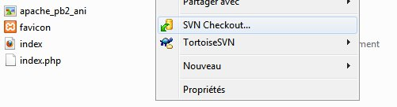
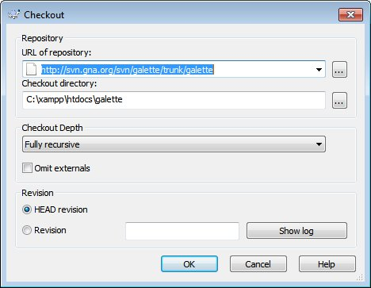
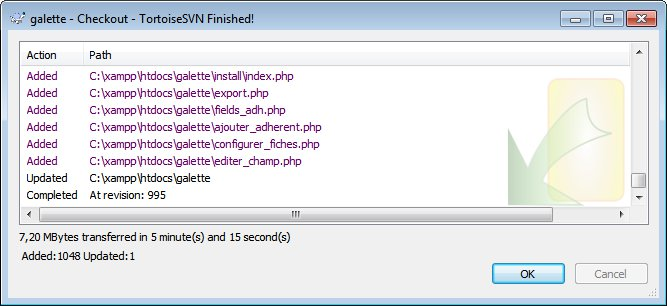
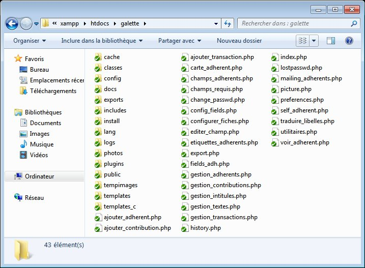

.. _svn:

*********************************
Récupération des sources avec SVN
*********************************

Le projet Galette utilise Subversion comme gestionnaire de sources. Sous linux, le client s'appelle `svn`. Il existe de nombreuses interfaces graphiques libres à Subversion sous Linux (`rapidsvn <http://rapidsvn.tigris.org/>`_, `KDESVN <http://kdesvn.alwins-world.de/>`_, `esvn <http://sourceforge.net/projects/esvn>`_, ...). Sous windows, `TortoiseSVN <http://tortoisesvn.tigris.org/>`_ vous sera probablement fort utile.

Le dépôt SVN de Galette est hébergé avec `le projet Galette chez Gna! <https://gna.org/projects/galette/>`_. Une interface web est visible à l'adresse : http://svn.gna.org/viewcvs/galette/. Le dépôt respecte la hiérarchie standard SVN, ce qui donne :

* ``trunk`` : version de développement,
* ``branches`` : anciennes versions (maintenues ou non),
* ``tags`` : snapshots des releases officielles qui ne doivent pas être modifiés.

Il faudra donc veiller à récupérer la branche dans laquelle vous souhaitez travailler ; qui sera probablement le trunk dans 99% des cas :-)

Comme expliqué sur la page du `dépôt SVN de Galette chez Gna! <https://gna.org/svn/?group=galette>`_, trois méthodes différentes s'offrent à vous :

* ``svn+ssh`` (`svn+ssh://trashy@svn.gna.org/svn/galette`) : c'est la seule et unique méthode valable si vous souhaitez contribuer au code. Pour pouvoir utiliser svn+ssh sr le dépôt Galette, vous devez posséder un compte Gna!, avoir une clé SSH configurée dans leur interface et vous devez faire partie du groupe Galette ;
* ``svn`` (`svn://svn.gna.org/svn/galette`) : vous permet de récupérer l'intégralité du projet, mais en lecture seuls ; il ne vous sera pas possible de propager vos éventuelles modifications sur le dépôt de Galette. Vous pourrez enrevanche bien entendu mettre à jour votre copie de travail depuis le dépôt ;
* ``http`` (`http://svn.gna.org/svn/galette`) : les possibilités sont les mêmes que pour le protocole ``svn`` ; la seule différence est que l'on utilise ici un protocole (et donc des ports) plus standards, qui ne seront probablement pas bloqué par d'éventuels serveurs Proxy par exemple.

Linux
=====

Ainsi donc, pour simplment récupérer Galette dans un répetoire et pouvoir le tester sans autre forme de procès, il  vous suffira sous Linux d'exécuter quelqeu chose comme :

.. code-block:: bash

   $ cd /var/www/html
   $ svo co http://svn.gna.org/svn/galette/trunk/galette ./galette
   [...]
   Révision 995 extraite.

Windows
=======

Sous windows, nous aurons recours au `logiciel libre TortoiseSVN <http://tortoisesvn.tigris.org/>`_, il faut donc dans un premier temps récupérer la dernière version du logiciel et de l'installer. Notez qu'il existe de nombreux packs de langue pour TortoiseSVN, dont le français ;-)

:ref:`XAMPP étant préalablement installé <installationwindows>` dans ``C:\xampp``, nous allons nous rendre dans le dossier ``C:\xampp\htdocs``, faire un click droit dans la fenêtre, et choisir *svn checkout*.

Dans la fenêtre qui s'ouvre alors, vous devez renseigner le chemin vers le dépôt de Galette, et le chemin vers le dossier local. Pour le premier, nous entrerons ``http://svn.gna.org/svn/galette`` ; et ``c:\xampp\htdocs\galette`` pour le second.

La récupération des sources sur le SVN débute alors, l'opération peut prendre un certain temps en regard de votre connexion internet et de la charge du serveur.

Le dossier ``C:\xampp\htdocs\galette`` contient maintenant une copie du dépôt SVN de Galette ; vous pourrez bénéficier des mises à jour en demandant à Tortoise de mettre à jour votre copie de travail.

Vous pouvez maintenant passer à :ref:`la phase d'installation de Galette <installation>`, félicitations ;-)
