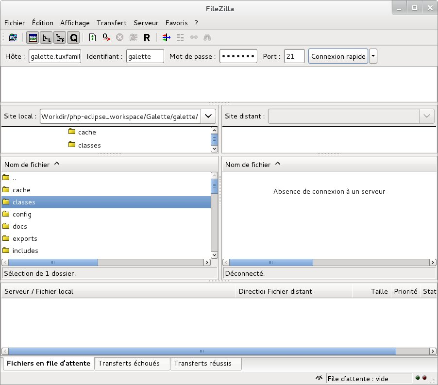

:orphan:

FTP
===

.. warning::

   Some archive or FTP softwares may corrupt files... It is strongly adviced if you use windows that you use `7zip <https://www.7-zip.fr>`_ to uncompress and `FileZilla <https://filezilla-project.org/>`_ for TFP transferts.

Once source code has been retrived locally, use :samp:`tar xjvf {galette.tar.bz2}` command under Linux/Unix/MacOS or a graphical tool under Windows.

Just copy the uncompressed directory obtained, and all its sub directories and files, with your FTP client.

Specific cases
==============

OVH
---

This hosting compay offers to `change PHP version you use from your customer account <https://docs.ovh.com/fr/hosting/configurer-le-php-sur-son-hebergement-web-mutu-2014/>`_.

Additionnal information are available at: https://docs.ovh.com/fr/fr/web/hosting/configurer-le-php-sur-son-hebergement-web-mutu-2014/

.. warning::

   Many users have display images or emargement list issues on OVH hosts. The solution to this issue is to create a `.ovhconfig` file at your hosting root with the following contents:

   .. code-block:: shell

      app.engine=phpcgi

Nginx
-----

`Nginx webserver <https://nginx.com>`_ configuration is different from Apache one (see `Nginx documentation for a more complete explanation <https://www.nginx.com/resources/wiki/start/topics/examples/likeapache-htaccess/>`_).

So you have to convert restriction access files in Nginx configuration, as for example:

.. code-block:: nginx

   location ~ /(data|config|lib)/ {
       deny all;
   }
