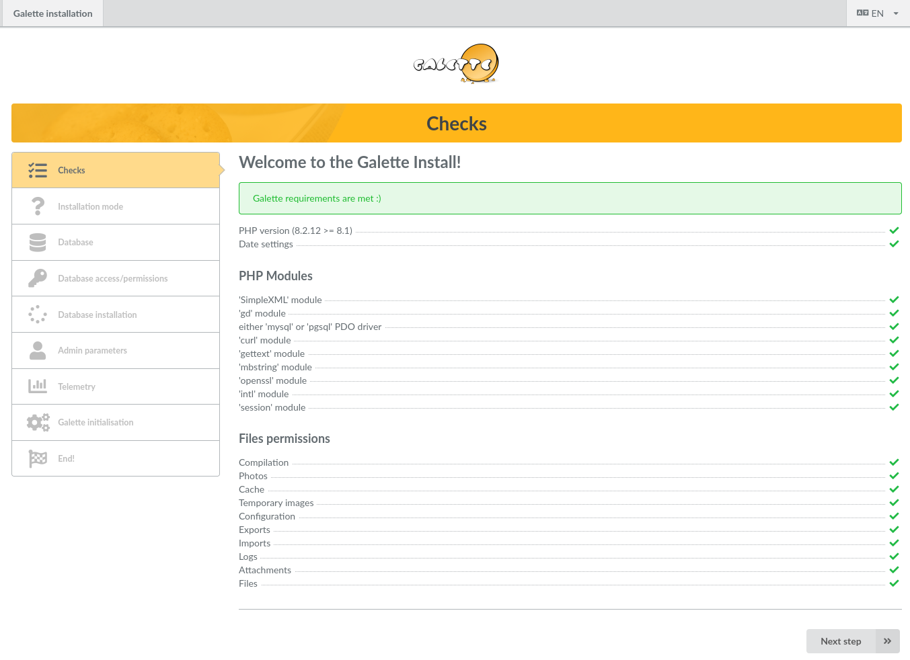
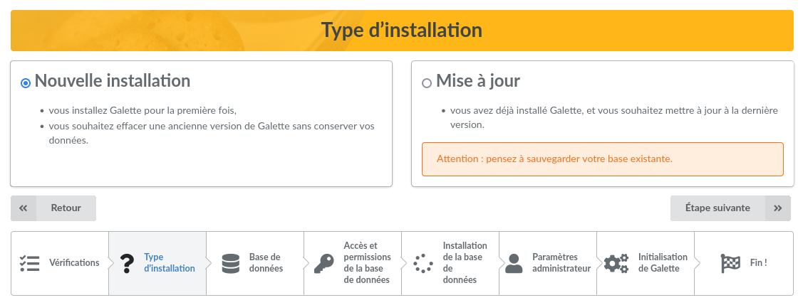
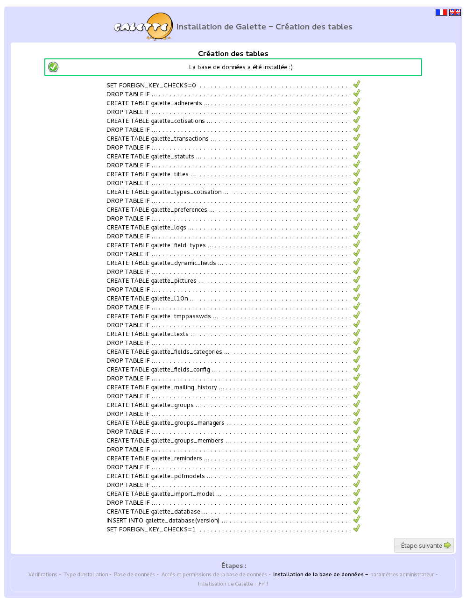
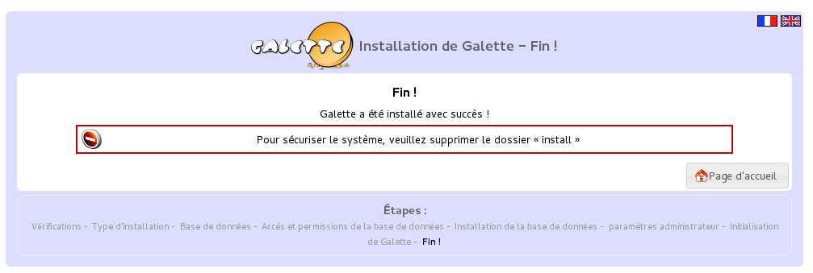
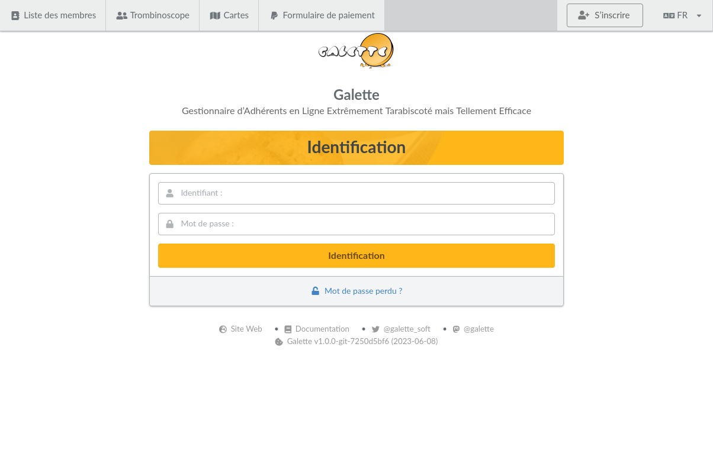

************
Installation
************

L'installation de Galette se fait entièrement depuis votre navigateur web (une fois :doc:`les étapes préliminaires <preparation>` achevées). Rendez-vous à l'adresse http://localhost/galette/. La procédure de :doc:`mise à jour de votre instance de Galette <update>` est documentée séparément.

Le principe, c'est d'installer Galette depuis l'archive de la dernière version stable. Vous pouvez aussi l'installer depuis :doc:`le code source <source-code>` (cette méthode est certainement plus complexe pour les non développeurs).

Vérification des paramètres
===========================

Un certain nombre de choses doit être respécté pour que l'installation de Galette se déroule sans accroc :

* la version de PHP doit être sufisante,
* certaines extensions PHP doivent être disponibles,
* certains dossiers doivent être accessible en écriture.

La première étape de l'installation se chargera de vérifier ces points, et vous avertira si quelque chose n'est pas compatible.

Si toutes :ref:`les étapes de préparation <preparation>` ont été correctement suivies, les droits des dossiers devraient être corrects.

Cette étape s'assure que les droits nécessaires au bon fonctionnement de Galette ont été placés. En cas de problème (rectangle rouge), référez-vous à la section « :ref:`Droits des fichiers <droitsfichiers>` », rafraîchissez ensuite la page pour relancer la procédure de vérification des droits.

Elle vérifie aussi la version de PHP utilisée, la présence des modules requis ou conseillés, et le paramétrage de la date (requis depuis PHP 5.3). L'installation d'un module se fait fait sur le serveur (rapprochez-vous de votre hébergeur ou de votre administrateur système, Galette ne requiert à priori rien d'exceptionnel), de même que le paramétrage de la date.

Type d'installation
===================

L'écran suivant vous permet de choisir le type d'installation. Vous aurez le choix entre « Nouvelle installation » et une « Mise à jour ». Les étapes suivantes seront pour beaucoup communes, mais certaintes étapes spécifiques seront à effectuer dans un cas ou dans l'autre.

Base de données
===============

Avant toute chose, vous devez vous assurer que votre base de données existe déjà. Rassemblez les éléments requis, à savoir :

* nom de l'hôte
* nom de l'utilisateur de la base
* mot de passe de l'utilisateur
* nom de la base
* type de la base (MySQL ou PostgreSQL)

Création de la base de données
------------------------------

.. note::

   **N'utilisez pas l'utilisateur root de votre base de données !**

   Pour des raisons de sécurité, il est fortement conseillé de créer un utilisateur spécifique pour la base de données Galette, et de ne lui attribuer des droits que sur la base Galette.

Pour l'exemple, nous allons nous baser sur une base de données nommée `magalette` appartenant à un utilisateur `monutilisateurgalette` dont le mot de passe est `monmotdepasse`.

* MariaDB

  .. code-block:: bash

     $ mysql -u root -p
     mysql> CREATE DATABASE magalette;
     mysql> GRANT ALL ON magalette.* to
         ->'monutilisateurgalette'@'localhost' IDENTIFIED BY 'monmotdepasse';

* PostgreSQL

  .. code-block:: bash

     $ su -
     # su - postgres
     $ createuser -P monutilisateurgalette
     $ createdb -O monutilisateurgalette magalette

Les commandes décrites ci dessus peuvent varier, référez vous aux documentations de `MariaDB <https://mariadb.com/kb/en/library/documentation/>`_ ou de `PostgreSQL <http://docs.postgresqlfr.org>`_ selon votre cas ; ou utilisez un outil graphique :

* `phpMyAdmin <http://www.phpmyadmin.net>`_ pour MariaDB ;
* `phpPgAdmin <http://phppgadmin.sourceforge.net>`_ ou `PgAdmin3 <http://www.pgadmin.org/download/?lang=fr_FR>`_ pour PostgreSQL.

Paramètres de la base
---------------------

Sur cet écran, sélectionnez votre type de base de données puis entrez simplement les nom d'hôte, nom de base de données, nom d'utilisateur et mot de passe. Le préfixe de la table est fort utile si vous n'avez pas une base dédiée intégralement à Galette ; la proposition par défaut devrait être parfaitement acceptable, mais vous pouvez bien entendu y mettre ce que vous souhaitez :-)

.. image:: ../_styles/static/images/installation/3_bdd.png
   :scale: 70%
   :align: center

Cette étape sera strictement similaire en installation et en mise à jour. Si un fichier de configuration existe déjà, Galette ira y chercher les informations (à l'exception du mot de passe). En cas de mise à jour, vous devrez vous assurer que le préfixe des tables correspond bel et bien à celui qui existe.

Vérifications et création des tables
------------------------------------

L'écran suivant va vérifier qu'une connexion peut être établie à votre base de données en utilisant les éléments que vous avez fournis, puis que les droits sont corrects (ajout/suppression/modification de tables, ajout/suppression/modification d'enregistrements, ...).

.. image:: ../_styles/static/images/installation/4_bdd_rights.png
   :scale: 70%
   :align: center

En cas d'erreur, revenez à l'étape précédente, effectuez les éventuels ajustement requis, puis validez de nouveau en cliquant le bouton « étape suivante ». Si l'erreur concerne un ou plusieurs tests lors de la vérification des droits, il faudra vous assurer que l'utilisateur de votre base de données possède bien les droits requis sur la base.

Création des tables
-------------------

.. note:: Ces instructions ne sont valables que pour une nouvelle installation. Dans le cas d'une mise à jour, la base de données existera déjà bien évidemment.

Si une connexion à la base a pu être établie, et que les droits sont corrects, l'installation va maintenant créer les tables et y insérer les valeurs par défaut. La création des tables peut être vérifiée à l'aide de PhpMyAdmin.

En ligne de commande, vous pouvez utiliser :

* pour MariaDB :

  .. code-block:: bash

     mysql> use magalette;
     mysql> show tables;

* pour PostgreSQL :

  .. code-block:: bash

     postgres=# \c magalette
     postgres=# \dt

Paramètres de l'administrateur
==============================

.. note:: Cet écran n'est affiché qu'en cas d'installation. Lors d'une mise à jour, les paramètres administrateurs auront déjà été renseignés ;)

L'écran suivant vous demande de saisir les informations de l'administrateur de Galette. Par la suite, certains comptes créés via l'interface pourront être élevés au rang d'administrateur également, mais celui qui est créé à l'installation n'est pas un adhérent, il ne peut pas être supprimé et possède certains droits particuliers.

.. image:: ../_styles/static/images/installation/6_admin.png
   :scale: 70%
   :align: center

Initialisation
==============

La toute dernière étape va écrire le fichier de configuration (s'il n'existe pas ou s'il n'est pas à jour), et initialiser certaines valeurs dans votre base de données toute fraîche, comme par exemple :

* la création des préférences de base,
* l'ajout des types de contributions et des statuts par défaut,
* la configuration des champs et leur visibilité,
* les textes des différents courriels,
* les titres des adhérents,
* les modèles PDF,
* ...

Lors d'une mise à jour, la plupart des données de base étant déjà initialisées, la liste sera beaucoup moins longue.

Fin de l'installation
=====================

Nous voici à la fin de l'installation, félicitations !

.. warning::

   Pour des raisons de sécurité, nous vous **conseillons fortement de supprimer le dossier install**, ou, au pire, d'en désactiver l'accès par le serveur web.

Vous avez maintenant accès à la page de login de Galette, entrez-y les identifiants administrateur préalablement renseignés, et vous pouvez commencer à l'utiliser. Vous pouvez maintenant vous référer au :doc:`manuel de l'utilisateur de Galette <../usermanual/index>`.

