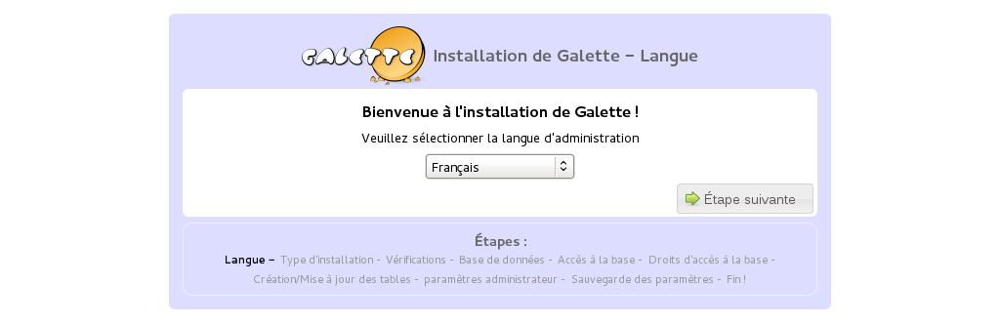
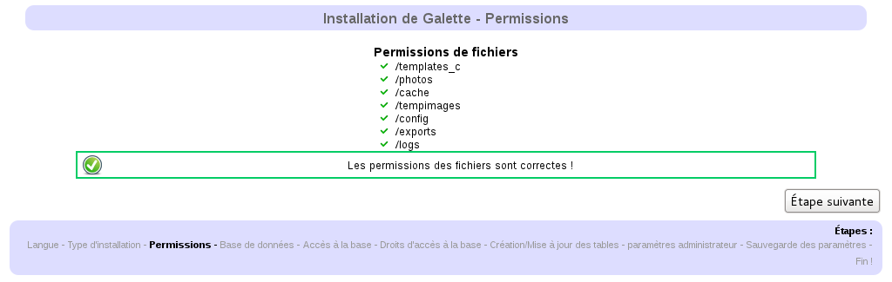
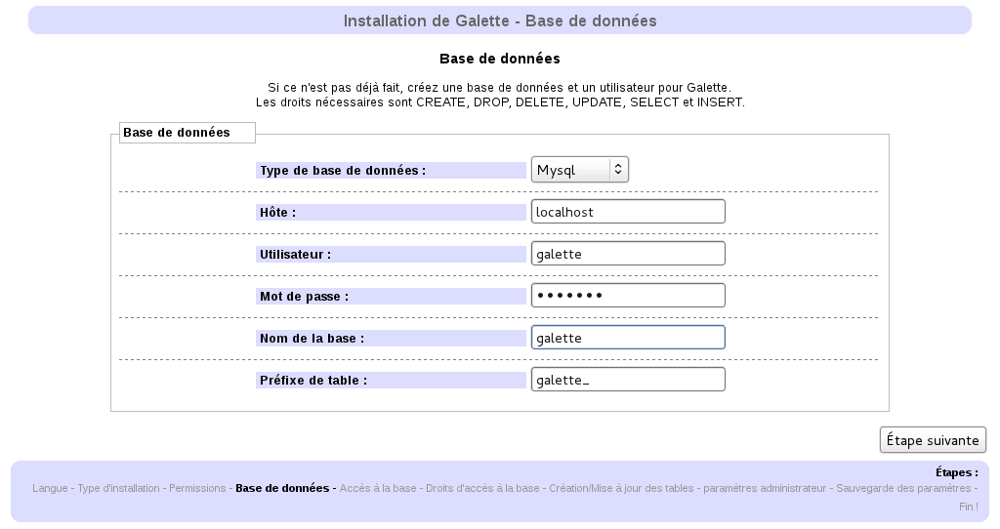
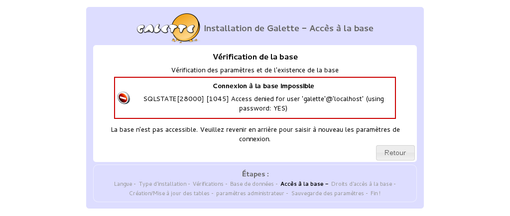
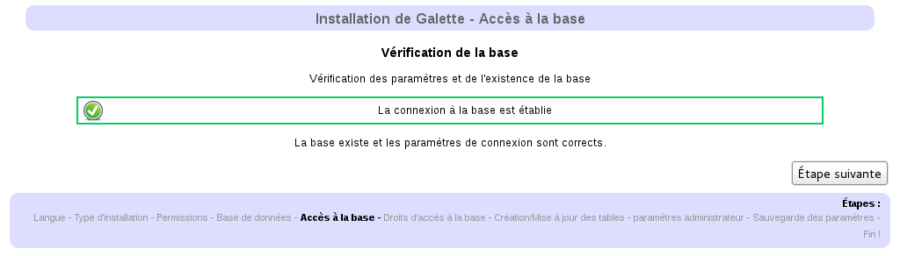
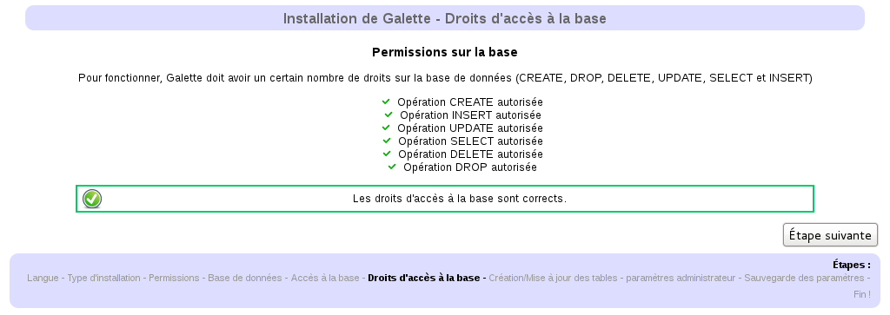
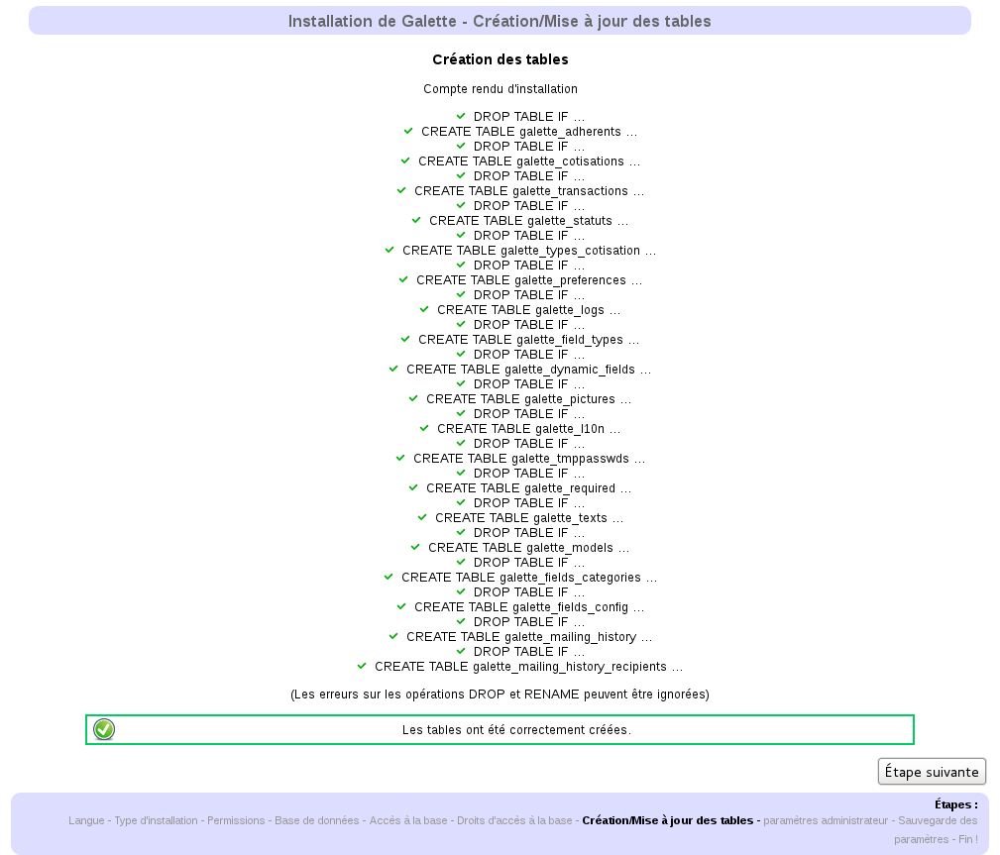
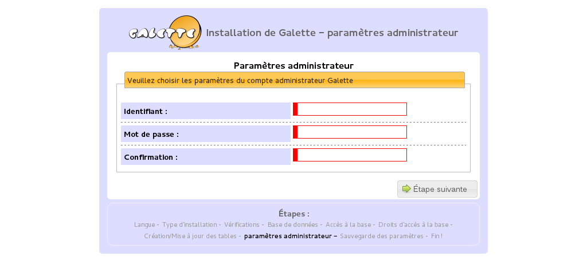
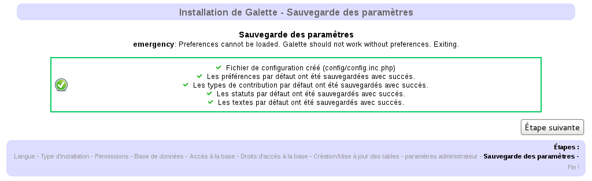

************
Installation
************

L'installation de Galette se fait entièrement depuis votre navigateur web (une fois :doc:`les étapes préliminaires <preparation>` achevées). Rendez-vous à l'adresse http://localhost/galette/install/.

Choix de la langue d'installation
=================================

Le première page de la procédure d'installation vous permet de choisir votre langue.

Type d'installation
===================

L'écran suivant vous permet de choisir le type d'installation. Vous aurez le choix entre « Nouvelle installation » (le cas que nous allons traiter ici) et une série de mises à jour.

.. image:: ../_styles/static/images/installation/2_type_install.png
   :scale: 70%
   :align: center

Vérification des permissions
============================

Si toutes :ref:`les étapes de préparation <preparation>` ont été correctement suivies, les droits des dossiers devraient être corrects. Cette étape s'assure que les droits nécessaires au bon fonctionnement de Galette aient été placés. En cas de problème (rectangle rouge), référez-vous à la section « :ref:`Droits des fichiers <droitsfichiers>` », rafraîchissez ensuite la page pour relancer la procédure de vérification des droits.

Base de données
===============

Avant toute chose, vous devez vous assurer que votre base de données existe déjà. Rassemblez les éléments requis, à savoir :

* nom de l'hôte
* nom de l'utilisateur de la base
* mot de passe de l'utilisateur
* nom de la base
* type de la base (MySQL ou PostgreSQL)

Création de la base de données
------------------------------

Pour l'exemple, nous allons nous baser sur une base de données nommée magalette appartenant à un utilisateur `monutilisateurgalette` dont le mot de passe est `monmotdepasse`.

* MySQL

  .. code-block:: bash

     $ mysql -u root -p
     mysql> CREATE DATABASE magalette;
     mysql> GRANT ALL ON magalette.* to
         ->'monutilisateurgalette'@'localhost' IDENTIFIED BY 'monmotdepasse';

* PostgreSQL

  .. code-block:: bash

     $ su -
     # su - postgres
     $ createuser -P monutilisateurgalette
     $ createdb -O monutilisateurgalette magalette

Les commandes décrites ci dessus peuvent varier, référez vous aux documentations de `MySQL <http://dev.mysql.com/doc/#refman>`_ ou de `PostgreSQL <http://docs.postgresqlfr.org>`_ selon votre cas ; ou utilisez un outil graphique tel `phpMyAdmin <http://www.phpmyadmin.net>`_ ou `phpPgAdmin <http://phppgadmin.sourceforge.net>`_.

Cas particulier de Free
^^^^^^^^^^^^^^^^^^^^^^^

Free n'autorise qu'une seule base de données dont les éléments sont les suivants :

* hôte : ``sql.free.fr``,
* utilisateur : ``jean.dupond`` (si l'adresse électronique de votre compte principal est `jean.dupond@free.fr`)
* mot de passe : le mot de passe associé à votre compte principal,
* nom de la base : ``jean_dupond`` (si votre login comprend un ``.``, le remplacer par un ``_`` (le caractère de soulignement, parfois également appelé « le trait du 8 »)

Cas particulier de NFrance
^^^^^^^^^^^^^^^^^^^^^^^^^^

À l'instar de free, NFrance n'autorise qu'une seule base de données (tout au moins dans le cas de la formule basic) :

* hôte : ``localhost``,
* utilisateur : ``juXXXXX``,
* mot de passe : mot de passe associé à votre abonnement chez NFrance,
* nom de la base : ``juXXXXX`` (identique au nom d'utilisateur/login).

En cas de doutes, rendez-vous sur `votre espace client <https://espace-client.nfrance.com/>`_.

Paramètres de la base
---------------------

Sur cet écran, sélectionnez votre type de base de données puis entrez simplement les nom d'hôte, nom de base de données, nom d'utilisateur et mot de passe. Le préfixe de la table est fort utile si vous n'avez pas une base dédiée intégralement à Galette ; la proposition par défaut devrait être parfaitement acceptable, mais vous pouvez bien entendu y mettre ce que vous souhaitez :-)

Si une erreur survient, le programme d'installation vous en informe :

De même, bien entendu, lorsque tout se passe correctement :-)

Vérifications et création des tables
------------------------------------

Les deux écrans suivants vont vérifier qu'une connexion peut être établie à votre base de données en utilisant les éléments que vous avez fournis, puis que les droits sont corrects (ajout/suppression/modification de tables, ajout/suppression/modification d'enregistrements, ...).

En cas d'erreur (rectangle rouge), revenez à l'étape précédente, effectuez les éventuels ajustement requis, puis validez de nouveau en cliquant le bouton « étape suivante ». Si l'erreur concerne un ou plusieurs tests lors de la vérification des droits, il faudra vous assurer que l'utilisateur de votre base de données possède bien les droits requis sur la base.

Création des tables
-------------------

Si une connexion à la base a pu être établie, et que les droits sont corrects, l'installation va maintenant créer les tables et y insérer les valeurs par défaut. La création des tables peut être vérifiée à l'aide de PhpMyAdmin.

En ligne de commande, vous pouvez utiliser :

* pour MySQL :

  .. code-block:: bash

     mysql> use magalette;
     mysql> show tables;

* pour PostgreSQL :

  .. code-block:: bash

     postgres=# \c magalette
     postgres=# \dt

Paramètres de l'administrateur
==============================

L'écran suivant vous demande de saisir les informations de l'administrateur de Galette. Par la suite, certains comptes créés via l'interface pourront être élevés au rang d'administrateur également, mais celui qui est créé à l'installation n'est pas un adhérent, et ne peux pas être supprimé.

.. warning::

   Le mot de passe saisi est sauvegardé dans la table ``galette_preferences``. Avant la version 0.63 de Galette, il était stocké en clair. Depuis la version 0.63, il est désormais stocké en utilisant l'algorithme md5, ce qui rend (quasi)impossible son déchiffrement. 

Fin de l'installation
=====================

Nous voici à la fin de l'installation ! Si tout s'est bien passé, un écran vous informera que le fichier de configuration a été créé, et que les paramètres sont bien stockés dans la base.

.. warning::

   Pour des raisons de sécurité, nous vous **conseillons fortement de supprimer le dossier install**. 

Vous avez maintenant accès à la page de login de Galette, entrez-y les identifiants administrateur préalablement renseignés, et vous pouvez commencer à l'utiliser. Vous pouvez maintenant vous référer au manuel de l'utilisateur de Galette. 

.. image:: ../_styles/static/images/installation/9_login.png
   :scale: 70%
   :align: center

