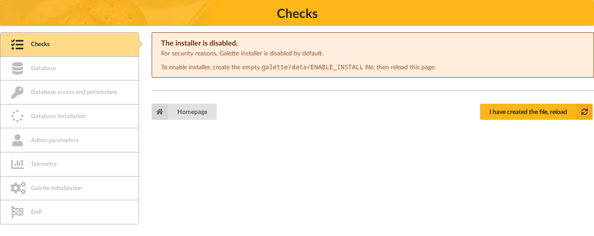
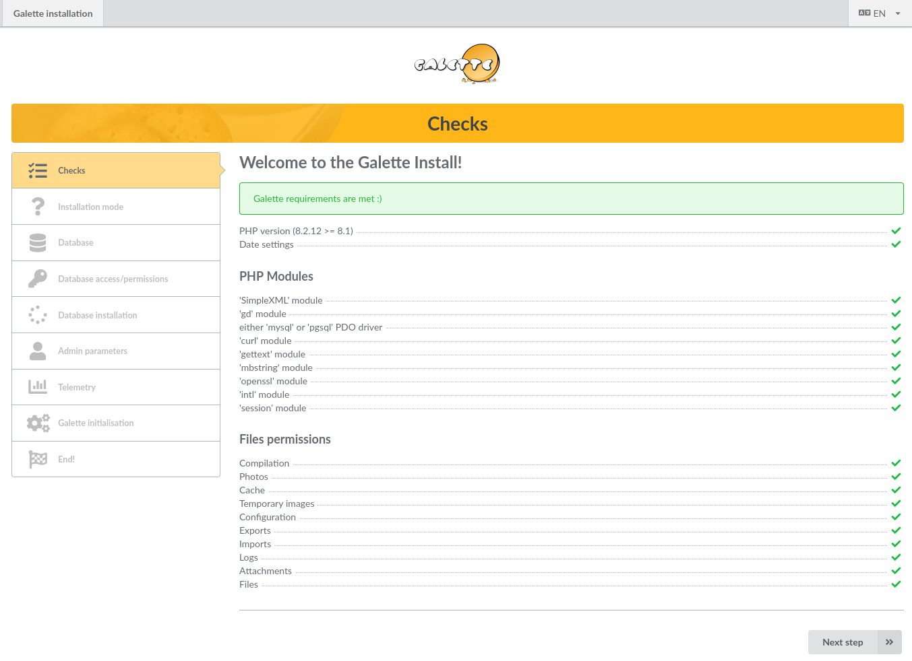
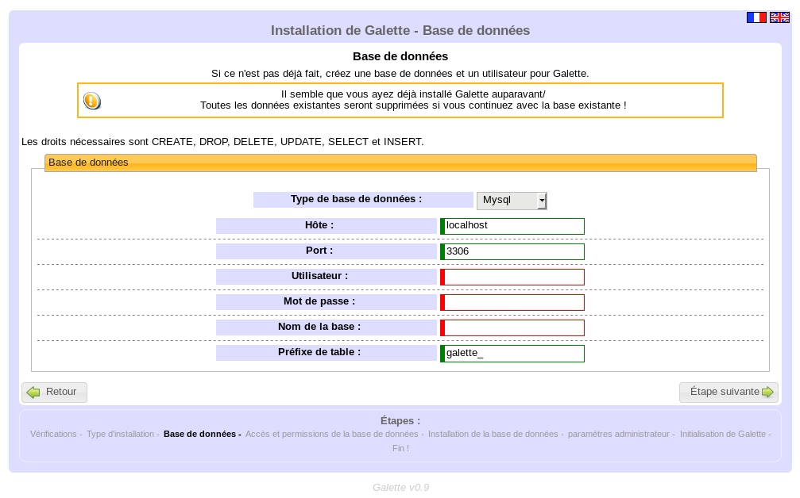
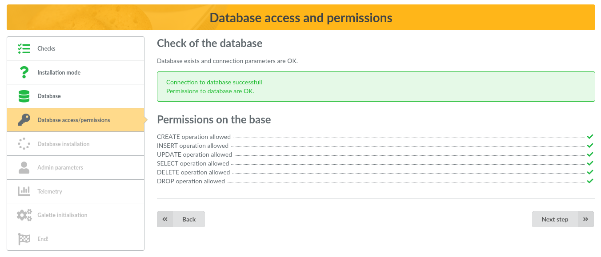
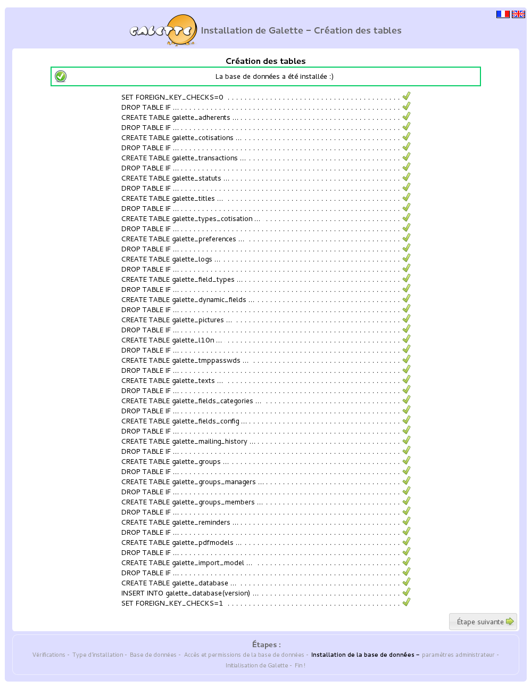
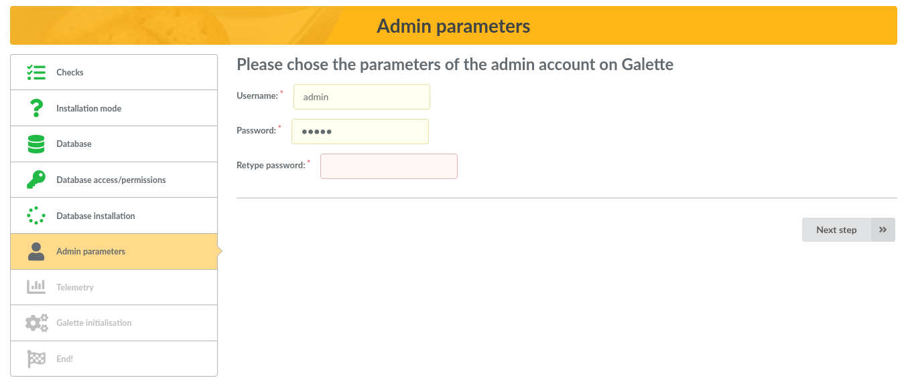
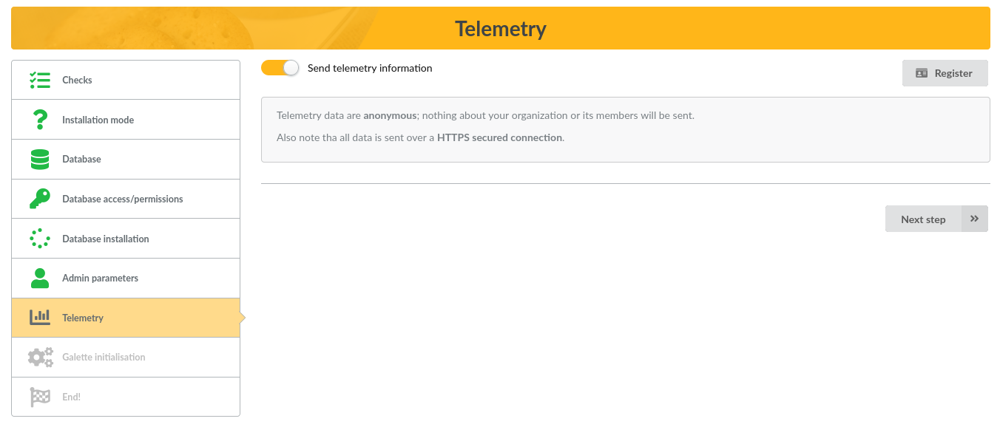
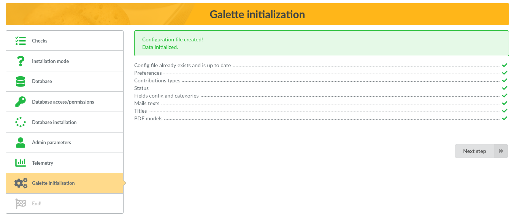
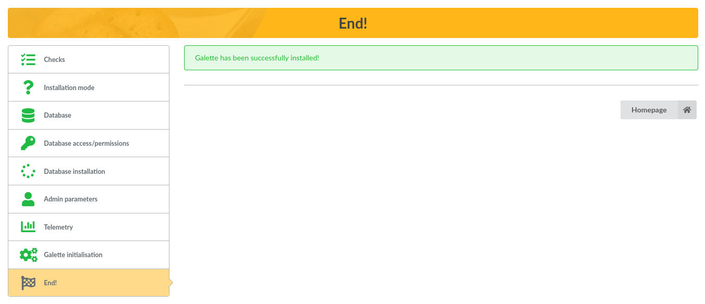
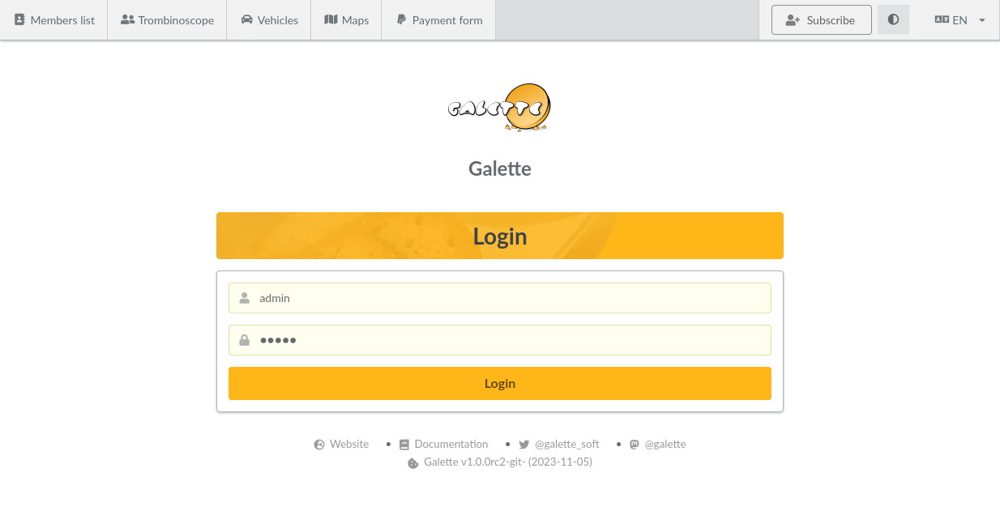

************
Installation
************

.. include:: /globals.rst

Galette installation is a web based process (once :doc:`preparation steps <preparation>` are done). Go to http://localhost/galette. :doc:`Update process <update>` is documented separately.

You should rely on latest stable release, but it is also possible (if your know what you are doing, this is more complex for non developers!) grab it from :doc:`source code <../source_code>`

.. _enableinstaller:

Enabling the installer
======================

.. versionadded:: 1.3.0

For security reasons, the installer does nothing until you tell it to. It stays closed as long as a file named ``ENABLE_INSTALL`` is missing from Galette |folder| ``data`` directory:

Create that empty file on the server, then reload the page:

::

   $ touch /path/to/galette/data/ENABLE_INSTALL

Creating it proves you have an access to the server, which a visitor passing by has not.

Galette removes the file by itself once the installation - or the :doc:`update <update>` - has completed, so the installer closes again behind you. That requires a write access on the |folder| ``data`` directory itself, which is not among the :ref:`directories Galette needs to write into <droitsfichiers>`. If it is read only for the web server, the last step displays a warning instead: remove the file by hand, the installation is complete all the same.

.. note::

   It is the **absence** of the file that closes the installer, and that is on purpose: losing it can only close the installer, it can never open it.

Installation or update?
=======================

.. versionchanged:: 1.3.0

   Galette does not ask anymore, and the corresponding step has been removed.

The mode is deduced from the |phpfile| ``config/config.inc.php`` file: no configuration file means a new installation, an existing one means an :doc:`update <update>`.

.. warning::

   To install a brand new instance over an existing one - erasing its data - remove the configuration file first. As long as it is there, Galette will only offer to update.

Checks
======

Please check the following if you want Galette to install without problems:

* your PHP version is high enough,
* PHP timezone is set (required since PHP 5.3),
* all required PHP extensions are installed and loaded,
* some directories requires write access.

If one of the mandatory extensions is missing or if the timezone is not set, please ask you system administrator. Galette does not require any "exotic" extension.

The very first installation step will check those points, and will warn you if something gets wrong.

If all :ref:`the installation steps <preparation>` has been properly followed, directories ACLs should be correct, please refer to :ref:`files ACLs section <droitsfichiers>` and refresh page in your browser.

Database
========

First of all, make sure the database exists, and prepare all required information:

* host name
* database user name
* database user password
* database name
* database type (MariaDB/MySQL or PostgreSQL)

Database parameters
-------------------

On that screen, select your database type, and enter hostname, database name, user name and password. Tables prefix is useful if you do not have a Galette dedicated database, default proposal should be ok but you can choose what you want :)

.. note::

   This step is displayed for a new installation only. When updating, everything - password included - is read from the existing configuration file, and the step is skipped. It only comes back if that file cannot be read, or if it is incomplete.

Checks
------

Next screen will try to connect to the database using provided elements, than it will check database rights are correct (user can add/remove/alter tables, and can add/remove/edit rows, ...).

If there is a connexion error, go back to previous step, fix your setup and try again. If you see rights issues, get them fixed on your server and use the "Refresh" button.

Create tables
-------------

.. note:: Those instructions are only for installation. When updating, a database already exists.

If a connection can be established to the database, and all is correct; installer will now create the tables, and insert default values. You can show created tables from any graphical tool or in command line:

* MariaDB:

  ::

     mysql> use mygalette;
     mysql> show tables;

* PostgreSQL:

  ::

     postgres=# \c mygalette
     postgres=# \dt

Admin parameters
================

.. note:: This screen is displayed from installation only. When updating, super admin user is already existing.

Next screen will ask you for information to create the Galette super admin user. Using Galette, you can set some members as administrators, but the one created at installation time is not a member, cannot be removed, and has some extra rights.

Telemetry
=========

To know more about Galette installed instances, we try to collect anonymous telemetry data. You can also register as a Galette user :)

Initialize
==========

The last step will write the configuration file if needed, remove the ``ENABLE_INSTALL`` file, and initialize some values in your fresh database, as exemple:

* add Galette default preferences
* add default contributions and status types,
* fields configuration and permissions,
* texts for administrative emails,
* members default titles,
* default PDF models
* ...

When updating, only the missing preferences and the new default data if any will be handled.

Installation end
================

Installation is now finished, congratulations!

You can now login to Galette, using super admin information you used at installation time. You can now go to the :doc:`Galette user manual <../usermanual/index>`.

Happy Galette!
