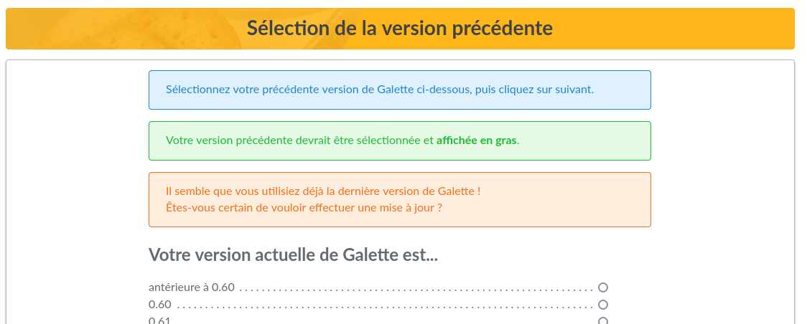

.. _update:

********
Updating
********

If you are using an old Galette release, it's time to update.

.. warning::

   An update is often not something lite, your data may be modified. So, please make sure you made **a backup of your current database**, or you may lost all or a part of your data.

   A backup of all Galette files is also recommended it would be helpful if you find a bug that prevent you to migrate and have to restore an old version;

.. note::

   Migrating a pre 0.7 release is theoretically supported, but this is not tested (those releases are more than 10 years old!), and it is possible your attempt fail.

   Nothing is really made to make such a time travel ;) If this is your case, you should first `migrate to Galette 0.7.8 <https://download.tuxfamily.org/galette/archives/galette-0.7.8.tar.bz2>`_; and do another migration to the latest version.

Updating files
==============

First, logout from your instance, and make sure to use a maintenance mode to prevent other users to reach the instance.

Then, download latest Galette version and replace the files. For more information on files installation, refer to the :ref:`prepare installation <preparation>` section.

Some directories keep data and/or configurations and should be copied back to the new instance:

* ``config/config.inc.php``. If this file is missing, Galette update process will ask you the information and create a new one. If the file is present, it will be used to fill information excepted database password. It is the only file that can be edited during update process,
* ``data/photos`` your members photos and logos,
* ``data/exports`` contains CSv exports,
* ``data/files`` contains files from dynamic fields of type file,
* ``data/attachments`` contains mailing attached documents.
* ``plugins`` your current plugins. It is a good idea to check if new plugins versions are available ;)

Once files are updated, go to your Galette instance. It will ask you if needed to proceed to the update of your database.

If so, visit the install URL ``/installer.php`` (ex: https://your.domain.name/installer.php) and choose *Update* when your are asked for the type of installation.

If it asks you nothing you're just done already ;)

Updating database
=================

.. warning::

   Installing a new Galette release does not strictly means a database update will be required! Sometimes, only updating the files will be enough; even for a major release.

   Galette will tell you if an update is needed, no need to "force" an update.

Update process is very similar to :doc:`Galette installation process <galette>`, with some steps that change. All is mostly transparent, information are provided on each step.

Database information
---------------------

At "Installation type" step, you'll have to choose "update". Database information page will be pre filled with existing information, excepting password. Other information should not be changed.

.. note::

   Note it is important that database name and prefixed used in previous database correspond to configuration.

Previous version selection
--------------------------

Next step is the choice of the previous Galette version. Installation process will try to "guess" what version it as, and will select this one per default (the one that will be displayed as bold text).

.. image:: ../_styles/static/images/installation/5_update_version_select.png
   :scale: 50%
   :align: center

If you try to update but your database version seems already correct, you will be warned. No entry will be displayed as bold text, please make sure to choose the right one:

Once update scripts have run, a summary will be displayed.
