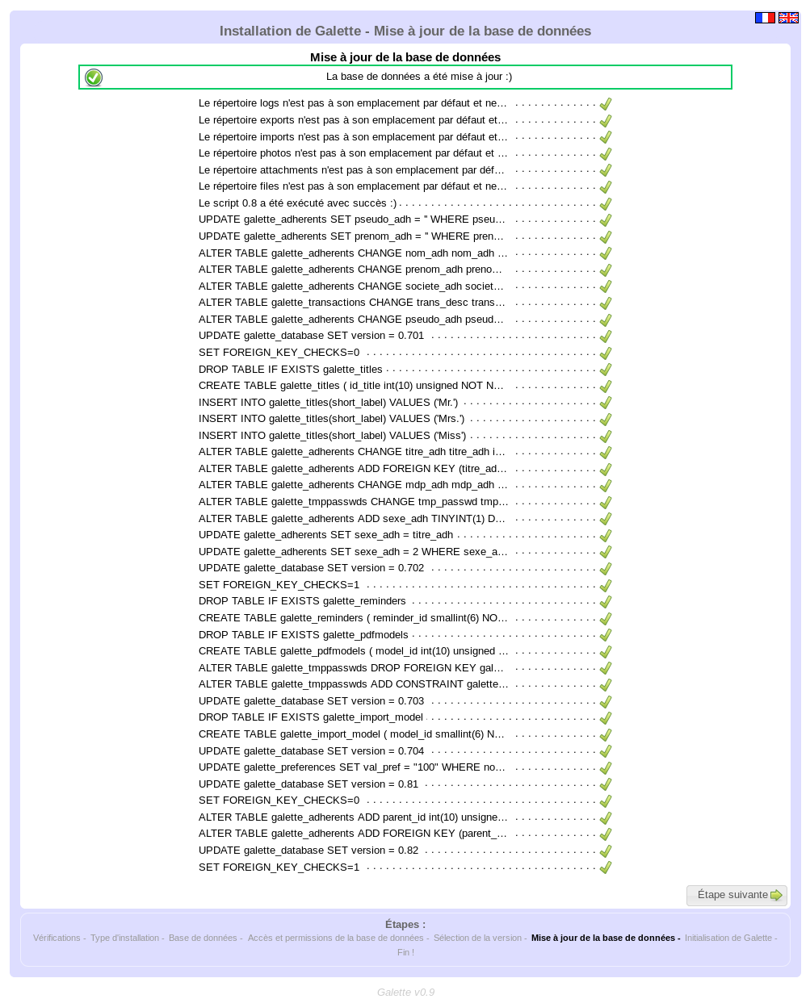

.. _update:

***********
Mise à jour
***********

Si vous utilisez actuellement une version antérieure de Galette, une mise à jour s'impose.

.. warning::

   Une mise à jour n'est jamais une opération anodine, puisque vos données sont modifiées. En conséquence, prenez bien soin d'effectuer une **sauvegarde de votre base de données actuelle** ; sous peine de perdre tout ou partie de vos données.

   Une sauvegarde de l'intégralité des fichiers de Galette est aussi fortement conseillée ; pour le cas où vous rencontreriez un problème de mise à jour et devriez revenir à la version précédente, ou encore si votre Galette avait été modifiée (ce qui est déconseillé, à juste titre !).

.. note::

   La migration d'une instance de Galette depuis une version antérieure à la version 0.7.0 supportée... Théoriquement. Mais dans la pratique, ce n'est absolument pas testé (ces versions datent de pus de 10 ans !), et il est possible qu'une telle tentative échoue.

   Rien n'est actuellement prévu pour permettre d'effectuer réellement un tel saut dans le futur ;-) Si votre instance de Galette est antérieure à la 0.7.0, nous vous conseillons dans un premier temps de `migrer vers la version 0.7.8 <http://download.tuxfamily.org/galette/archives/galette-0.7.8.tar.bz2>`_ ; puis ensuite de recommencer avec la dernière version stable.

Mise à jour des fichiers
========================

Dans un premier temps, déconnectez-vous de votre instance de Galette actuelle.

Ensuite, `téléchargez la dernière version de Galette <http://download.tuxfamily.org/galette/galette-0.9.1.1.tar.bz2>`_ et mettez à jour les fichiers. Pour plus de détails sur l'installation des fichiers de Galette, reportez-vous à la section :ref:`préparation de l'installation <preparation>`.

Certains fichiers et répertoires contiennent des données et devraient être réintégrés à la nouvelle installation :

* ``config/config.inc.php``. Si ce fichier est absent, Galette en créera un nouveau. Si le fichier est présent, les données qu'il contient seront automatiquement chargées (hormis le mot de passe) lors de la configuration du moteur de base de données. C'est le seul fichier qui est modifié par la procédure de mise à jour,
* ``data/photos`` qui contient les photos de vos adhérents et votre logo,
* ``data/exports`` qui contient les exports CSV (Galette 0.7.0 et versions ultérieures),
* ``data/files`` qui contient les fichiers attachés aux adhérents (Galette 0.8 et versions ultérieures),
* ``data/attachments`` qui contient les fichiers attachés aux mailings.

Une fois la mise à jour des fichier effectuée, rendez-vous ensuite sur votre instance de Galette. Celle-ci vous demandera, au besoin de lancer la procédure de mise à jour de votre base. Si votre instance ne vous demande rien, c'est que tout est terminé ;-)

Dans le cas contraire, rendez vous sur la page `http://localhost/galette/webroot/installer.php`.

Mise à jour de la base de données
=================================

.. warning::

   La passage à une version plus récente de Galette ne signifie pas forcément qu'une mise à jour de la base soit requise ! Certaines fois, la seule mise à jour des fichiers de l'application suffira, même pour une version majeure !

   L'application vous avertira si une mise à jour est nécessaire, il est inutile de "forcer" le passage par l'opération de mise à jour.

La procédure de mise à jour est similaire à :doc:`l'installation de Galette <galette>`, avec certaines étapes en plus ou en moins. Tout cela est totalement transparent, des informations sur les différentes étapes, leur échec ou leur succès vous seront affichées sur le même modèle que lors de la création des tables.

Informations de la base
-----------------------

À l'étape « Type d’installation », vous devrez sélectionner « mise à jour ». L'étape de paramétrage de la base de données sera pré-remplie avec les informations existantes, à l'exception du mot de passe de la base que vous devrez saisir vous-même. Normalement, les autres informations ne doivent pas être modifiées.

.. note::

   Notez qu'il est important que le nom de la base de données et le préfixe qui vous sont demandés lors de l'installation correspondent aux **valeurs actuelles**.

Sélection de la version précédente
----------------------------------

Vous devrez ensuite sélectionner la version antérieure de Galette. Le système d'installation essaiera de « deviner » pour vous de quelle version il s'agit, et sélectionnera l'entrée adéquate par défaut (elle sera affichée en caractères gras pour la différencier des autres).

.. image:: ../_styles/static/images/installation/5_update_version_select.png
   :scale: 70%
   :align: center

Le système vous préviendra également si vous tentez de mettre à jour alors que votre base semble être à la bonne version. Si tel est le cas, aucune entrée ne sera affichée en caractères gras ; mais nous vous conseillons fortement de prendre conseil avant de faire des «bêtises » :

.. image:: ../_styles/static/images/installation/5bis_already_updated.png
   :scale: 70%
   :align: center

Une fois le ou les scripts de mise à jour exécutés, un bref récapitulatif devrait être affiché :

