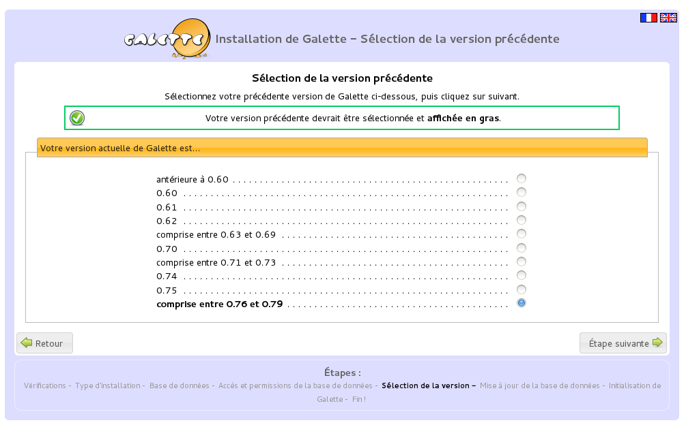
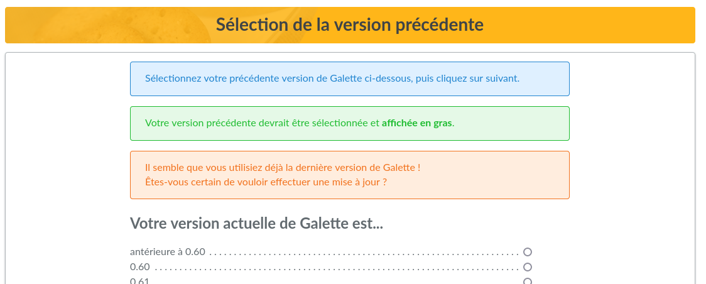

.. _update:

********
Updating
********

If you are using an old Galette release, it's time to update.

.. warning::

   An update is often not something lite, your data may be modified. So, please make sure you made **a backup of your current database**, or you may lost all or a part of your data.

   A backup of all Galette files is also recommended it would be helpful if you find a bug that prevent you to migrate and have to restore an old version;

.. note::

   Migrating a pre 0.7 release is theoretically supported, but this is not tested (those releases are more than 10 years old!), and it is possible your attempt fail.

   Nothing is really made to make such a time travel ;) If this is your case, you should first `migrate to Galette 0.7.8 <https://galette.eu/download/archives/galette-0.7.8.tar.bz2>`_; and do another migration to the latest version.

Updating files
==============

First, logout from your instance, and make sure to use a maintenance mode to prevent other users to reach the instance.

Then, download latest Galette version and replace the files. For more information on files installation, refer to the :ref:`prepare installation <preparation>` section.

Some directories keep data and/or configurations and should be copied back to the new instance:

* ``config/config.inc.php``. If the file is present, the update reads everything from it - database password included - and never asks you for a credential again. If it is missing, Galette cannot know it is an update: it would offer a brand new installation instead,
* ``data/photos`` your members photos and logos,
* ``data/exports`` contains CSv exports,
* ``data/files`` contains files from dynamic fields of type file,
* ``data/attachments`` contains mailing attached documents.
* ``plugins`` your current plugins. It is a good idea to check if new plugins versions are available ;)

Once files are updated, go to your Galette instance. It will ask you if needed to proceed to the update of your database.

If so, :ref:`enable the installer <enableinstaller>` by creating the ``data/ENABLE_INSTALL`` file, then visit the install URL ``/installer.php`` (ex: https://your.domain.name/installer.php). Galette sees your configuration file and runs an update, you have nothing to choose.

If it asks you nothing you're just done already ;)

Updating database
=================

.. warning::

   Installing a new Galette release does not strictly means a database update will be required! Sometimes, only updating the files will be enough; even for a major release.

   Galette will tell you if an update is needed, no need to "force" an update.

Update process is very similar to :doc:`Galette installation process <galette>`, with some steps that change. All is mostly transparent, information are provided on each step.

Database information
---------------------

.. versionchanged:: 1.3.0

   Database information are not asked anymore, and neither is the installation type.

The update reads the database type, host, port, name, user, password and table prefix from your configuration file, and goes straight to the access and permissions check. The form only comes back if that file cannot be read or is incomplete - fill it in with the very same information as before, the table prefix included.

Previous version selection
--------------------------

.. versionchanged:: 1.3.0

   When the version can be read from the database, this step is skipped.

Galette reads the version its database holds and updates from there. The step below is only displayed when that reading is not conclusive - which is the case for a pre 0.7 database, since the table holding the version did not exist yet. Select the version you are coming from, the one Galette guessed is displayed as bold text:

The step is also displayed when your database is already up to date, so you get a chance to stop before running the scripts again:

Once update scripts have run, a summary will be displayed.

.. note::

   The ``data/ENABLE_INSTALL`` file is removed once the update has completed.
