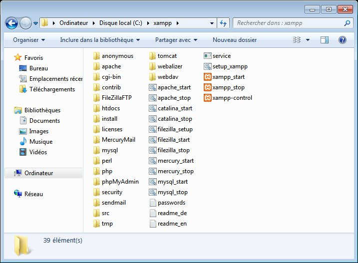
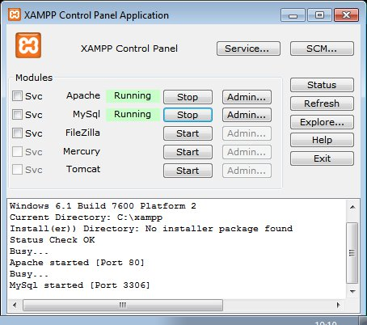

:orphan:

Windows
=======

Installation described here rely on `XAMPP <https://www.apachefriends.org/fr/xampp-windows.html>`_; ohter instalaltion methods exists but are not listed here.

First of all, download XAMPP on your computer. Let's install it under ``C:\xampp``.

Launch the ``xampp-control`` executable (you can find it in ``C:\xampp``), so you can start Apache and MySQL services.

Once those steps done, download galette and move it to ``C:\wampp\htdocs\galette``, web application will be available from http://127.0.0.1/galette/. Just visit this URL so the installation process begin.

.. note::

   Enabling PHP modules under XAMPP is done in ``xampp/php/php.ini``. Most of the required extensions are already present, but commented (line bebings with a ";"), just uncomment them and restart XAMPP.

   `openssl` extension is missing in the file, to activate it just add the following to your `php.ini`: ``extension=php_openssl.dll``
