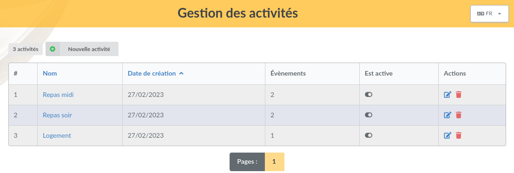
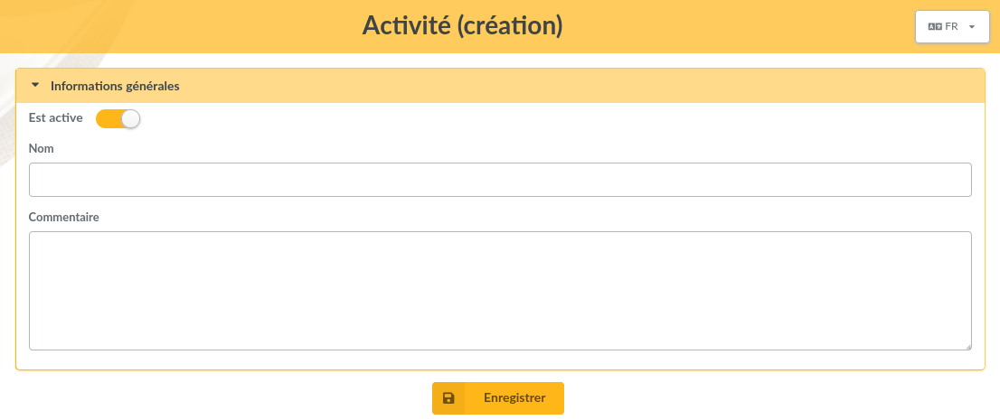
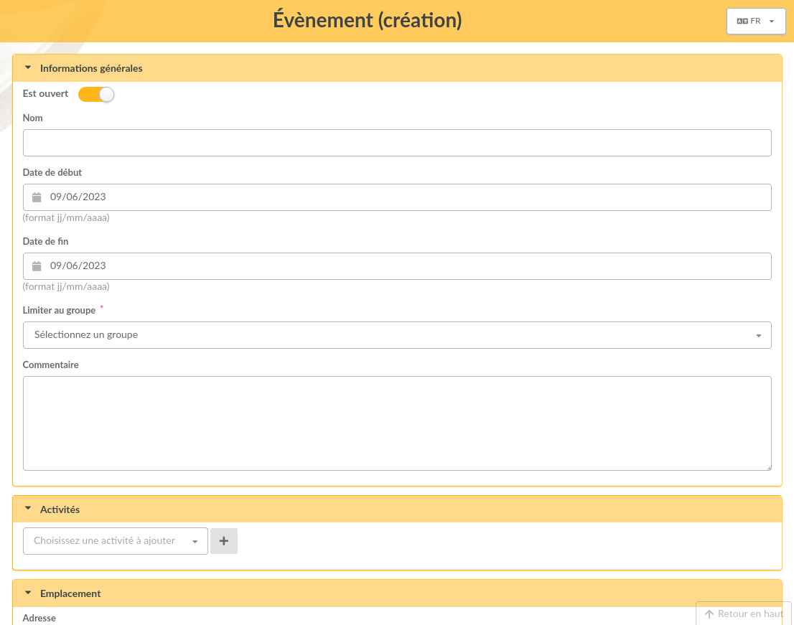
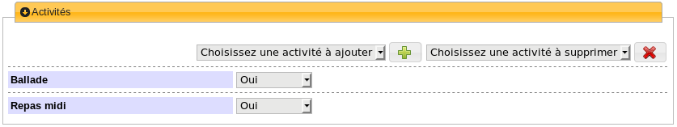
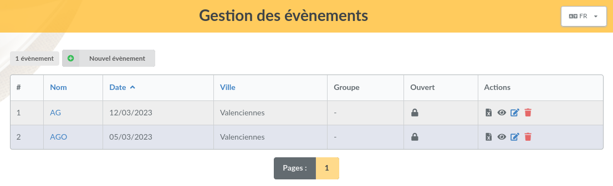
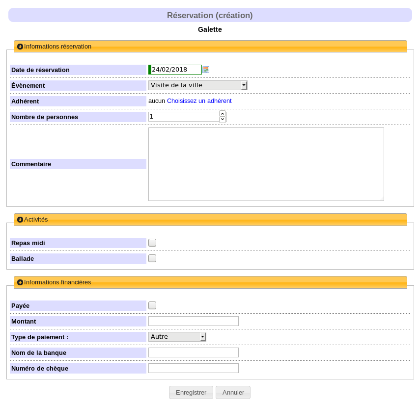
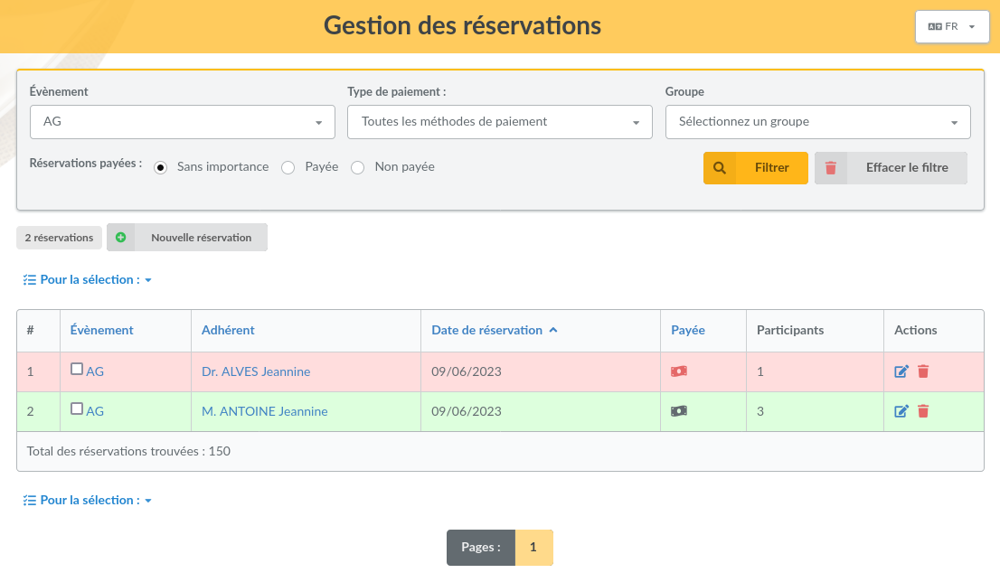

======
Events
======

This plugin provides:

* events management,
* associate activities with events,
* booking management.

Installation
============

First of all, download the plugin:

.. image:: https://img.shields.io/badge/2.1.3-Events-ffb619.svg?logo=php&logoColor=white&style=for-the-badge
   :target: https://galette.eu/download/plugins/galette-plugin-events-2.1.3.tar.bz2
   :alt: Get latest Events plugin!

.. image:: https://img.shields.io/badge/Nighly-Events-ffb619.svg?logo=php&logoColor=white&style=for-the-badge
   :target: https://galette.eu/download/plugins/galette-plugin-events-dev.tar.bz2
   :alt: Get Events plugin nightly build!

Extract the downloaded archive in Galette ``plugins`` directory.
For example, under linux (replacing `{url}` and `{version}` with correct values):

.. code-block:: bash

   $ cd /var/www/html/galette/plugins
   $ wget {url}
   $ tar xjvf galette-plugin-events-{version}.tar.gz

Database initialisation
=======================

In order to work, this plugin requires several tables in the database. See :ref:`Galette plugins management interface <plugins_managment>`.

And this is finished; Events plugin is installed :)

Plugin usage
============

When the plugin is installed, an `Events` group is added to Galette menu when a user is logged in. There are various possibilities that change depending on user profile (simple member, group manager, administrator, ...).

Activities
----------

You can define as much activities as you want, and associate them to an event. An activity may be an organized trip, a meal, a housing, ...

An activity is composed with a name, a status and an optional comment.

To add a new activity, just click on "New activity" link:

Events
------

Events are the main goal of the plugin. You can define several information, like a name, begin and ending dates, location, ...

Name, begin date and town are mandatory. All other information are entirely optional.

Events that are not linked to a group will be available for all members. If a group is set, only members and managers of this group will have access.

.. note::

   When a group manager creates a new event, he must choose one of the groups he owns!

You can attach one or several activities to each event, and for each one set if it is available, not available or even mandatory. Choose the activity to add, and click the button.

.. warning::

   Adding or removing activity from an event will reload the page and ask you to fill mandatory information. Nonetheless (and this is specified each time), the event **will not be stored** during this operation.

   Ensure you save the event :)

From Events list, you can edit or remove entries, access to booking list ou export bookings as CSV.

Bookings
--------

Bookings can be registered for each event. As we said before, simple members and groups managers will be limited to their groups events, ou to the events that are not restricted to a group.

Adding a new booking can be achieved from the menu "New booking" or from the event bookings list.

Bookings are closed once the event is marked as close, or when the begin date is over. Administrators and staff members can always add new bookings.

Activities list is retrieved from the event; mandatory ones must of course be checked during booking.

You can filter bookings list per event, payment type or payment status. You can then send a mailing to booked members, using the standard Galette mailing mechanism.
