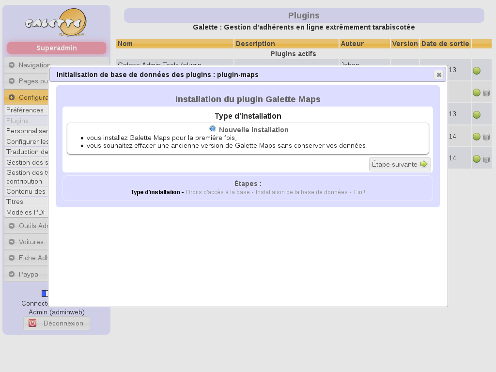
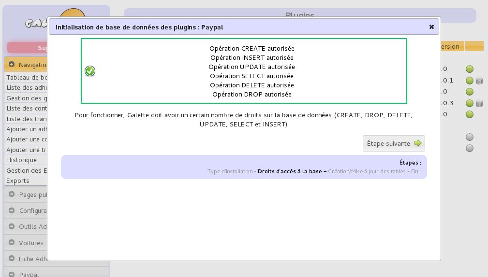
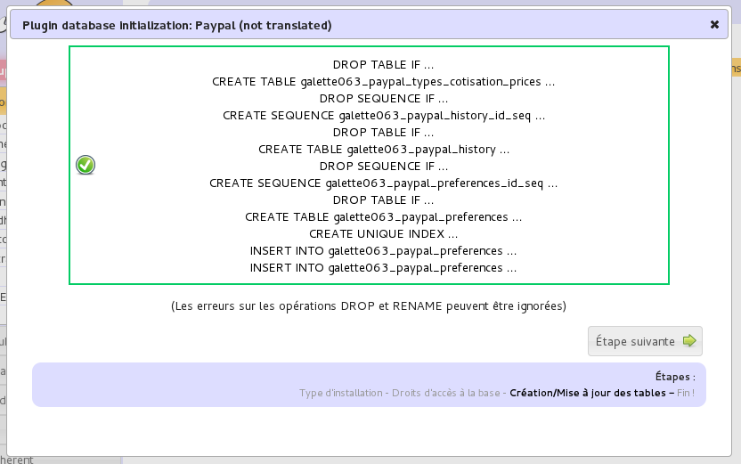
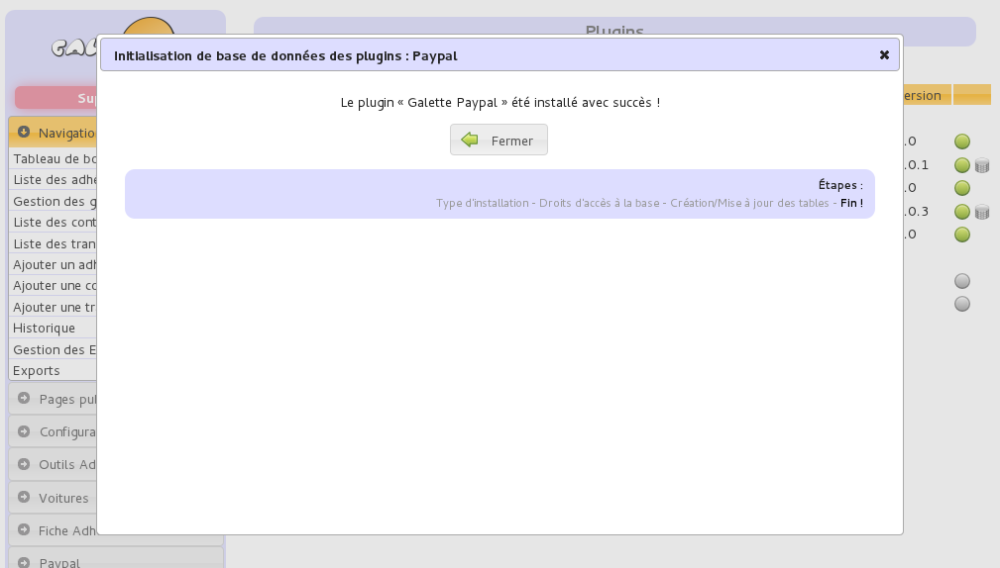

.. _plugins:

.. only:: builder_html

   .. rst-class:: docs plugins_doc

   :doc:`documentation des plugins <index>`

.. rst-class:: doc_main_page

====================
Plugins pour Galette
====================

Le système de plugins permet d'étendre les fonctionnalités de Galette dans certains cas particuliers, tout en évitant « d'encombrer » l'application principale. Les plugins non compatibles seront automatiquement désactivés. Il faut dans ce cas envisager de passer à la version supérieure du plugin.

Chaque plugin est en fait un simple dossier qui doit être placé dans le dossier ``{galette}/plugins/``. Reportez-vous ensuite à la documentation du plugin pour l'installer.

Il est possible de désactiver un plugin en créant simplement un fichier ``_disabled`` vide dans le répertoire du plugin.

*********************
Plugins « officiels »
*********************

Les plugins « officiels » sont développés et/ou maintenus par l'équipe de développement de Galette. Les plugins actuellement disponibles pour Galette sont :

.. toctree::
   :maxdepth: 2

   paypal.rst
   fullcard.rst
   admintools.rst
   maps.rst
   auto.rst
   objectslend.rst
   events.rst

*************
Plugins tiers
*************

Les plugins tiers sont développés et/ou maintenus par des membres de la communauté. Ils peuvent ne pas être disponibles dans différentes langues, ou ne pas fonctionner avec tous les moteurs de bases de données supportés oficiellement.

* `Aéroclub <https://galette-community.github.io/plugin-aeroclub/>`_ (gestion de base d'un aéroclub), développé par Mélissa,
* `QRCodes <https://galette-community.github.io/plugin-qrcodes/>`_ (génération de QRCodes), développé par Frédéric,
* `Grades <https://galette-community.github.io/plugin-grades/>`_ (gestion d'évaluations), développé par Frédéric.

Une `communauté Github <https://github.com/galette-community/>`_ a été créée pour :doc:`gérer les plugins tiers <plugins-tiers>`, si vous souhaitez y placer votre plugin.

.. _plugins_managment:

********************************
Interface de gestion des plugins
********************************

Une interface de gestion des plugins est disponible, accessible par les administrateurs depuis le tableau de bord. Après avoir copié le(s) plugin(s) téléchargé(s) dans le dossier ``plugins`` de Galette ; une liste vous sera proposée :

.. image:: ../_styles/static/images/usermanual/plugins_managment.png
   :scale: 75%
   :align: center
   :alt: Gestion des plugins

Si le serveur web possède les droits en écriture dans les dossiers des plugins, il vous sera possible d'activer ou de désactiver un plugin simplement en cliquant sur l'icône de statut en fin de ligne.

Si le plugin requiert une base de données pour son fonctionnement, vous pourrez jouer les scripts d'installation et de mise à jour depuis l'interface. Et puisqu''un petit schéma vaut mieux qu'un long discours, voici - en images - l'illustration de l'installation de la base de données du plugin Paypal :-)

Dans un premier temps, vous aurez à sélectionner le type d'installation (installation ou mise à jour - ça ne vous rapelle rien ? ;-)) :

Les droits sur la base de données seront ensuite vérifiés. Contrairement à l'installation du Galette ; aucune information concernant la base de données ne vous sera demandée, puisque les informations en question sont déjà disponibles (le simple fait d'accéder à l'interface des plugins confirme cela) :

Les scripts en eux-mêmes seront alors exécutés, si les droits sont corrects :

Et voilà, c'est fini !

