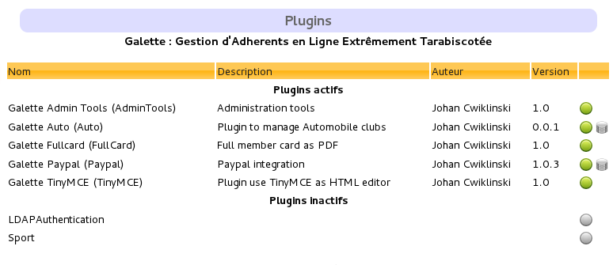

.. _plugins:

.. only:: builder_html or readthedocs

   .. rst-class:: docs plugins_doc

   :doc:`Plugins documentation <index>`

.. rst-class:: doc_main_page

=======
Plugins
=======

Plugins system allows to extend Galette with specific features that would not be useful for most of the users. Incompatible plugins will automatically be disabled, in which case you should consider upgrading to a more recent version.

Each plugin is a simple directory in ``{galette}/plugins/``, then refer to the plugin documentation to install it.

****************
Existing plugins
****************

The `galette-plugins organization <https://github.com/galette-plugins/>`_ hosts all plugins. See :doc:`how to add your plugin <plugins-tiers>` if you want yours to join.

* `Paypal <https://galette-plugins.github.io/plugin-paypal/>`_
* `Fullcard <https://galette-plugins.github.io/plugin-fullcard/>`_
* `Maps <https://galette-plugins.github.io/plugin-maps/>`_
* `Auto <https://galette-plugins.github.io/plugin-auto/>`_
* `Events <https://galette-plugins.github.io/plugin-events/>`_
* `ObjectsLend <https://galette-plugins.github.io/plugin-objectslend/>`_
* :doc:`Activities<activities>`
* `oAuth2 <https://galette-plugins.github.io/plugin-oauth2/>`_
* `Stripe <https://galette-plugins.github.io/plugin-stripe/>`_
* `HelloAsso <https://galette-plugins.github.io/plugin-helloasso/>`_
* `LegalNotices <https://galette-plugins.github.io/plugin-legalnotices/>`_

.. toctree::
   :hidden:

   plugins-tiers.rst

.. _plugins_managment:

****************************
Plugins management interface
****************************

A plugins management interface is provided, you will find it from the dashboard or in the configuration menu. After you have downloaded plugin(s) in Galette ``plugins`` directory, a list will be displayed:

If web server has read access to your plugins directory, then you can enable or disable any plugin from the related icon.

If plugin requires a database to work, you can play installation and update scripts from the interface.

Database ACLs will then be checked. Unlike Galette, no information will be asked to you, since all is already available from your current instance.
