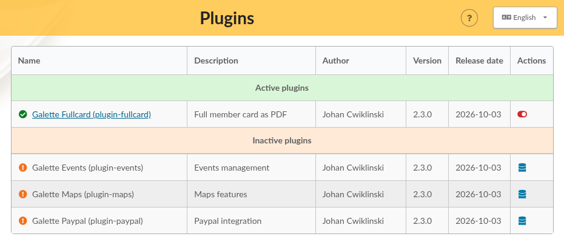

.. _plugins:

.. only:: builder_html or readthedocs

   .. rst-class:: docs plugins_doc

   :doc:`Plugins documentation <index>`

.. rst-class:: doc_main_page

=======
Plugins
=======

Plugins system allows to extend Galette with specific features that would not be useful for most of the users. Incompatible plugins will automatically be disabled, in which case you should consider upgrading to a more recent version.

Each plugin is a simple directory in ``{galette}/plugins/``, then refer to the plugin documentation to install it.

****************
Existing plugins
****************

The `galette-plugins organization <https://github.com/galette-plugins/>`_ hosts all plugins. See :doc:`how to add your plugin <plugins-tiers>` if you want yours to join.

* `Paypal <https://galette-plugins.github.io/plugin-paypal/>`_
* `Fullcard <https://galette-plugins.github.io/plugin-fullcard/>`_
* `Maps <https://galette-plugins.github.io/plugin-maps/>`_
* `Auto <https://galette-plugins.github.io/plugin-auto/>`_
* `Events <https://galette-plugins.github.io/plugin-events/>`_
* `ObjectsLend <https://galette-plugins.github.io/plugin-objectslend/>`_
* `Activities <https://galette-plugins.github.io/plugin-activities/>`_
* `oAuth2 <https://galette-plugins.github.io/plugin-oauth2/>`_
* `Stripe <https://galette-plugins.github.io/plugin-stripe/>`_
* `HelloAsso <https://galette-plugins.github.io/plugin-helloasso/>`_
* `LegalNotices <https://galette-plugins.github.io/plugin-legalnotices/>`_

.. toctree::
   :hidden:

   plugins-tiers.rst

.. _plugins_managment:

****************************
Plugins management interface
****************************

A plugins management interface is provided, you will find it from the dashboard or in the configuration menu. After you have downloaded plugin(s) in Galette ``plugins`` directory, a list will be displayed:

If web server has read access to your plugins directory, then you can enable or disable any plugin from the related icon.

If plugin requires a database to work, you can play installation and update scripts from the interface.

Database ACLs will then be checked. Unlike Galette, no information will be asked to you, since all is already available from your current instance.

.. versionchanged:: 1.3.0

   Each plugin now has its own database version, and is updated on its own. The page lists the active plugins first, then the inactive ones, with the reason why they are inactive.

An icon next to the name of an inactive plugin tells why it is not active:

* **Not installed**: the plugin needs database tables that have not been created yet. Click on the database icon of the **Actions** column to install them,
* **Need update**: the plugin files are more recent than its database. Click on the database icon to run the update,
* **Explicitly disabled**: the plugin has been disabled from this page, or from the :doc:`command line </command-line>`. Click on the activation icon to enable it again,
* **Incompatible with current version**: the plugin is made for another version of Galette; look for a more recent version of the plugin,
* **A required file is missing**: the plugin files are incomplete; download the plugin again,
* **Database version missing**: Galette cannot tell which version of the plugin database is installed.

The name of an active plugin opens a window with information about it: version, author, routes and access rights.

.. warning::

   Back up your database before installing or updating a plugin database, as you would before updating Galette itself.
