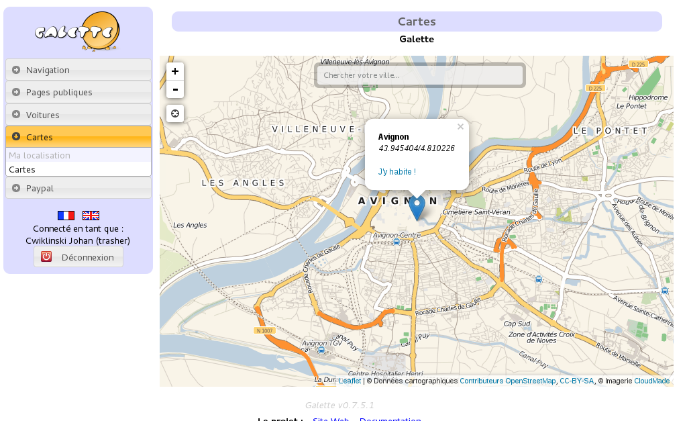
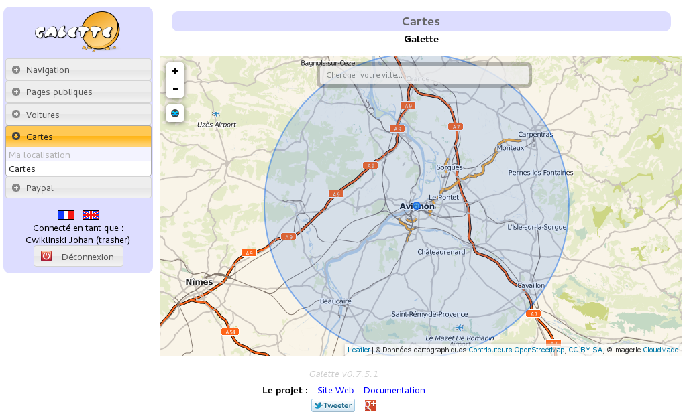
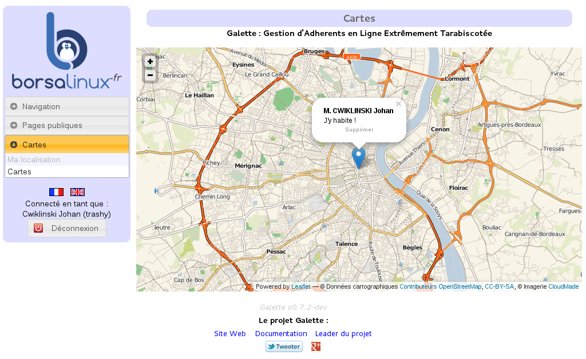

====
Maps
====

This plugin provides:

* possibility to store geogaphical coordinates for members (latitude and longitude),
* a public map displaying up to date members that have choosen to be publically visible.

Installation
============

First of all, download the plugin:
https://download.tuxfamily.org/galette/plugins/galette-plugin-maps-1.5.0.tar.bz2

Extract the downloaded archive in Galette ``plugins`` directory.
For example, under linux (replacing `{url}` and `{version}` with correct values):

.. code-block:: bash

   $ cd /var/www/html/galette/plugins
   $ wget {url}
   $ tar xjvf galette-plugin-maps-{version}.tar.gz

Database initialisation
=======================

In order to work, this plugin requires several tables in the database. See :ref:`Galette plugins management interface <plugins_managment>`.

And this is finished; Maps plugin is installed :)

Plugin usage
============

When the plugin is installed, a group `Maps` is added to Galette menu when a member is logged in, which contains `My location` entry. This page allow member to store its location.

A `Geolocalize` button is also added when displaying a member, that allows administrators to set member coordinates.

Also, a `Map` entry is added in public pages list, that displays geolocalized members that are up to date. Administrators and staff members will see all members, while simple members and visitors will only see up to date public ones.

First of all, members will enter their location coordinates. Several options are provided:

* if town has been set in member informations, a list of possible places will be proposed (via `Nominatim online service <https://nominatim.openstreetmap.org>`_),
* additionnaly, a search zone (provided from `OpenStreetMap <https://nominatim.openstreetmap.org/>`_),
* and also a geolocalize button using browser capacities.

The search zone can be used when saving members location, and when displaying the maps.

.. image:: ../_styles/static/images/plugin-maps/towns_list.png
   :scale: 70%
   :align: center

A member can define its location (with the precision he wants) on the map selecting one of the propositions:

Using the geolocalization button will define its position from the browser:

Then, member location is displayed on map, and can be removed:

How to get the sources?
=======================

Please refer to :doc:`Galette developer guide <../development/index>` to get informations about :doc:`souces retrieval <../development/git>`, and :ref:`development model <devmodel>`.
