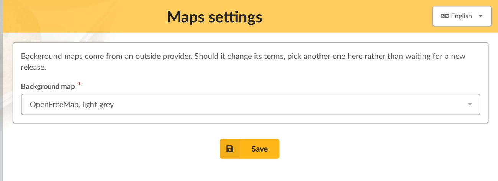
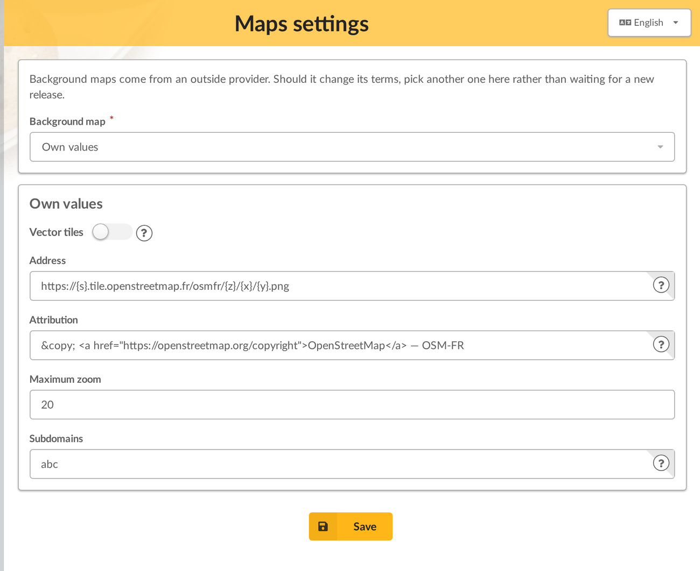
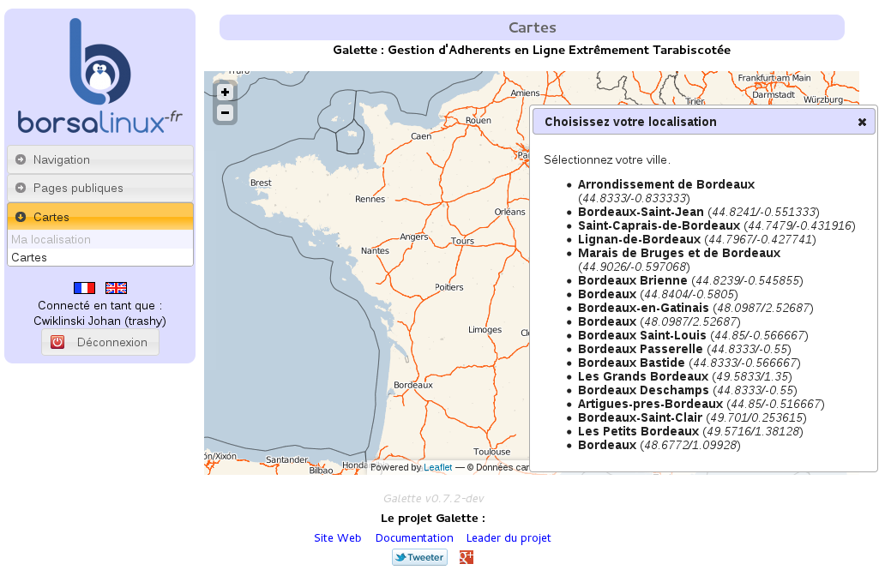
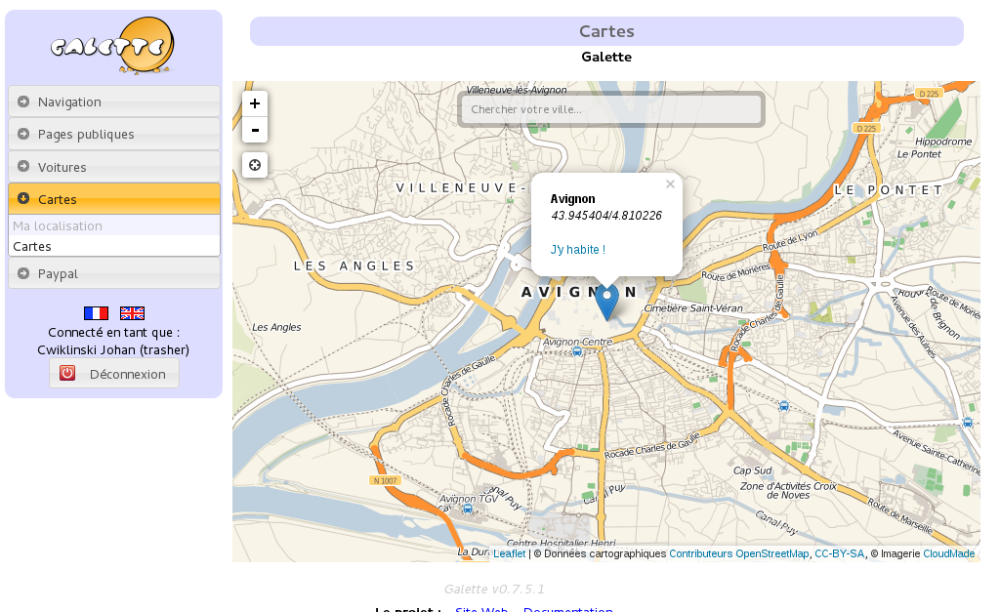
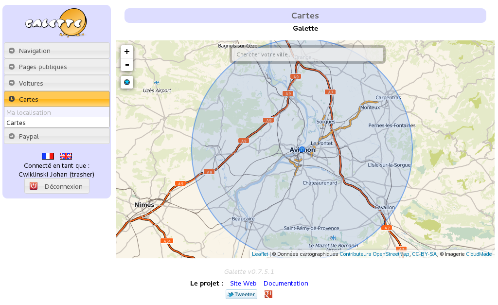
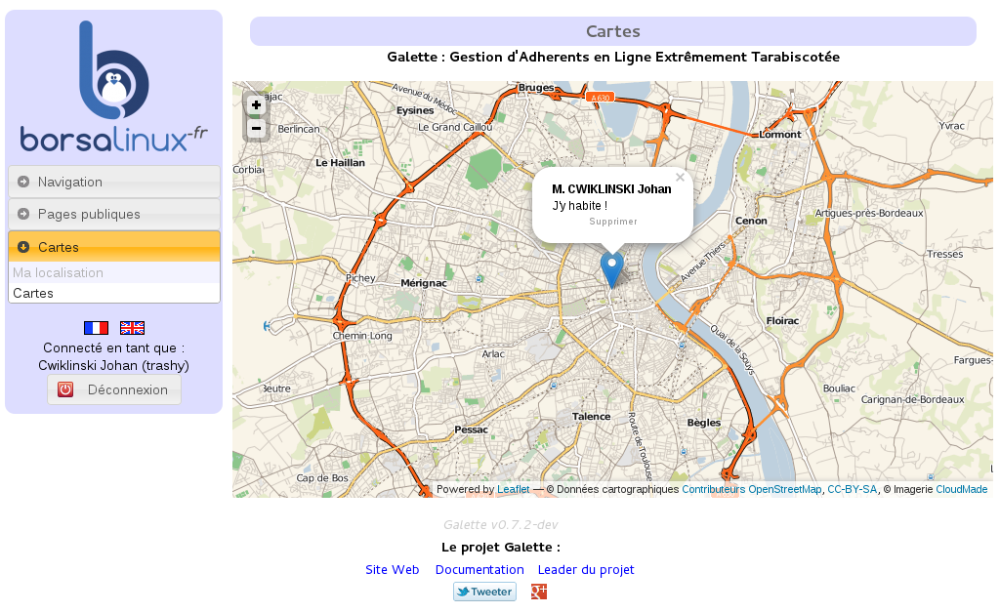

====
Maps
====

This plugin provides:

* possibility to store geographical coordinates for members (latitude and longitude),
* a public map displaying up to date members that have chosen to be publicly visible.

Installation
============

First of all, download the plugin:

.. image:: https://img.shields.io/badge/2.2.1-Maps-ffb619.svg?logo=php&logoColor=white&style=for-the-badge
   :target: https://galette.eu/download/plugins/galette-plugin-maps-2.2.1.tar.bz2
   :alt: Get latest Maps plugin!

.. image:: https://img.shields.io/badge/Nightly-Maps-ffb619.svg?logo=php&logoColor=white&style=for-the-badge
   :target: https://galette.eu/download/plugins/galette-plugin-maps-dev.tar.bz2
   :alt: Get Maps plugin nightly build!

Extract the downloaded archive in Galette ``plugins`` directory.
For example, under linux (replacing `{url}` and `{version}` with correct values):

.. code-block:: bash

   $ cd /var/www/html/galette/plugins
   $ wget {url}
   $ tar xjvf galette-plugin-maps-{version}.tar.bz2

Database initialisation
=======================

In order to work, this plugin requires several tables in the database. See :ref:`Galette plugins management interface <plugins_managment>`.

And this is finished; Maps plugin is installed :)

Background map
==============

.. versionadded:: 2.3.0

The provider is a setting from `Maps settings`, in the `Configuration` menu.

Several providers are proposed:

* **OpenFreeMap, light grey** — the default. Vector tiles, in a discreet grey
  that lets member markers stand out. No account, no API key, and the service
  can be `self-hosted <https://openfreemap.org>`_.
* **OpenFreeMap, colours** — the same service, rendered in full colour.
* **OpenStreetMap** — the standard rendering, from the OpenStreetMap Foundation
  servers.
* **OpenStreetMap France** and **Humanitarian OSM Team** — hosted by the OSM-FR
  association; the second one gives more weight to roads and facilities.
* **OpenStreetMap Germany** — German rendering, favouring local names.
* **Esri, light grey** — a very light grey rendering, close to what the plugin
  displayed before.

Your own values
---------------

.. warning::

   Check the usage policy of the provider you choose. Most of them are run by
   associations or by volunteers, and they set conditions on the traffic they
   accept.

The last entry of the list, `Your own values`, replaces the proposed providers with
an address of your own — a provider that is not listed, or your own tile server.

* **Vector tiles** tells the plugin what it is being given: a MapLibre style when
  ticked, classic raster tiles when not.
* **Address** is the style address for vector tiles, and the tiles address for
  raster ones, such as ``https://tile.openstreetmap.org/{z}/{x}/{y}.png``.
* **Attribution** is the credit the provider requires. HTML is allowed. It is not
  a formality: data licences make it mandatory.
* **Maximum zoom** is the deepest zoom level the provider serves. Going past it
  displays empty tiles.
* **Subdomains** lists the letters the ``{s}`` token of the address is replaced
  with, for instance ``abc``. Raster tiles only.

Plugin usage
============

When the plugin is installed, a group `Maps` is added to Galette menu when a member is logged in, which contains `My location` entry. This page allow member to store its location.

A `Geolocalize` button is also added when displaying a member, that allows administrators to set member coordinates.

Also, a `Map` entry is added in public pages list, that displays geolocalized members that are up to date. Administrators and staff members will see all members, while simple members and visitors will only see up to date public ones.

First of all, members will enter their location coordinates. Several options are provided:

* if town has been set in member information, a list of possible places will be proposed (via `Nominatim online service <https://nominatim.openstreetmap.org>`_),
* additionally, a search zone (provided from `OpenStreetMap <https://nominatim.openstreetmap.org/>`_),
* and also a geolocalize button using browser capacities.

The search zone can be used when saving members location, and when displaying the maps.

A member can define its location (with the precision he wants) on the map selecting one of the propositions:

Using the geolocalization button will define its position from the browser:

Then, member location is displayed on map, and can be removed:

