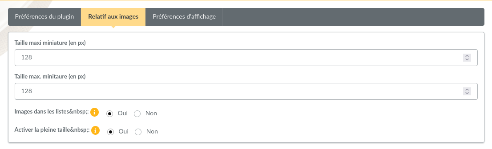
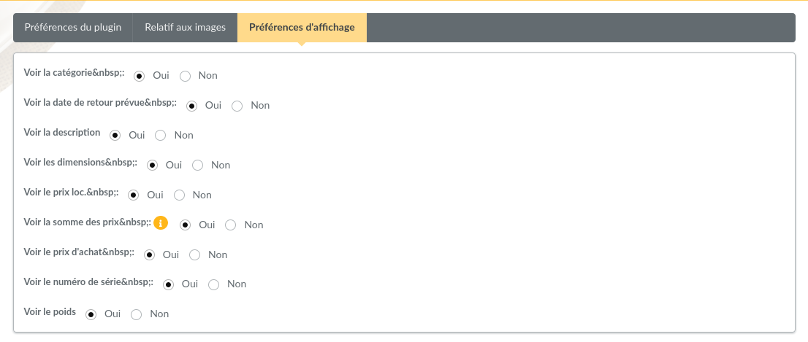

============
Objects lend
============

This plugin provides:

* objects management (description, size, lenght, price, ...)
* groups objects by categories,
* manage object state, and their presence in stock or not,
* manage lending and/or renting objects,
* contribution generation,
* ...

Installation
============

First of all, download the plugin:

.. image:: https://img.shields.io/badge/2.0.0-ObjectsLend-ffb619.svg?logo=php&logoColor=white&style=for-the-badge
   :target: https://galette.eu/download/plugins/galette-plugin-objectslend-2.0.0.tar.bz2
   :alt: Get latest ObjectsLend plugin!

.. image:: https://img.shields.io/badge/Nighly-ObjectsLend-ffb619.svg?logo=php&logoColor=white&style=for-the-badge
   :target: https://galette.eu/download/plugins/galette-plugin-objectslend-dev.tar.bz2
   :alt: Get ObjectsLend plugin nightly build!

Extract the downloaded archive in Galette ``plugins`` directory.
For example, under linux (replacing `{url}` and `{version}` with correct values):

.. code-block:: bash

   $ cd /var/www/html/galette/plugins
   $ wget {url}
   $ tar xjvf galette-plugin-objectslend-{version}.tar.gz

Database initialisation
=======================

In order to work, this plugin requires several tables in the database. See :ref:`Galette plugins management interface <plugins_managment>`.

And this is finished; ObjectsLend plugin is installed :)

Plugin usage
============

Once plugin has been installed, a `Object lend` group is added to Galette menu.

Defaults status are provided at installation, but they can not fit your needs, you can of course define your own.

.. image:: ../_styles/static/images/plugin-objectslend/status.png
   :scale: 50%
   :align: center

Define status, create categories and objects; users can lend objects with a reason, then give them back with location.

A lend history is provided for administrators and staff members from object page.

Preferences
-----------

Several preferences allows to change plugin behavior.

.. image:: ../_styles/static/images/plugin-objectslend/plugin_preferences.png
   :scale: 50%
   :align: center

From this screen, you can define if members can lend objects or not, if it should create a new contribution (and its type and description), if image should be displayed in objects list, and thumbnails size.

.. versionadded:: 0.5

It is possible to activate the fullsize photo display.

.. note::

   Photos sent with previous plugin version were always resized, only the thumbnail was stored. If you want to get fullsize display, you will have to send photos again.

