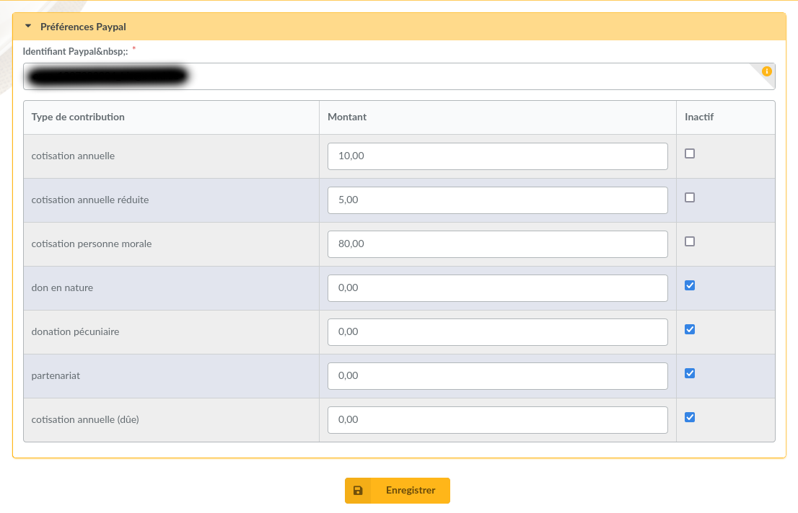
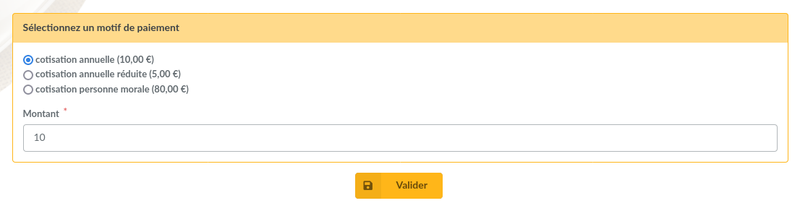
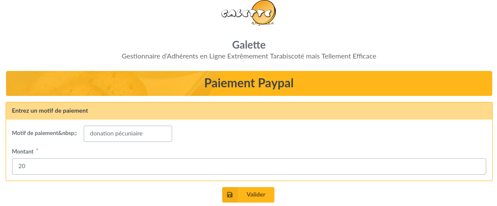

======
Paypal
======

This plugin provides:

* possibility to associate an amount to a contribution type,
* create a Paypal payment form,
* an history,
* automatic transaction storage once validated.

.. warning::

   Due to the way Paypal payments are handled, especially the payment confirmation, your instance must be publically accessible.

Installation
============

First of all, download the plugin:

.. image:: https://img.shields.io/badge/1.10.0-Paypal-ffb619.svg?logo=php&logoColor=white&style=for-the-badge
   :target: https://download.tuxfamily.org/galette/plugins/galette-plugin-paypal-1.10.0.tar.bz2
   :alt: Get latest Paypal plugin!

Extract the downloaded archive in Galette ``plugins`` directory.
For example, under linux (replacing `{url}` and `{version}` with correct values):

.. code-block:: bash

   $ cd /var/www/html/galette/plugins
   $ wget {url}
   $ tar xjvf galette-plugin-Paypal-{version}.tar.bz2

Database initialisation
=======================

In order to work, this plugin requires several tables in the database. See :ref:`Galette plugins management interface <plugins_managment>`.

And this is finished; Paypal plugin is installed :)

Plugin configuration
====================

Once plugin has been installed, a `Paypal` group is added to the menu, with some new entries:

* `Payment form`: the payment form itself, which is accessible as a public page,
* `Preferences`: plugin preferences, accessible for administrators and staff members.

In order to work properly, you need to fill a very important value: your Paypal account code. You can either use the email address associated with your Paypal account (but you will need to chang it in Galette if it changes on Paypal) or your merchant identifier. To find your merchant identifiant, log in to Paypal and you will find it in your account preferences. Changing identifier is only allowed for administrators.

Preferences screen also permit to edit amount related to contributions types, and to hide some types.

After that, any user can choose the contribution type, adjust the amount and pay from his Paypal account. If the user is a logged in member, and if the contribution type is a membershop extension, its membership wil be recalculated when the payment will be confirmed.

