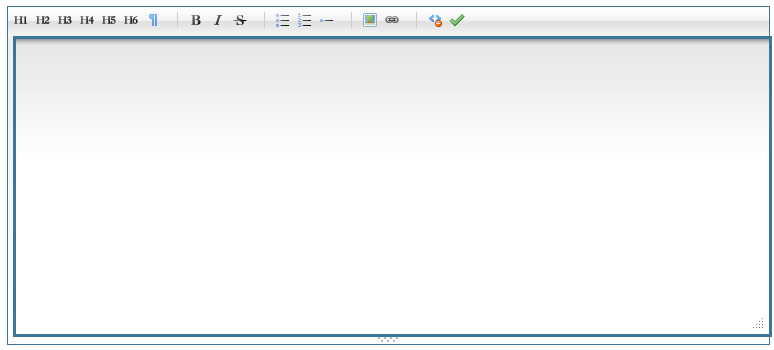
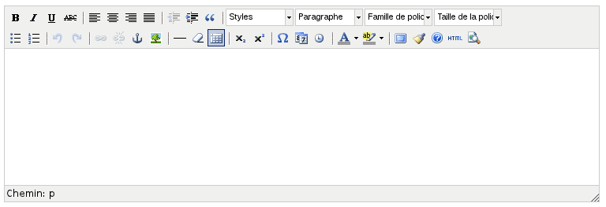

=======
TinyMCE
=======

Le plugin `TinyMCE <http://tinymce.moxiecode.com/>`_ fournit l'éditeur HTML du même nom, qui sera utilisé lors de la rédaction de mailings par exemple. Par défaut, c'est `markItUp <http://markitup.jaysalvat.com>`_ qui est inclus dans Galette, car il est d'une part bien plus léger ; et d'autre part beaucoup plus rapide à charger. Toutefois, il propose moins de fonctionnalités...

   L'éditeur HTML de base de Galette : markItUp.

   L'éditeur HTML de Galette TinyMCE (un fois le plugin installé)

Installation
============

Dans un premier temps, vous devez récupérer le plugin.

.. note::

   Aucune version stable du plugin n'existe actuellement.
   
   L'utilisation de la version de développement ne sera plus obligatoire dans le futur.

.. note::

   Sous Galette 0.7, le nom du dossier du plugin est important, ce doit être `TinyMCE` (sans respect de la casse) ; cette limitation a été levée dans les version postérieures.

Sous Linux, vous pourrez récupérer la version de développement du plugin de cette façon :

.. code-block:: bash

   $ cd /var/www/html/galette/plugins
   $ git clone git://git.tuxfamily.org/gitroot/galette/plugin-tinymce.git

Pour obtenir la version de développement :

* Sans utiliser git-flow :

.. code-block:: bash

   $ cd plugin-tinymce
   $ git checkout -b develop origin/develop

* en utilisant git-flow :

.. code-block:: bash

   $ git flow init
   Which branch should be used for bringing forth production releases?
      - master
   Branch name for production releases: [master] 
   Branch name for "next release" development: [develop] 
   
   How to name your supporting branch prefixes?
   Feature branches? [feature/] 
   Release branches? [release/] 
   Hotfix branches? [hotfix/] 
   Support branches? [support/] 
   Version tag prefix? []

Si vous êtes sous windows, suivez simplement la :ref:`récupération de la version de développement de galette sous Windows <gitwindows>`, veillez juste à entrer les valeurs ``git://git.tuxfamily.org/gitroot/galette/plugin-tinymce.git`` et ``c:\xampp\htdocs\galette\plugins\plugin-tinymce`` respectivement pour les chemins vers le dépôt et vers le dossier local.

Et voilà ; le plugin TinyMCE est installé :-)
