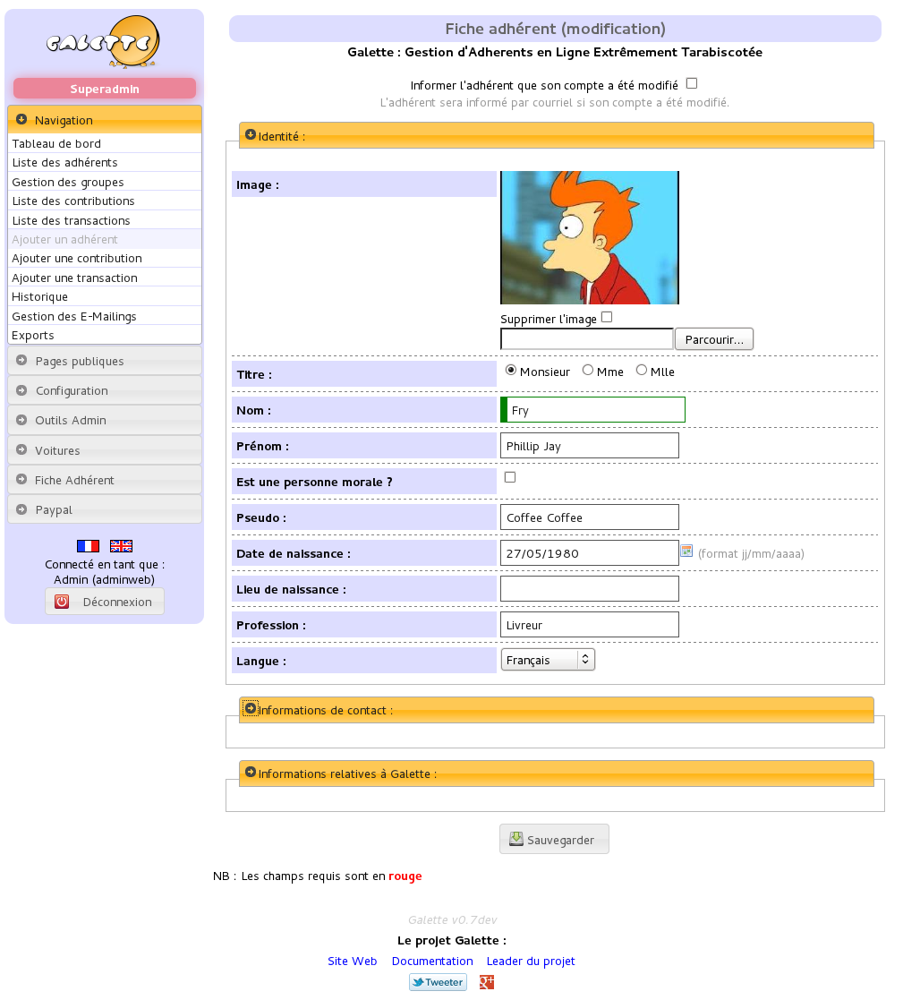
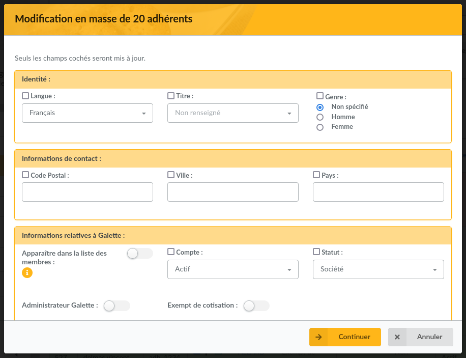
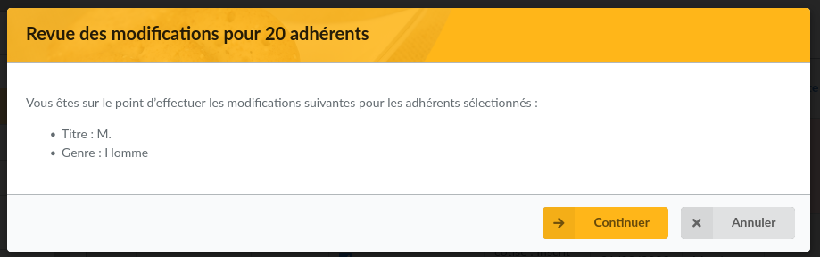
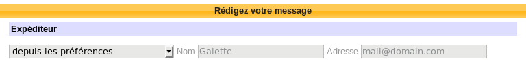
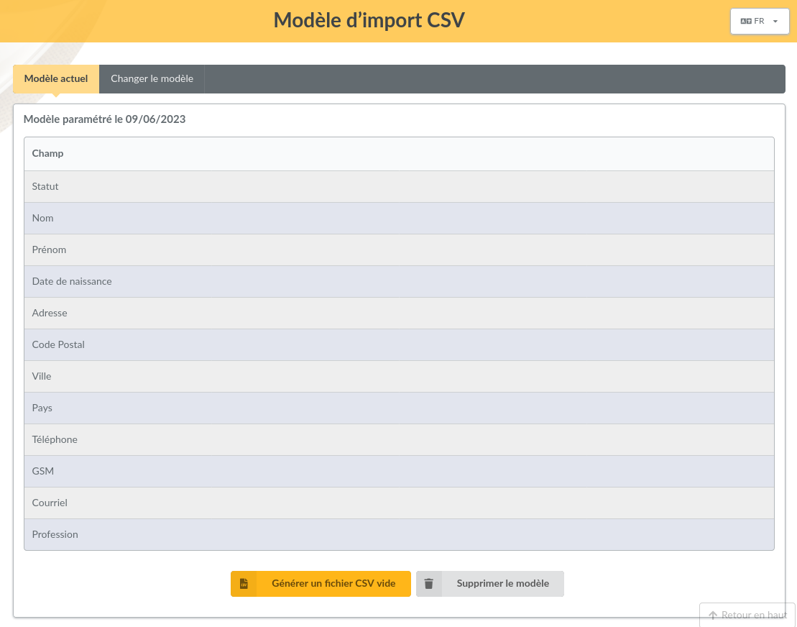
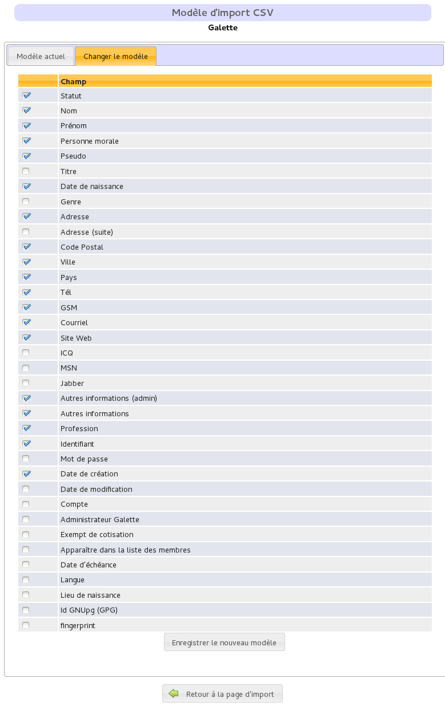
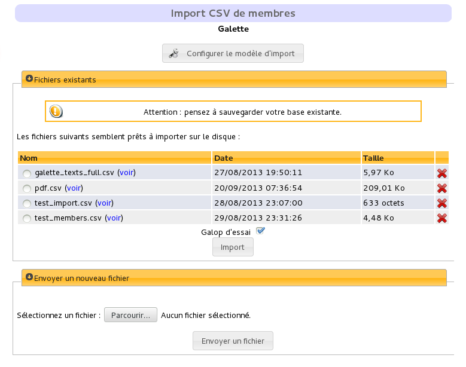

.. _man_adherents:

******************
Members management
******************

One of the first contact with Galette interface after the installation, login and dashboard will be members list, main part of the system. Of course, this list will be empty for now :)

.. note::

   You can use the "Generate fake data" from the "Configuration" menu to add demonstration data in your instance.

Let's start by creating a new member. As everywhere in Galette, mandatory fields are displayed with a red border; all other are optionnal. Different parts of the page (`Identity`, `Contact informations`, `Galette related data` and maybe `Dynamic fields`) can be retracted clicking on their respective title.

.. image:: ../_styles/static/images/usermanual/add_member.png
   :scale: 50%
   :align: center
   :alt: `Identity` screen part adding member

On date fields, you can access a calendar:

.. image:: ../_styles/static/images/usermanual/calendar.png
   :align: center
   :alt: Date selection

When storing a member (or any other object in Galette), page will be reloaded with all informations you've entered (excepting passwords).

Members list
============

Members list allows you to:

* filter and order members,
* display members card,
* removals,
* send mailings,
* generate PDF labels,
* generate PDF emargement lists,
* generate PDF members cards,
* CSV exports,
* mass changes.

Each possible action per member is grouped at the end of the line, actions designed to be applied on a selection are at the bottom of the list. Plugins may add entries in both cases.

Filter and select members
^^^^^^^^^^^^^^^^^^^^^^^^^

Filtering members list is documented in :ref:`search section <search_galette>`. All possibilities can be used with actions on selection.

Mass changes
^^^^^^^^^^^^

.. versionadded:: 0.9.1

Members selected in list can be edited (partially) at once.

Only fields with a checked checkbox at the beginning of the line will be changed. A summary will be displayed.

Ordering
^^^^^^^^
It is possible to order members list on following fields:

* name,
* nickname,
* status,
* contribution status,
* modification date.

Most of the times, the result is transparent. Just note ordering on `status` will use status priority and ordering on `contribution status` will use creation date, contribution exemption and due date;

Configure CSV fields
^^^^^^^^^^^^^^^^^^^^

Per default, CSV export for a members selection will provide same fields as the ones that are displayed on screen. It is possible to change this behavior specifiying yourself which fields must be exported in the ``galette/config/local_export_fields.inc.php`` file. If for example you only want identifier, first and last member names, the content of the file will be:

.. code-block:: php

   <?php
   $fields = array(
       'id_adh', 'nom_adh', 'prenom_adh'
   );

.. _emailing:

E-Mailing
=========

.. warning:: **Mailings in Galette are designed to work from the members list.**

   Direct mailing creation will work without problems, but members selection is harder.

From Galette, you can send mailings to a selection of members. Each sent mailing is stored in order to be reused, so you can select a stored mailing to be used as a template, retrieving selected members list, mailing subject and contents.

To send a new mailing, select members from the list and then use the `Send an email` button at the bottom of the list. If some of selected members does not have an email address, Galette will propose you to print corresponding labels.

.. image:: ../_styles/static/images/usermanual/mailing_selected_members.png
   :scale: 50%
   :align: center
   :alt: Selected members for mailing

.. note:: Selecting members in the list must be done on one page only. Filtering features, as well as the possibility to display all members will be useful ;)

.. versionadded:: 0.9.1

You can choose a sender for each mailing:

* **from Galette preferences** (default value): this will use informations stored in preferences,
* **current logged-in user**: will use the name and the email of the current logged-in user (not available for super admin),
* **other**: you can set any name and email address you want.

Once the subject has been filled, you can work on the contents. You can send email in text only, or in HTML (keep in mind sending HTML messages by mail is often not the way to go). A simple HTML WYSIWYG editor is provided.

Once the HTML editor is enabled, the checkbox to handle HTML tags is automatically checked, remember to check the box if you do not use the editor but want to send HTML!

.. warning:: Even if Galette is able to send HTML emails, this is discouraged. Messages lenght will be way larger (for almost nothing), and some (like me!) read their emails as text only. That is why Galette will **always** provide a text version of HTML emails.

It is also possible to add attachements, just click on the `Browse` button in that attachements section. If your browser is compatible, you can add several files at once (using `Shift` and `Ctrl` keys).
All attachements are stored on disk, under a directory named with the mailing identifier (automatically defined from database).

`Preview` button let you preview your message before sending it.

.. image:: ../_styles/static/images/usermanual/mailing_preview.png
   :scale: 50%
   :align: center
   :alt: Preview message

Any started emailings will be stored in your session to be retrieved in the future. An icon will be displayed in pages titles when a mailing is progress and will provide a link to go to it.

If you want, you can cancel this mailing using the `Cancel mailing` button, it will be deleted from your session. If you want to store it for a longer time, you can add the `Save` button. It will then be stored in the mailings list, and you will be able to grab it later.

Mailings history
^^^^^^^^^^^^^^^^

.. note:: When you start a mailing, it is stored into your session. Session ends when users log out, or on a server defined timeout. Mailing history stores the mailing in the database, this ensure it will always be available in the future.

Every sent mailing is stored into the database, and can be used as a template to write a new one. In this case, a new mailing will be created using informations from the history, and the original one will be kept as is.

Mailings can be stored before they are sent. In this case, it is possible to continue it later. When you use history on a draft mailing, original entry will be replaced on sending.

When you use an existing history entry, here are the informations that will be used:

* recipients,
* attachements,
* subject,
* message,
* html/text flag.

CSV imports
===========

It is possible to import member data from a predefined model. A default model is provided, but you can configure it to suits your needs, using the `Imports` menu entry.

Model
^^^^^

Import model defines fields and their order in a CSV file. When importing, current model will be used to check your CSV file intergity.

To configure the model, click on the `Configure` button from the UI.

If proposed model is not ok for you, click on `Edit model` and choose your fields:

Once you have selected your fields, click on the `Store new model` button.

When in the current model tab, you can download an empty model from the `Generate an empty CSV file` button. Of course, you can change model if you want, or remove it to get the default model back.

Import
^^^^^^

Once you have retrieved and fill the empty file, you have to send it using the form `Send a new file`. At this step, Galette will check your file extension is ``csv`` (or ``txt``) and it size does not exceed maximum upload file size (2Mio per default in PHP).

.. note::

   If you want to import a huge file, you can put it from your FTP client in the ``galette/data/imports`` directory, or split it into several smaller files you can import one by one.

Sent files are listed in the `Existing files` section. You can show, remove or import it:

The `dry run` checkbox (checked per default) is designed to test your file data are valid (mandatory fields filled, data formatting is correct, ...) without storing anything in the database.

When you import a CSV file, if one line is incorrect, previous ones may be stored in the database already; so it is advised to use the dry-run before to get error fixed.

You will have error messages than something went wrong (in dry-run mode or not):

.. note::

   You may see mandatory missing fields even if import is ok. This may happen when all the fields you set as required in Galette configuration are not listed in your import model.

.. _linkmembers:

Links beetween members
======================

.. versionadded:: 0.8.2

You can link several members to a "parent" one. This may be used to store families for exemple, or members of a same compagny. You can access children members from the parent, and parent from the children.

You can add as many child as you want for a member, but a child cannot become a parent.

The other interesting point of this system is you can retrieve some informations from the parent when sending mailings or labels. In the children members, email and postal addresses automatically become optionnal, whatever the configuration says. If any of those informations is missing, it will be retrieved from the parent.

.. note:: Members without email adresses cannot use the "retrieve password" feature. This does not affect the unicity email constraint in the database.

Impersonnating
==============

.. versionadded:: 0.9

Some issues may be related to a particular account, because of its ACLs, groups, ... In this case, it is unfortuntely frequent to see some credentials sent by insecure emails; which should really be avoid.

As super admininistrator user, you wil see an extra icon in the members list, allowing you to log in as selected user without his credentials. Once you've impersonnated the user, you can reproduce the issue and fix it or get all required informations to report the issue upstream.
