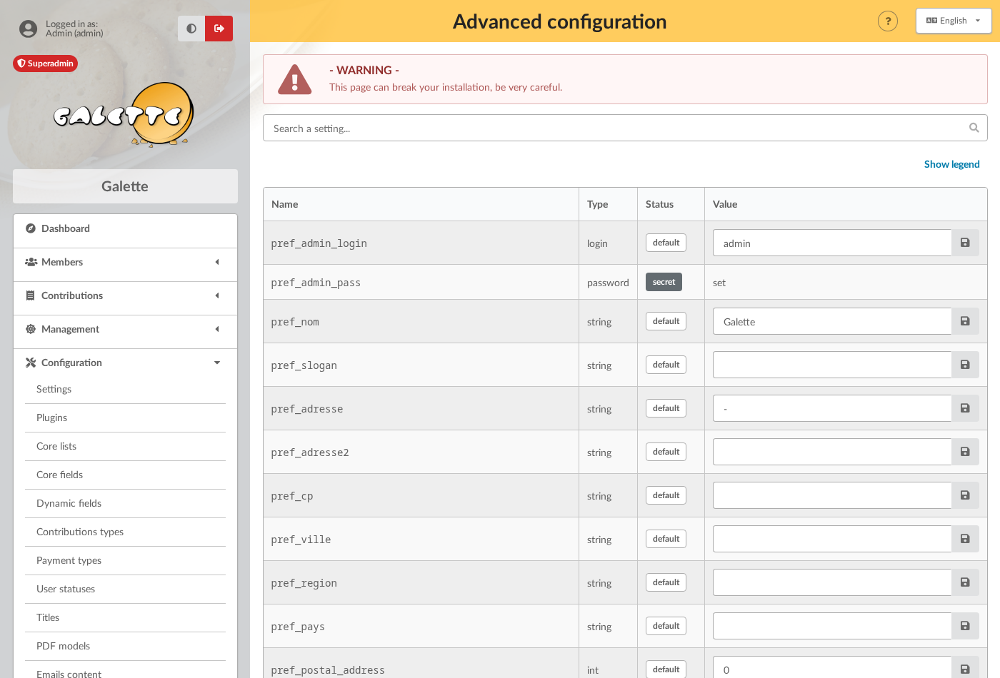
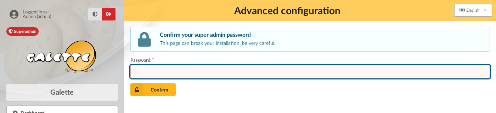
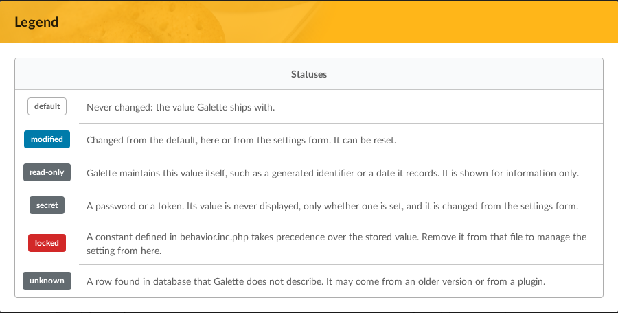
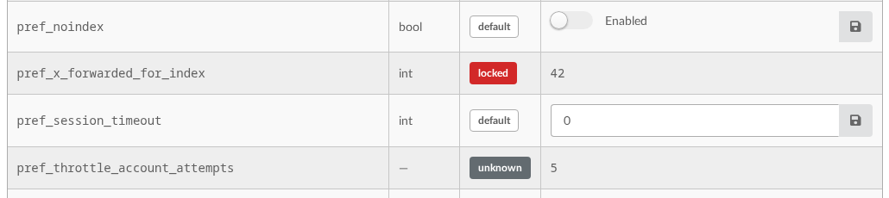
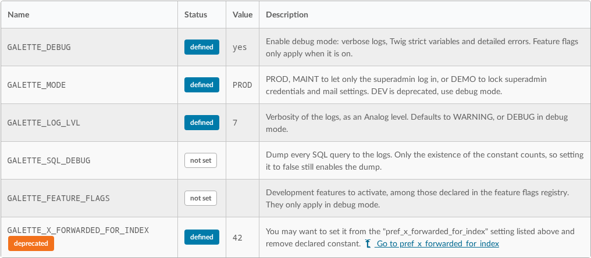

.. _man_avancees:

*****************
Experienced users
*****************

.. warning::

   Use only following instructions if you know what you are doing... "The management is not responsible for any case of [...]" :D

Adapt to your graphical chart
=============================

If you are comfortable with CSS stylesheets, you can adapt Galette CSS to fit your own colors. To achieve that, it is strongly discouraged to edit Galette CSS files, but rather the specific mechanism designed for that. Create a ``galette_local.css`` file in your ``webroot/themes/default`` directory with your styles, it will be automatically included.

Try to keep things as simple as possible. For example, if you want to change association name color (displayed under pages titles), you will find in Galette the CSS rule `#asso_name` that defines several parameters including the color. Then, in your stylesheet, you will just need the following:

.. code-block:: css

   #asso_name {
       color: red;
   }

This will be enough to display your association name in red. Note that local CSS file and all issues it may cause will not be taken into account by the Galette team, no support will be provided.

You also can override the print stylesheet, just create a ``galette_print_local.css`` file.

Add and change strings
======================

It is possible if needed to customize translated strings in Galette - without editing any Galette source file. Just create a ``galette_{mylang}_local_lang.php`` file (where `{mylang}` must be replaced with the language, like `fr_FR.utf8` or `en_US`) in the ``lang`` directory. This file must contains a simple PHP array with the original string (the one in Galette source code) as index.

As example,  we want to change the "Password" string on the login page in french, translated as `Mot de passe :`. The original string is `Password:` (see ``galette/templates/default/pages/index.html.twig``), its french translation is `Mot de passe :` and we want to replace it with `Secret :`; so we will create the ``galette_fr_FR.utf8_local_lang.php`` with the following contents:

.. code-block:: php

   <?php
   $lang['Password:'] = 'Secret :';
   return $lang;

Since Galette uses a cache system for translations, changes may not be visible immediately; you may have to restart PHP (or to clear cache). It is important to take the original string verbatim, punctuation included; and take care to escape single quotes (with a backslash) in all the strings.

You also can override langs for plugins using the same method, just place the file in plugins lang directory and name it ``{plugin}_{mylang}_local_lang.php`` where `{plugin}` is the routing name you can find in the ``_define.php`` file.

.. note:: This will work only if you use Galette translation features, and not with native gettext.

Change session lifetime
=======================

.. versionchanged:: 1.3.0

   The session lifetime is a setting stored in database, ``pref_session_timeout``, reachable from the :ref:`advanced configuration <advanced_config>` page. The ``GALETTE_TIMEOUT`` constant still works and still wins over it.

Per default, Galette will create session with default lifetime duration (and it seems browsers act differently in this case). Set ``pref_session_timeout`` from the :ref:`advanced configuration <advanced_config>` page to change it; the value is a number of seconds, and ``0`` means until the browser is closed.

If the ``GALETTE_TIMEOUT`` constant is still declared in :ref:`behavior configuration <behavior>`, it takes precedence and the setting shows as *locked*. Remove it from that file to manage the lifetime from the page.

.. _proxy_ip:

Log IP addresses behind a proxy
===============================

If your Galette instance is behind a proxy, IP address stored in history will be the proxy one, and not the user one :(

.. versionchanged:: 1.3.0

   The proxy depth is a setting stored in database, ``pref_x_forwarded_for_index``, reachable from the :ref:`advanced configuration <advanced_config>` page. The ``GALETTE_X_FORWARDED_FOR_INDEX`` constant still works and still wins over it.

To fix that, set ``pref_x_forwarded_for_index`` from the :ref:`advanced configuration <advanced_config>` page. Each proxy server appends its own address to the header, and the value is the position to read from the **end** of the list, starting at ``1``. So ``1`` is what you want behind a single reverse proxy, and ``0`` - the default - disables the lookup entirely.

.. warning::

   For security reasons, leave it to ``0`` if your instance is not behind a proxy! Anyone could otherwise send an ``X-Forwarded-For`` header of their own and have it logged in place of their address.

If the ``GALETTE_X_FORWARDED_FOR_INDEX`` constant is still declared in :ref:`behavior configuration <behavior>`, it takes precedence and the setting shows as *locked*.

External stats
==============

.. versionadded:: 0.9

Many statistics platforms rely on an extra  Javascript block to work. You can create a ``tracking.js`` file under ``webroot/themes/default`` directory, it will be automatically included.

Galette uses Javascript to work. If the code you add in the ``tracking.js`` file is incorrect, this may break Galette!

CSV exports
===========

.. versionchanged:: 1.0.0

   You can setup parameted exports with a `YAML <https://yaml.org/>`_ file instead of an XML one.

Galette provides a parameted CSV exports system. Only one parameted export is provided, but you can add your own to the ``config/exports.yaml`` file.

.. note::

   Legacy XML configuration file is still supported; if a duplicate identifier is found, YAML file takes precedence.

Let's examine existing "cotisations" parameted export:

.. code-block:: yaml

    - cotisations:
      # Model: List all cotisations amounts, begin and end dates with adherent name and town
      name: Cotisations
      description: Export de l'état des cotisations pour l'ensemble des adhérents
      filename: galette_cotisations.csv
      query: |-
        SELECT nom_adh, prenom_adh, ville_adh, montant_cotis, date_debut_cotis, date_fin_cotis
          FROM galette_cotisations
          INNER JOIN galette_adherents
            ON (galette_cotisations.id_adh=galette_adherents.id_adh)
      headers:
        - Name
        - Surname
        - Town
        - Amount
        - Begin date
        - End date
      separator: ;
      quote: \"

* each array entry is a unique identifier, lowercase without spaces or special character
* `name` and `description` are mandatory as used to display each parameted export in the user interface
* `filename` sets the filename for output file
* `query` is the query to execute, it's mandatory. There is no other limitation than the SQL engine ones, expect you cannot send them any parameters
* `headers` manages columns titles:

  * like in the above example, an array of columns titles of your own
  * if not present, Galette fields names will be exported. You can use named columns in your SQL query (``SELECT nom_adh AS "Column title" FROM ...``)
  * set to false (``headers: false``) to disable column headers output

* `separator` is the CSV separator that will be used. Possible values are:

  * semicolon (``;``) - default
  * comma (``,``)
  * tabulation character (``\t``)

* `quote` either double quote - default - or simple quote character
* to disable an export, you can add ``inactive: true``

.. _admintools:

Administration tools
====================

.. warning::

   All the admin tools operations are destructive, use them with caution, and **make sure you did a database backup** before!

There are a few tools provided for Galette admin that permits to:

* **reinitialize mailings contents** will reset all emails contents to default values,
* **reinitialize fields configuration** will reset all members core fields to their default value. This does not imply dynamic fields,
* **reinitialize PDF models** will reset all PDF models to default values,
* **generate empty logins and passwords** those information are required to improve security, but sometimes missing (if you import a CSV for example). This feature will set random values as login and password fields that would be empty in database.
* **Fix dynamic fields dates format** will convert all dynamic fields dates to the new format (see :ref:`dynamic fields <dynamic_fields>`).

.. _advanced_config:

Advanced configuration
======================

.. versionadded:: 1.3.0

The settings form only shows a curated set of settings. The **Configuration > Advanced configuration** entry lists them **all**, one row per setting, including those that have no place on the form and those that used to be reachable only by editing a PHP file.

.. warning::

   This page can break your installation, be very careful. Values are checked, but a setting that is perfectly valid can still be wrong for your instance, and nothing asks you to confirm before storing it.

Only the super administrator can reach the page, and the password is asked again before it opens. The confirmation is remembered for fifteen minutes; after that, or after a new login, it is asked again.

Settings are saved **one at a time**: each row has its own **Save** button, and a **Reset to default** button appears as soon as the value differs from the one Galette ships with. Nothing is submitted for the whole page, so a mistake on one row cannot take the others with it.

A value goes through the very same checks as the settings form, and is refused with the same messages: a number outside its bounds, a malformed email address, but also a change that would break a rule *between* settings, such as setting both a membership extension and a fixed beginning of membership.

A search field above the table filters the rows on the setting name. It needs Javascript; without it the whole list is displayed.

Each row carries a status, also recalled in the page legend:

* **default**: never changed, the value Galette ships with,
* **modified**: changed from the default, here or from the settings form. It can be reset,
* **read-only**: Galette maintains this value itself, such as a generated identifier or a date it records. It is shown for information only,
* **secret**: a password or a token. Its value is never displayed, only whether one is set, and it is changed from the settings form,
* **locked**: a constant declared in :ref:`behavior.inc.php <behavior>` takes precedence over the stored value. Remove it from that file to manage the setting from here,
* **unknown**: a row found in database that Galette does not describe. It may come from an older version or from a plugin. It is displayed, never edited.

A setting only shows an input when it can be edited from there. In the example below, ``pref_x_forwarded_for_index`` is locked by a constant and only displays what applies, while ``pref_session_timeout``, right after it, is editable:

A second table, below the settings, lists the constants ``behavior.inc.php`` understands, whether each one is currently declared, and what it is set to. It is there so you can see how the instance is configured without opening the file. A constant a setting now replaces only appears in that table while it is declared, along with a link to the setting it overrides.

.. _galettemodes:

Galette modes
=============

Several modes are provided in Galette you can configure with ``GALETTE_MODE`` constant (:ref:`see Galette behavior configuration <behavior>`). This directive can take the following values:

* ``PROD``: production mode (non production instance should be on another mode). This is the default mode for releases, but it may change in development branch.
* ``DEMO``: demonstration mode, the same as ``PROD`` but with some features disabled like sending emails, modifying superadmin data, ...
* ``TEST``: reserved for unit tests.
* ``MAINT``: maintenance mode. Only super admin will be able to login.

.. _debug:

Galette Debug
=============

.. versionadded:: 1.1.0

A dedicated constant name ``GALETTE_DEBUG`` can be used to enable debug mode. With this mode on:

- unstable/not finished parts will be activated,
- some data will not be stored in session,
- default log level is set to ``DEBUG``,
- news won't be cached,
- database version check will not be done.

.. _behavior:

**********************
Behavior configuration
**********************

Some of Galette behaviors are set by declaring constants in the ``galette/config/behavior.inc.php`` file. A commented example of every one of them ships as ``behavior.inc.php.dist``, next to it.

For example:

.. code-block:: php

   <?php
   define('GALETTE_DEBUG', true);

.. versionchanged:: 1.3.0

   Only the settings Galette needs **before it can reach database** are still declared here. The others became regular settings, editable from the :ref:`advanced configuration <advanced_config>` page.

The following are read too early to be stored in database, so this file is the only place they can be set:

* ``GALETTE_DEBUG``: enable debug mode, :ref:`see Galette debug <debug>`,
* ``GALETTE_MODE``: instance mode, :ref:`see Galette modes <galettemodes>`,
* ``GALETTE_LOG_LVL``: verbosity of the logs, as an `Analog <https://github.com/jbroadway/analog>`_ level. Defaults to ``WARNING``, or ``DEBUG`` in debug mode,
* ``GALETTE_SQL_DEBUG``: dump every SQL query to ``data/logs/galette_sql.log``. Only the existence of the constant counts, so defining it to ``false`` still enables the dump,
* ``GALETTE_FEATURE_FLAGS``: development features to activate, as an array. They only apply in debug mode.

Settings that moved
===================

.. versionadded:: 1.3.0

Three settings that used to be declared here are now stored in database, and edited from the :ref:`advanced configuration <advanced_config>` page:

* ``GALETTE_URI`` became ``pref_galette_url``,
* ``GALETTE_X_FORWARDED_FOR_INDEX`` became ``pref_x_forwarded_for_index``, :ref:`see logging IP addresses behind a proxy <proxy_ip>`,
* ``GALETTE_TIMEOUT`` became ``pref_session_timeout``.

Declaring one of them still works, and **still takes precedence over the stored value**: nothing breaks on upgrade. Galette then writes a warning in its logs, and the advanced configuration page shows the setting as *locked*, naming the constant responsible. Remove it from ``behavior.inc.php`` to manage the setting from the page.

.. note::

   ``pref_galette_url`` is the one setting the :ref:`reminders cron script <reminders>` cannot do without: it runs with no incoming request, so it has no way of guessing the address of your instance. Set it - or keep the constant - if you automate reminders.
