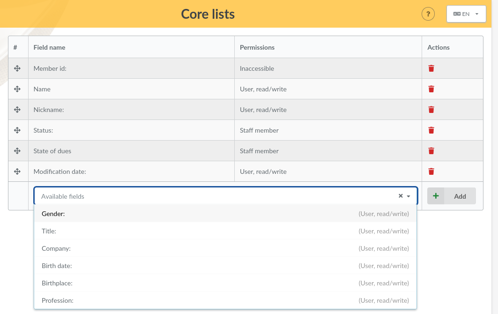

.. _man_configuration:

********************
Fields Configuration
********************

List fields
===========

.. versionadded:: 0.9.4

You can choose which fields will appears on Galette members list and the order they will appear with a drag & drop interface. Related access rights can be set from core fields configuration (see below).

.. note::

    Two fields are mandatory and cannot be moved: member number and name.

    It is not possible to set access rights on id column, and parent will be accessible for staff members only.

Mandatory fields and access rights
==================================

When you create or edit a member, some fields are mandatory. Default configuration may not suit your needs, but you can configure some elements easily ;)

From the `Configuration`, `Core fields` menu, you will get access to all fields available for members, and choose for each one if it is mandatory or not, as well as associated access rights:

* `inaccessible` will make the field inaccessible for everyone,
* `administrator` will make the field readable and writeable for administrators only,
* `staff members` will make the field readable and writable for staff members and administrators,
* `groups managers` will make the field readable and writable for groups managers on the memebrs of groups they own, and for staff memebrs and administrators,
* `read/write` will make the field readable and writeable for member, groups managers, staff members and administrators,
* `read only` will make the field read only for the members, but writable for groups managers, staff members and administrators.

.. image:: ../_styles/static/images/usermanual/fields_config.png
   :scale: 50%
   :align: center
   :alt: Core fields management

Dynamic fields
==============

Galette comes per default with many fields for members, contributions and transactions. Some of them will be useless, but you may need fields that does not exists...

In this case, that is quite simple : just add a new dynamic field with a label, define if it is mandatory or not, and that's all : Galette will handle them automatically, just show the result ;)

There are several types of dynamic fields:

* `separator`: just a label, like a part title,
* `free text`: multiline text area,
* `single line`: one line text,
* `choice`: a dropdown list,
* `date`: a date field with a selector,
* `boolean`: a checkbox,
* `file`: add files.

While creating a new field (or editing an existing one); you also can:

* mark it as required,
* define access rights, the same as for core fields,
* add extra information to help users.

.. image:: ../_styles/static/images/usermanual/champs_dynamiques_rendu.png
   :scale: 50%
   :align: center
   :alt: A dynamic field

Some field types like separators, dates and booleans, does not need any extra information; for others:

* `free text`:

  * `width`: define number of columns,
  * `height`: define number of rows.

* `single line`:

  * `width`: field width,
  * `size`: number of characters,
  * `repeat`: number of possible ocurences.

* `choice`:

  * `values`: possible values for the dropdown.

* `file`:

  * `size`: maximum file size, in Kio (this size is limited to the one for the PHP configuration).

Labels translation
==================

Galette handle several languages, but when you add a new dynamic field, there is only one value possible. Galette proposes an interface to translate those labels in each available language.

Note that each new label will be added with current Galette lang.

Emails contents
===============

Depending on your configuration (see preferences), administrative emails cans be sent to users and/or administrators, when you add a new member or a new contribution, or from the lost password feature for example.

Defaults are provided, but you can change them.

.. note:: It is important to note that those textes contain variables - of the ``{VARIABLE}`` form - that will be replaced automatically on sending. Be carefull to not forget any of those, that could cause sending issues.

.. image:: ../_styles/static/images/usermanual/edit_mails.png
   :scale: 50%
   :align: center
   :alt: Edit mail send to a new member in french

An email will be send to member when:

* he self subscribes. This mail contains authentication informations,
* his card is added or edited by someone else (if the corresponding box is checked),
* he uses lost password feature,
* a new contribution is attache to his account (if the corresponding box is checked).

An email will be send to administrators when:

* a new member is added or self subscribes,
* a new contribution is attached to his account.

Of course, emails will be sent ony if Galette configuration allows it (and the setup is correct). Sending messages to administrators is configured globally from the preferences, while sending emails to members is conditionned on a checkbox from the user interface, excepting for self subscription messages that will always be send.

Several variables - automatically replaced on sending - are available for both subject and contents. Some of them may be used in all messages, but others will be only on some conditions. Refer to the inline help on Galette interface to know more.
