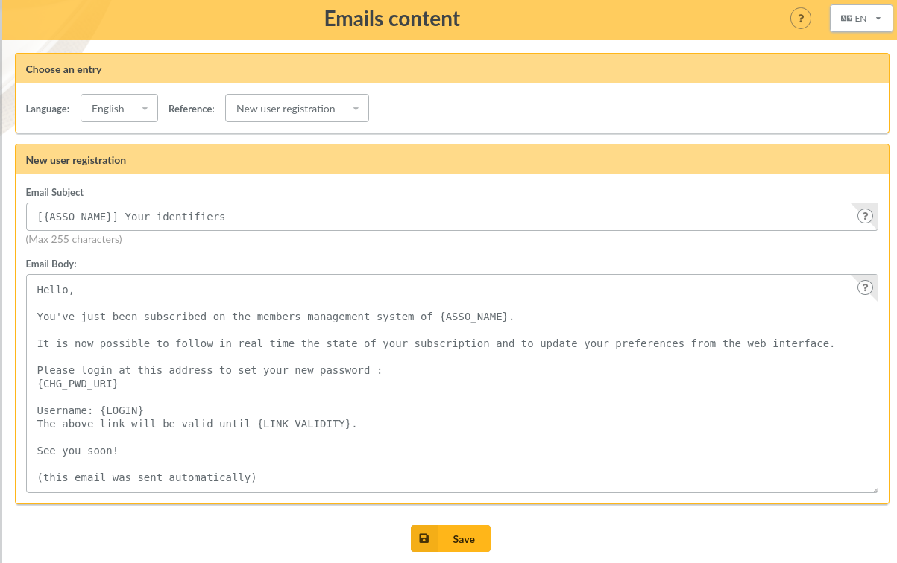

.. _man_configuration:

***********************
Configurer les éléments
***********************

Champs obligatoires et droits d'accès
=====================================

Lors de la saisie ou de la modification de fiches adhérents, certains champs sont marqués comme étant requis. Bien entendu, cette sélection par défaut peut ne pas vous convenir, mais vous avez la possibilité de paramétrer ça facilement :-)

Depuis le menu `Configuration`, `Champs du coeur`, vous aurez accès à la liste des champs de la fiche adhérent, il vous suffira pour chacun d'entre eux, de définir si oui ou non il est requis, ainsi que les droits d'accès associés :

* `personne` correspond à un champ inaccessible par quiconque (désactivé, en fait),
* `administrateur` correspond à un champ accessible en lecture/écriture par les administrateurs de l'application uniquement,
* `membre du bureau` correspond à un champ accessible en lecture/écriture par les membres du bureau et les administrateurs,
* `responsables de groupes` correspond à un champ accessible en lecture/écriture par les responsables du groupe auquel appartient l'adhérent, les membres du bureau et les administrateurs,
* `lecture/écriture` correspond à un champ accessible en lecture/écriture par l'adhérent, les responsables du groupe, les membres du bureau et les administrateurs,
* `lecture seule` correspond à un champ accessible en lecture seulement par l'adhérent, en lecture/écriture pour les responsables du groupe, les membres du bureau et les administrateurs.

Ajouts de champs supplémentaires
================================

Galette propose par défaut un certain nombre de champs, pour la gestion des adhérents, des contributions et des transactions. Certains champs ne vous seront probablement pas utiles, mais d'autres vont peut-être cruellement vous manquer...

Dans ce cas, c'est simple : créez un nouveau champ, sélectionnez son type, donnez lui un libellé, définissez s'il est requis ou optionnel ; et c'est tout : Galette se chargera du reste, il suffira d'admirer le résultat... ;-)

Il vous est proposé quatre types de champs dynamiques :

* `séparateur` : juste un libellé, comme un titre de partie,
* `texte libre` : ajoutera une zone de texte multiligne,
* `ligne simple` : ajoutera une zone de texte monoligne,
* `choix` : ajoutera une liste de choix,
* `date` : ajoutera un champ de type date, avec sélecteur,
* `booléen` : ajoutera une case à cocher,
* `fichier` : permettra de lier des fichiers à la fiche adhérent.

Lors de la création d'un nouveau champ (ou de la modification d'un champ existant) ; vous aurez également la possibilité de :

* choisir si le champ est visible par tous ou uniquement aux administrateurs,
* rendre le champ obligatoire,
* définir ses droits d'accès, suivant les mêmes modalités que pour les champs du cœur.

.. image:: ../_styles/static/images/usermanual/champs_dynamiques_rendu.png
   :scale: 50%
   :align: center
   :alt: Un champ dynamique de chaque type possible sur la fiche adhérent

Certains champs - comme les séparateurs, les dates et les booléens - ne requièrent aucune autre information complémentaire ; pour les autres :

* `texte libre` :

  * `largeur` : définit la largeur de la zone de texte,
  * `hauteur` : définit la hauteur de la zone de texte.

* `ligne simple` :

  * `largeur` : la largeur de la zone,
  * `taille` : le nombre de caractères maximum que peut contenir la zone,
  * `répétition` : nombre d'occurrences possibles de ce champ.

* `choix` :

  * `valeurs` : la liste des valeurs possibles pour la liste de choix.

* `fichier` :

  * `taille` : taille maximale du fichier, en kilo-octets (cette taille ne peut être supérieure à la limite imposée par la configuration de PHP).

Traduction de libellés
======================

Galette est multilingue, l'ajout de nouvelles valeurs telles que les libellés des champs dynamiques ne permet l'adjonction que d'une seule et unique valeur (monolingue donc). Galette propose donc une interface qui vous permet de traduire de tels libellés dans les différentes langues disponibles.

Notez que par défaut, tout libellé entré correspondra à sa traduction dans la langue courante de Galette.

Contenu des courriels
=====================

En fonction de la configuration (voir les préférences), des courriels peuvent être envoyés aux adhérents et/ou aux administrateurs ; lors de la création d'une nouvelle fiche, ou lors de l'ajout d'une contribution par exemple.

Les textes en question sont fournis par défaut, et une interface vous est proposée pour les modifier.

.. note:: Il est important de noter que les textes en question comportent des variables - notées sous la forme ``{VARIABLE}`` - qui seront remplacées automatiquement lors de l'envoi du message. L'oubli de l'une de ces valeurs peut potentiellement causer des problèmes d'envoi des messages.

Si ce paramètre est actif, un courriel sera envoyé à l'adhérent lorsque :

* il s'auto inscrit. Ce courriel comporte typiquement ses identifiants de connexion,
* sa fiche est ajoutée ou modifiée par qui de droit (à condition que la case correspondante soit cochée lors de la saisie),
* il demande à réinitialiser son mot de passe,
* une nouvelle contribution est attachée à son compte (à condition que la case correspondante soit cochée lors de la saisie).

De même, un courriel sera envoyé à l'administrateur lorsque :

* un nouvel adhérent est inscrit ou s'auto inscrit,
* une contribution est attachée à un compte.

Les courriels ne seront bien entendus envoyés que si le paramétrage de Galette permet l'envoi de messages (et si cela est configuré correctement). L'envoi de messages aux administrateurs est configuré de manière globale dans les préférences ; tandis que l'envoi de message à l'adhérent passe par une case à cocher au coup par coup dans l'interface, sauf pour le mail d'auto-inscription qui sera envoyé systématiquement.

Un certain nombre de variables - remplacées automatiquement lors de l'envoi - sont disponibles, à la fois pour le sujet et pour le corps du message. Certaines sont utilisables pour la totalité des messages, d'autres (comme les informations de l'adhérent ou son mot de passe) ne le sont que dans certains contextes spécifiques.

Voici la liste des variables disponibles :

* `{ASSO_NAME}` : le nom de l'association, disponible globalement,
* `{ASSO_SLOGAN}` : le slogan de l'association, disponible globalement,
* `{NAME_ADH}` : le nom de l'adhérent, disponible sous réserves,
* `{MAIL_ADH}` : l'adresse courriel de l'adhérent, disponible sous réserves,
* `{LASTNAME_ADH}` : nom de l'adhérent, disponible sous réserves,
* `{FIRSTNAME_ADH}` : prénom de l'adhérent, disponible sous réserves,
* `{LOGIN}` :  l'identifiant de connexion de l'adhérent, disponible sous réserves,
* `{LOGIN_URI}` : l'URL de Galette, disponible globalement,
* `{PASSWORD}` : le mot de passe de l'adhérent, disponible uniquement depuis la page d'auto inscription,
* `{CHG_PWD_URI}` : lien de modification du mot de passe, disponible uniquement depuis la réinitialisation du mot de passe,
* `{LINK_VALIDITY}` : durée de validité du lien, disponible uniquement depuis la réinitialisation du mot de passe,
* `{DEADLINE}` : date de fin, disponible uniquement lors de la création d'une contribution,
* `{CONTRIB_INFO}` : informations sur la contribution, disponible uniquement lors de la création d'une contribution,
* `{CONTRIB_AMOUNT}` : montant de la contribution, disponible uniquement lors de la création d'une contribution,
* `{CONTRIB_TYPE}` : type de contribution, disponible uniquement lors de la création d'une contribution,
* `{DAYS_REMAINING}` : nombre de jours d'adhésion restants, disponible uniquement pour les courriels de rappel,
* `{DAYS_EXPIRED}` : nombre de jours depuis que l'adhésion a expiré, disponible uniquement pour les courriels de rappel.

