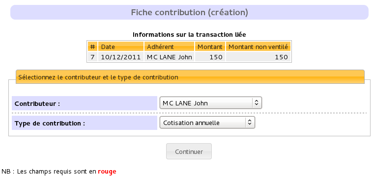

.. _man_contributions:

*************************
Gestion des contributions
*************************

Les contributions
=================

Une contribution peut correspondre à une cotisation, à un don, à un cadeau, ... Galette vous permet d'enregistrer cela pour chaque adhérent. Les types de contributions sont paramétrables (le point suivant traite du sujet).

Types de contribution
^^^^^^^^^^^^^^^^^^^^^

Les Transactions
================

.. image:: ../_styles/static/images/usermanual/transactions_list.png
   :scale: 75%
   :align: center
   :alt: Liste des transactions

Les transactions correspondent à un règlement global d'un adhérent. Chaque transaction est ensuite ventilée en contributions à concurrence du montant de la transaction. Ainsi, une transaction n'aura aucun effet sur la date de fin d'inscription d'un adhérent.

.. image:: ../_styles/static/images/usermanual/transactions_add.png
   :scale: 75%
   :align: center
   :alt: Ajout d'une transaction

Seules quelques informations sont nécessaires à la création d'une transaction :

* une brève description,
* l'émetteur,
* la date (renseignée par défaut la date du jour),
* le montant.

Après enregistrement d'une transaction, vous serez redirigé vers la fenêtre de création d'une contribution. Si la contribution entrée ne ventile pas entièrement le montant de la transaction, il vous sera proposé d'en créer une nouvelle, et ainsi de suite. Par défaut, toute nouvelle contribution créée à partir d'une transaction prendra comme montant la somme non ventilée de la transaction.

Bien entendu, il vous est aussi possible de modifier une transaction après coup :

.. image:: ../_styles/static/images/usermanual/transactions_edit.png
   :scale: 75%
   :align: center
   :alt: Modification d'une transaction

Vous pourrez également lui associer une contribution existante, ou en créer une nouvelle.

.. image:: ../_styles/static/images/usermanual/transactions_edit_add_contrib.png
   :scale: 50%
   :align: center
   :alt: Ajout d'une contribution existante à une transaction

