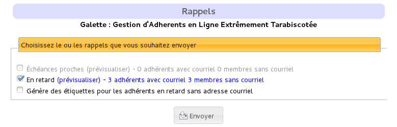
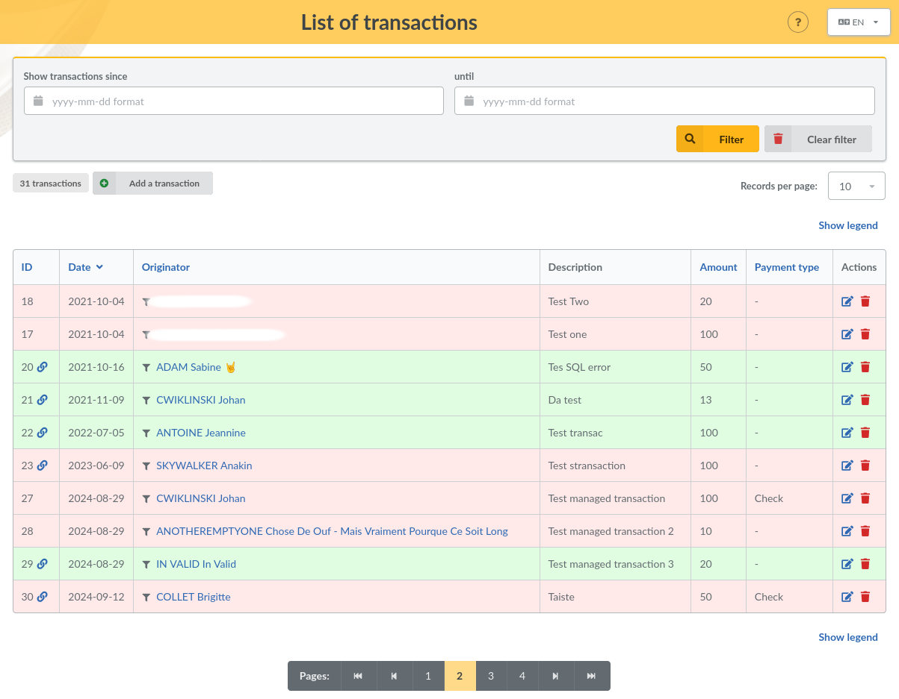
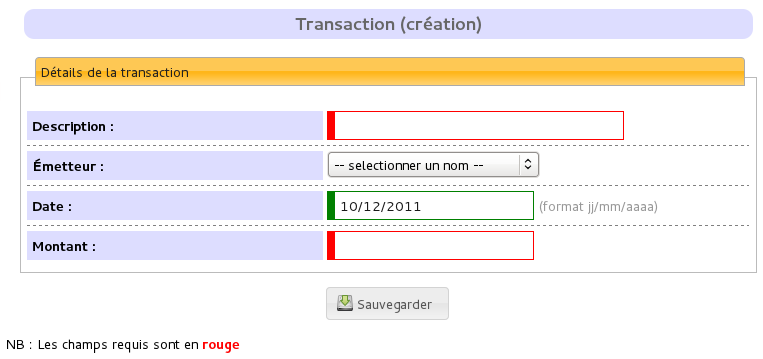
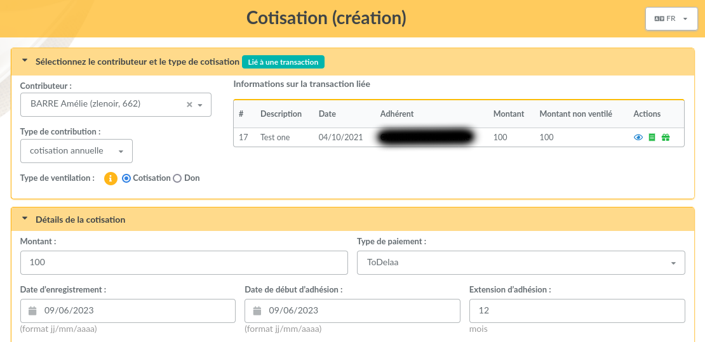
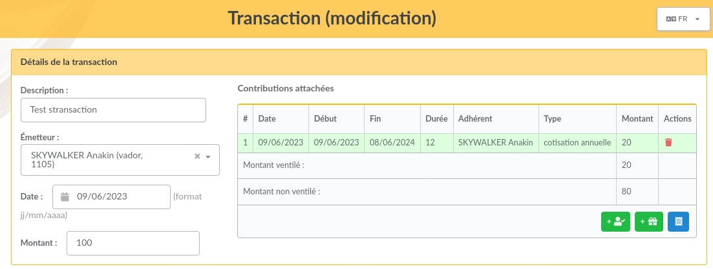
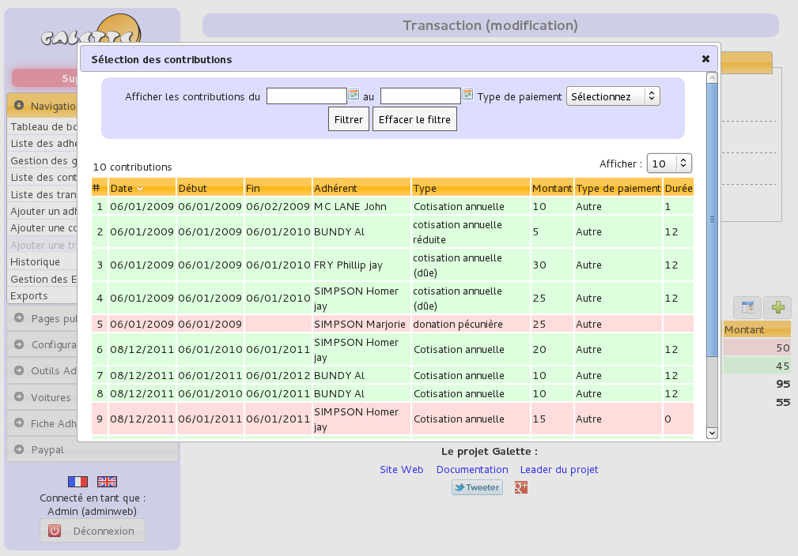

************************
Contributions management
************************

Galette allows you to manage contributions sent from your members. There are several types of contributions, and transactions are also proposed.

A transaction? What's that? Well, a simple example is better than a long text... We will use three members of a same association: Marc, Julie and Zac. Each one is member, independently of which group or else they are affected to, that does not matters.

Zac send you a check to pay his own membership, Marc and Julie ones and also a donation to the association. In this case, Zac's check will be handled in a transaction attached to his account, and which will be distributed in four contributions, each one attached to corresponding member.

Another example: Pierre pays his own contribution, his transaction will only contains his membership and will be distributed in only one contribution.

If Pierre, Zac, Julie or Marc are late, you can send them a :ref:`reminder <reminders>` :p

Contributions
=============

A contribution can be a membership, a donation, a gift, ... Galette allows you to store all of that for each member.

Contributions types
^^^^^^^^^^^^^^^^^^^

Contributions are entirely configurable. There are two main types of contributions in Galette:

* the ones that extends a membership (a montly or yearly membership for example),
* the ones that do not extends membership, like donations.

Contribution types management allows you to define a label, and if it extends the memebrship or not.

.. _reminders:

Reminders
^^^^^^^^^

Emails models to remind due dates are available from the emails contents ("Impending due date" and "Late due date").

The reminder button from the dashboard or the reminders entry of the menu will give you access to the reminders management interface.

Two categories can be selected:

* members whose due date is close,
* members whose due date is in the past.

Per default (this is currently not configurable), reminders are sent one month, then seven days before the due date; and then one and two months after the due date expiration. Reminders are stored in the database, if you never sent any reminder, all matching members will be reminded.

Galette will tell you if some members do not have an email address, you can print labels for those ones.

Finally, it is possible to automate reminders with a cron task which will call the ``galette/reminder.php`` file. If you want reminders to be sent every day at 8:30 AM, then you can add a ``/etc/cron.d/galette`` file (on Fedora and similar, look at your system documentation to know how to add a crontab) with the following content:

.. code-block:: bash

   30  8  *  *  *  apache /usr/bin/php -f /var/www/galette/reminder.php

Invoices and receipts
^^^^^^^^^^^^^^^^^^^^^

In the contributions list, there is a PDF icon which is designed to generate invoice ou receipt for one contribution.

You can customize the PDF using :ref:`PDF models <pdf_models>`.

Transactions
============

As seen in the example from this chapter introduction, a transaction is a global payment for a member.

Only a few informations are required to add a new transaction:

* a description,
* the originator,
* the date (current date per default),
* the amount.

Each transaction is dispatched among contributions, in the limit of the transaction amount. A transaction has itself no effect on members due dates.

After adding a new transaction, you will be redirected to a new contribution creation. If this new contribution does not dispatch the remaning amount of the transaction, galette will propose you to create another one. Per default, the amount of a new contribution from a transaction will be the remaning amount of the transaction.

Of course, it is also possible to edit a transaction:

You can also attach an existing contribution instead of creating a new one.

.. _dropdown_members:

Members selection
=================

.. versionadded: 0.9.2

The dropdown list to choose a member is available from contributions and transactions (as well as from several plugins) displays only a few members, for performances reasons.

You can display more members using the "Load following memebrs..." link, and you can also try to search entering any text (this will search in first name, last name and identifiers).
