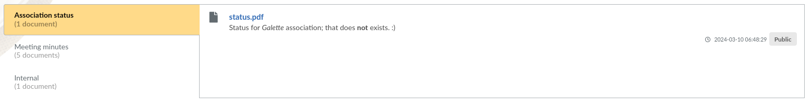
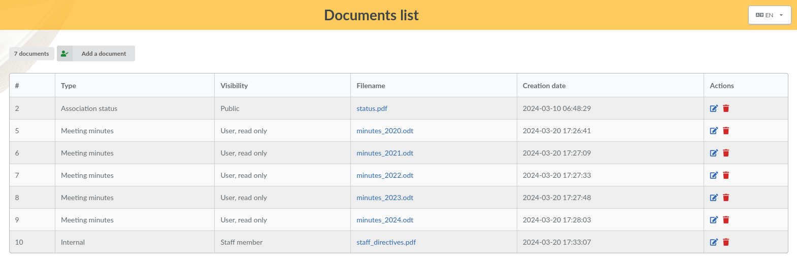
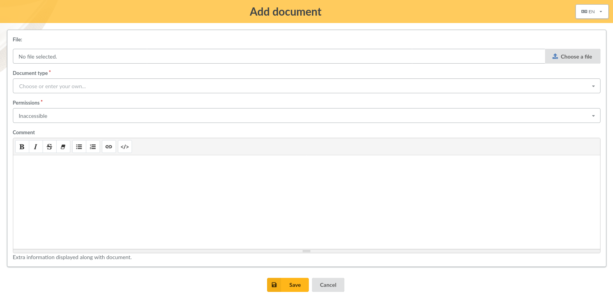
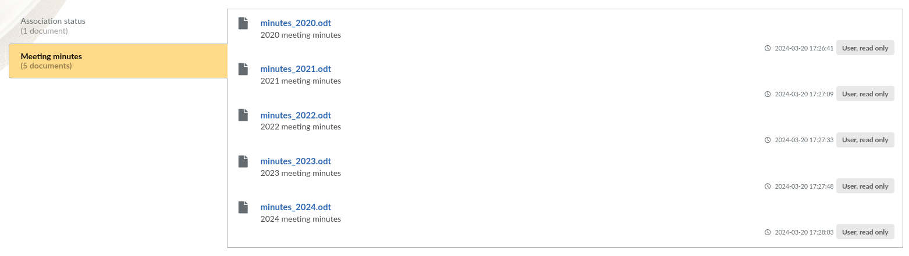

.. documents:

*********
Documents
*********

.. versionadded: 1.1.0

You can store and share administrative documents from Galette, like statuses, meeting minutes, and so on.

This is dispatched in two parts:

* **Documents management**: where you can add, edit, and delete documents - available from Management, Documents menu;
* **Public list**: where documents can be seen - available from Public pages, Documents menu.

Management
==========

When creating or editing a document, you will of course choose a file to upload, a document type and a permission.

Several possible documents types are available from the list, you add a new one by just entering your text in the field.

Permissions will determine which documents will be displayed on public page; according to the user's rights.

Public list
===========

Documents public list is, as all public pages in Galette, related to "Show public pages" parameter from settings; but it's also related to specific access rights which has been set on each one.

On the above screenshot, a simple member is logged and can only see documents which are public and which are allowed for users. The internal document is restricted to staff members and therefore is not shown here.