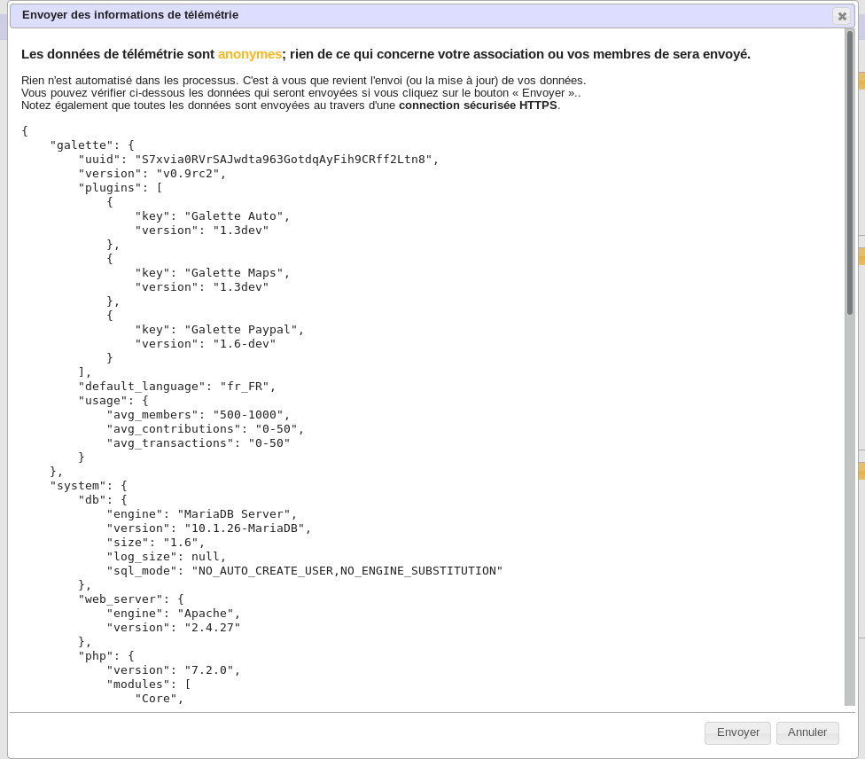
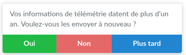
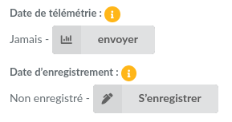
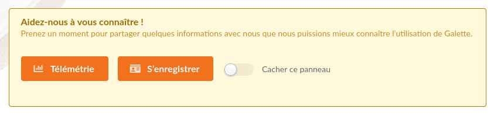

.. _man_generalites:

************
Generalities
************

Rights
======

We can see several rights level in Galette, allowing access to different parts and features of the application. Levels are:

* **super administrator** is a special user (the only one that is not a member) created at installation,
* **administrators** are members for who the "administrator" checkbox has been checked,
* **staff members** have a specific status (President, Treasurer, Secretary, ...),
* **groups managers** have only rights on the groups they manage,
* **up to date members** are members whose account are active, and whose subscription are up to date,
* **members** are members whose account is inactive or whose subscriptions are not up to date,
* simple **visitors**.

Staff members, administrators as well as the super administrator can create, edit and remove members, contributions, transactions, send emailings, ...

Administrators have also access to the application configuration, excepted super admin information.

The super administrator has a full access to the application, but not to all features. Indeed, this is not a member account, and it cannot have some of required information. He of course can change its own login information from application preferences.

Members can change their own information, and can see their contributions and transactions (as read only).

Visitors can - if this is parameted in preferences - access to public pages (trombinoscope, public members list) but can also register :)

Group managers
^^^^^^^^^^^^^^

With the stricter configuration, groups managers can show and search on members of their groups, and see accessible data for members.
On members and cards, you can :ref:`configure which fields are accessible <fields_acls>`.

From the preferences, you can also :ref:`give groups managers extra rights <pref_rights>`, like editing or creating members.

Management rules
================

Due dates are calculated by day. If a member pay into before the end of his membership, duration of this membership will be added to remaining days. Example:

 | Roger subscribed on 2004-01-01 for one year,
 | if he pays into for a year on 2004-12-13,
 | his due date will become 2006-01-01.
 | No day will be forget.

At the contrary, if a member renew his membership late, we evaluate again his membership duration:

 | Roger subscribed on 2004-01-01 for one year,
 | if he pays into for a year on 2006-01-13,
 | his due date will become 2006-01-13.

He is not an up to date member from 2006-01-01 to 2006-01-13... On paper at least :)

Those rules are flexible because you can freely change membership dates on contributions, if you have rights to add or update them. We can imagine an association who stores all contributions on the first day of the next month (offering its members a longer membership time).

Interface
=========

We do our best for the Galette interface to be:

* logical and consistent (you will always find icons at familiar places),
* web standards compliant (HTML and CSS valid),
* HTML semantic respectful,
* accessible (without any WCAG, WAI or equivalent tests run).

If you find places where one of those points is incorrect, do not hesitate to tell us on the tracker or on the mailing list!

Telemetry
=========

.. versionadded:: 0.9

Galette propose to send some telemetry information:

* **entirely anonymous**: no information about your association or your members is sent,
* **deliberately blurred**: we retrieve an estimation of members count, never a real count,
* sent by a **secured** way (`HTTPS`) on https://telemetry.galette.eu.

Sending telemetry data is a manual process, nothing will be send until you **explicitely** ask it. With those information, we can have a better knwownledge of different usages of Galette, their number of member or contributions, plugins used, ...

Those information are useful for the project development and promotion. When you send those information, you can review data that would be sent.

After data has been sent once, Galette will propose to send an update from time to time. You can also send them from Galette preferences.

It is also possible to register your association on the website, of course, not anonymously, but it is not possible to link telemetry and registration. New references are moderated.

You can update your registration information from Galette preferences. The form will be blank (because it is not possible to retrieve data you've sent) but all data will be updated because your instance has a unique registration identifier designed for that.

A new panel has been added on Galette dashboard to send telemetry information and/or register your instance. Once those steps has been completed, the panel will dissapear. You also can choose to just disable it.

