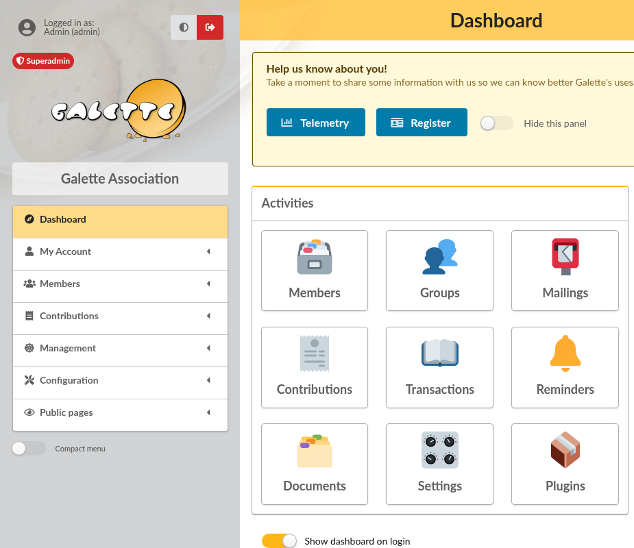

.. _man_getting_started:

***************
Getting started
***************

Galette has just been installed for your association, and you wonder where to start? This page walks you through the first steps, in order. Each step links to the part of this manual that describes it in detail.

1. Secure the super administrator account
=========================================

During the installation, a **super administrator** account has been created. This account is not a member: it is the "master key" of your Galette, it can do everything, but it should not be used every day.

* Log in with it, then go to **My Account**, then **My information**, and set a strong password,
* keep that password somewhere safe.

For daily work, it is better to use the member accounts of the people who run the association:

* a member whose status is a board status (president, treasurer, secretary by default) is a **staff member**,
* checking **Galette Admin** on a member card makes this member an **administrator**.

See :ref:`rights <man_generalites>` to know what each one can do.

2. Fill in your association information
=======================================

Go to **Configuration**, then **Settings**. The **General** tab holds the information about your association:

* its name and a short description, displayed on every page,
* its logo,
* its address, phone number, email address and website.

They are used on the screens, but also on the documents Galette produces: invoices, receipts, member cards... Then click on **Save**.

Two settings of the **Parameters** tab decide how memberships are counted, and deserve a look right away:

* **Default membership extension**: how many months a membership fee lasts, usually 12,
* **Beginning of membership**: set it if all memberships of your association start on the same day of the year (on January 1st, or at the beginning of your season, for example). Leave it empty if each membership lasts from the day it is paid.

All the settings are described in :ref:`Galette preferences <man_preferences>`, and the way due dates are calculated in :ref:`management rules <management_rules>`.

3. Check that emails can be sent
================================

Galette sends emails: login information to new members, password recovery, reminders, mailings... In the **E-Mail** tab of the settings, choose how emails are sent and set the sender address. Use **Test connection**, then **Send a test email**, to make sure a message really arrives before going further.

Ask your web host which settings to use. Without them, members cannot recover a lost password by themselves.

4. Adapt the lists to your association
======================================

Galette comes with ready to use lists, which you can rename, complete or remove from the **Configuration** menu:

* **User statuses**: the roles of the members in your association (president, treasurer, active member...),
* **Contributions types**: the kinds of membership fees and donations you receive,
* **Payment types**: the ways your members pay (cash, check, credit card...),
* **Titles**: Mr., Mrs....

Take a few minutes to adapt them now: they will appear in every form afterwards.

If you need to record information Galette does not know about, such as a licence number, you can add your own fields from **Configuration**, then **Dynamic fields**; see :ref:`dynamic fields <dynamic_fields>`.

5. Add your members
===================

To add a member, go to **Members**, then **Add a member**. Only a few fields are required; the others can be filled in later, by you or by the member themselves. See :ref:`members management <man_adherents>`.

If you already have a list of members in a spreadsheet, you can import it rather than typing everything again; see :ref:`CSV imports <csv_imports>`.

6. Record the membership fees
=============================

When a member pays, go to **Contributions**, then **Add a membership fee**, select the member, the contribution type, the amount and the payment type. Galette calculates the end of the membership on its own.

Donations are recorded the same way, from **Add a donation**. See :doc:`contributions management <contributions>`.

7. Write to your members
========================

Go to **Members**, then **List of members**, select the members you want to write to with the checkboxes, and choose **Mail** in the actions displayed under the list. See :ref:`e-mailing <emailing>`.

8. Let your members log in
==========================

Each member with a username and a password can log in to Galette, see their membership, download their member card or their receipts, and update their own information. The :ref:`my account <man_my_account>` page is written for them: you can send them its link.
