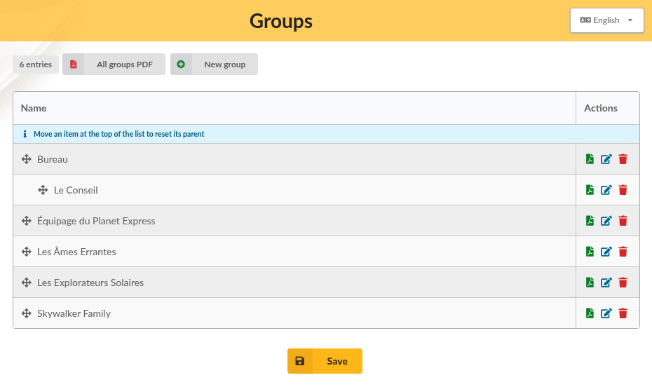
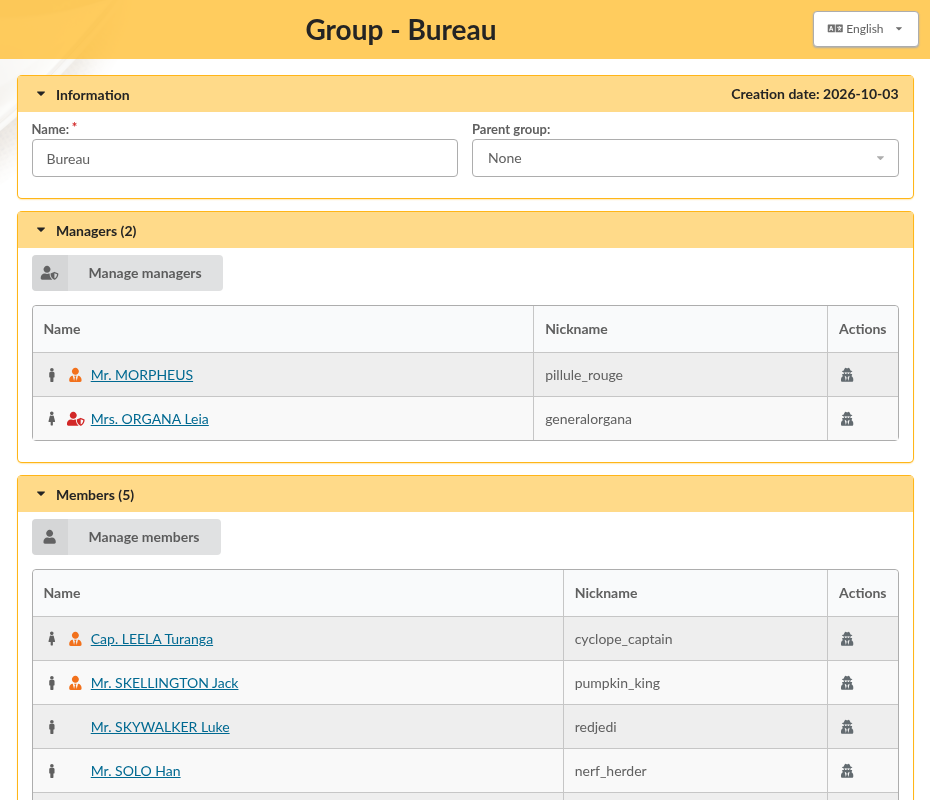

.. _man_groups:

******
Groups
******

Groups gather members who share something: the board, a team, a section of your association, the people taking part in a project... A member can belong to as many groups as needed, and groups can be nested: a "Juniors" group can be placed under a "Football" group, for example.

Each group can also have **managers**. A manager is a member who looks after the members of the group; what a manager is allowed to do is decided by the association, see :ref:`group managers <pref_rights>`.

Groups are managed from **Management**, then **Groups**.

Groups list
===========

The list displays all groups, the subgroups being placed under their parent group.

* **New group** creates a group: type its name and click on **Create**,
* **All groups PDF** exports all groups and their members in a single PDF file,
* the icons of the **Actions** column export the group as PDF, edit it, or delete it.

To change the organisation of your groups, drag a group with the arrows icon and drop it under another one: it becomes its subgroup. Moving a group at the top of the list detaches it from its parent. Click on **Save** under the list to keep your changes.

Editing a group
===============

Click on the edit icon of a group to see and change it.

* **Information**: the name of the group, and its **Parent group** if it is a subgroup,
* **Managers**: the members who manage the group. Click on **Manage managers** to add or remove some,
* **Members**: the members of the group. Click on **Manage members** to add or remove some.

In both cases, a window opens with the list of members: click on a row to select a member, or to unselect them, then close the window. Do not forget to save the group afterwards.

Groups can also be changed from a member card: the **Groups:** part of the member form lists the groups the member belongs to and the groups they manage.

Several members at once
=======================

To add several members to a group, or to remove them from it, in one go:

#. go to **Members**, then **List of members**, and select the members with the checkboxes,
#. choose **Mass change** in the actions displayed under the list,
#. in the **Groups:** part, pick a group in **Add to group** or in **Remove from group**,
#. check the summary, and confirm.

See :ref:`mass changes <mass_changes>` for the other information that can be changed this way.

Deleting a group
================

Click on the delete icon of the group, and confirm. A group that still has members or subgroups cannot be deleted as is: check **Cascade delete** in the confirmation window to delete the group along with its subgroups. Members are never deleted; they are only removed from the group.

Groups and searches
===================

The members list can be filtered on a group, and the :ref:`advanced search <advsearch>` can find members belonging to several groups at once.
