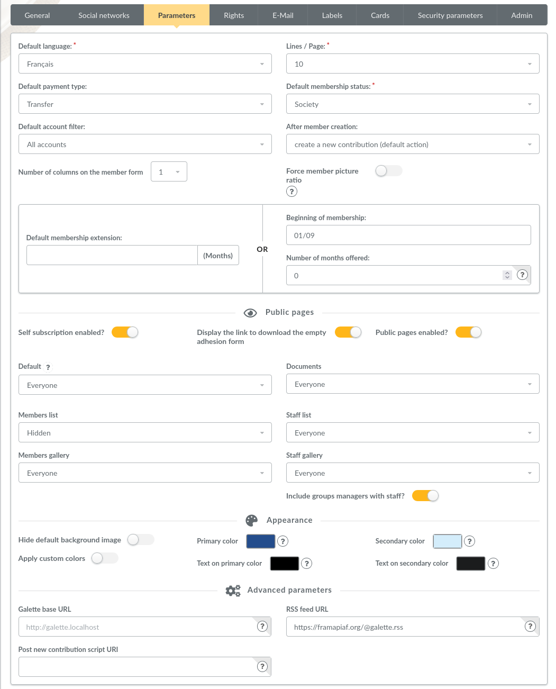
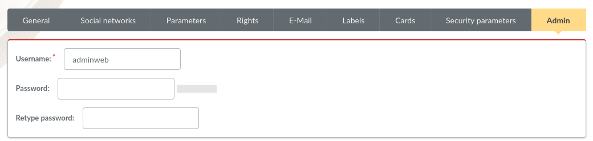
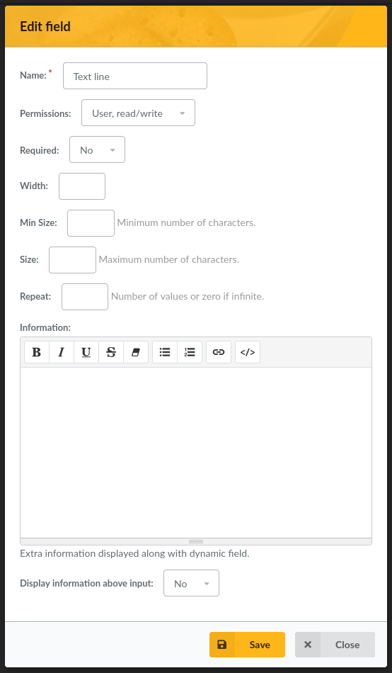

.. _usermanual:

.. rst-class:: docs user_doc

:doc:`manuel de l'utilisateur <index>`

.. rst-class:: doc_main_page

=======================
Manuel de l'utilisateur
=======================

Bienvenue dans le guide de l'utilisateur de Galette :-)
Ces pages vous guideront à travers les différents écrans et possibilités offerts par Galette pour la gestion de votre association.

Juste après l'écran de connexion, vous serez emmenés vers le tableau de bord de Galette.

.. image:: ../_styles/static/images/usermanual/desktop.png
   :scale: 75%
   :align: center
   :alt: Tableau de bord

La partie principale du tableau de bord vous propose un accès rapide aux principales fonctionnalités du logiciel, tandis que la partie gauche vous permet de suivre les dernières nouvelles du projet :)

***********
Généralités
***********

Les droits
==========

On distingue plusieurs niveaux de droits dans Galette, permettant l'accès à différentes parties et fonctionnalités de l'application. Les différents niveaux sont les suivants :

* le super administrateur, qui est créé à l'installation ;
* les administrateurs, qui sont des adhérents pour lesquels la case « administrateur » a été cochée ;
* les membres du bureau, qui possèdent un statut particulier (Président, Trésorier, Secrétaire, ...) ;
* les adhérents à jour, qui sont marqués comme actifs, et qui sont à jour de leurs cotisations ;
* les adhérents qui sont marqués comme inactifs, ou qui ne sont pas à jour de leurs cotisations,
* les simples visiteurs.

Les membres du bureau, les administrateurs et le super administrateur peuvent créer ou modifier des adhérents, des cotisations, des transactions, effectuer des E-Mailings, ...

Les administrateurs ont accès en plus à la configuration de l'application, à l'exception des informations de connexion du super administrateur. Par défaut, à la connexion, les administrateurs accèdent à un tableau de bord, sur lequel les dernières nouvelles de `Galette sur Twitter <http://twitter.com/galette>`_ et de la `page Google+ de Galette <https://plus.google.com/116977415489200387309>`_ sont affichées.

Le super administrateur a accès à l'intégralité de l'application ; mais pas forcément à toutes les fonctionnalités. En effet, il ne s'agit pas d'un adhérent, il peut ne pas posséder certaines informations nécessaires. Il peut bien entendu modifier les informations de connexion le concernant, depuis les préférences de l'application.

Les adhérents peuvent consulter et modifier leur propre fiche d'informations, et peuvent aussi consulter les contributions et transactions les concernant (sans pouvoir les modifier).

Les simples visiteurs peuvent consulter le trombinoscope et la liste des adhérents (en fonction du paramétrage choisi dans les préférences du logiciel) ; mais peuvent aussi... s'inscrire :-)

*********************
Gestion des Adhérents
*********************

La gestion des adhérents est bien évidemment le cœur de Galette. Vous pourrez enregistrer l'ensemble de vos membres, 

L'un de vos tout premiers contacts avec l'interface de Galette - hormis les pages d'installation, la page de connexion et le bureau - sera la liste des adhérents. Bien entendu, juste après l'installation ; cela ne sera pas fort parlant, puisque cette liste sera vide... Mais ça ne devrait pas durer :-D

Commencez donc par la création d'une nouvelle fiche adhérent. Comme partout dans Galette, les champs obligatoires sont marqués en rouge ; tous les autres champs sont facultatifs. Les différentes parties de cet écran (`Identité`, `Informations de contact`, `Informations relatives à Galette` et éventuellement `Champs supplémentaires`) sont rétractables, en cliquant sur la flèche qui précède le titre.

.. image:: ../_styles/static/images/usermanual/add_member.png
   :scale: 50%
   :align: center
   :alt: La partie `Identité` de l'écran d'ajout d'adhérent

Sur les champs de type date, la petite icône en fin de ligne vous donne accès à un calendrier.

.. image:: ../_styles/static/images/usermanual/calendar.png
   :align: center
   :alt: Sélection d'une date

Si votre navigateur supporte HTML5 (c'est le cas depuis un certain temps pour Firefox et Chromium par exemple) ; il vous avertira directement des champs requis et non renseignés. Si, pour une raison ou une autre, l'une des informations était erronée, la page serait rechargée avec les informations saisies (en dehors du mot de passe !), et un message en haut de page vous informera des erreurs rencontrées. Le même type de message s'affichera pour les champs requis si votre navigateur ne supporte pas HTML5 (dans ce cas, je vous invite fortement à `utiliser un navigateur web récent et respectueux des standards <http://www.mozilla-europe.org/>`_ ; votre expérience avec Galette et bien d'autres sites s'en retrouverait améliorée).

Liste des adhérents
===================

La liste des adhérents vous donne accès à de nombreuses fonctions :

* filtrage et tri des adhérents,
* affichage des fiches des adhérents,
* suppression(s),
* envoi de mailings,
* génération d'étiquettes (PDF),
* génération de listes d'émargement (PDF),
* génération de cartes de membres (PDF).

Les actions possibles sur chaque adhérent sont regroupées en fin de chaque ligne, les actions possibles sur une sélection d'adhérents sont regroupées en bas de la liste. Certains plugins peuvent ajouter des entrées dans l'un ou l'autre de ces regroupements.

Filtrage
^^^^^^^^

Le formulaire situé en haut de page vous permet d'effectuer des opérations de filtrage.

.. image:: ../_styles/static/images/usermanual/list_members-filter.png
   :scale: 50%
   :align: center
   :alt: Filtrage de la liste des membres

Vous pourrez ainsi filtrer sur :

* une recherche textuelle sur l'une des informations suivante :

  * le nom (nom et prénom),
  * l'adresse,
  * le courriel et les messageries instantanées,
  * l'emploi,
  * les informations.

* l'un des statuts de l'adhérent :

  * tous les adhérents,
  * les adhérents à jour,
  * les échéances proches (les adhérents dont la cotisation va arriver à échéance sous xx jours),
  * les retardataires,
  * les adhérents n'ayant jamais cotisé,
  * les membres du bureau,
  * les administrateurs.

* un état du compte :

  * tous les comptes,
  * comptes actifs,
  * comptes inactifs

* la présence ou l'absence d'une adresse de courriel.

Tout filtrage sera conservé le temps de votre session, vous pourrez ainsi aller modifier un paramétrage ou autre, et revenir sur la liste ; vous récupérerez automatiquement le filtre que vous aviez exécuté.

Les différents filtres sont bien entendu complémentaires, vous donnant la possibilité par exemple de chercher parmi vos adhérents ceux dont le compte est actif, qui possèdent une adresse courriel et dont le nom contient un « a » ;-)

Tri
^^^

Il est possible de trier la liste des adhérents (filtrée ou non) sur toutes les colonnes contenant une information provenant de votre base d'adhérents. Ainsi, vous pouvez trier la liste par :

* nom,
* pseudo,
* statut,
* état de cotisation

Pour les premiers cas, le résultat obtenu est assez transparent, il n'est pas vraiment besoin de le détailler ici. Pour le dernier cas, l'ordonnancement sera appliqué par date de création, exemption de cotisation et date d'échéance.

Paramétrage des champs obligatoires
===================================

Lors de la saisie ou de la modification de fiches adhérents, certains champs sont marqués comme étant requis. Bien entendu, cette sélection par défaut peut ne pas vous convenir, mais vous avez la possibilité de paramétrer ça facilement :-)

Depuis le menu `Configuration`, `Champs obligatoires`, vous aurez accès à la liste des champs de la fiche adhérent, il vous suffira pour chacun d'entre eux, de définir si oui ou non il est requis.

.. image:: ../_styles/static/images/usermanual/required_fields.png
   :scale: 50%
   :align: center
   :alt: Paramétrage des champs requis

E-Mailing
=========

Depuis Galette, vous pouvez envoyer des E-Mailings à une sélection de vos adhérents. Chaque E-Mailing envoyé est stocké afin de pouvoir servir de modèle par la suite. Ainsi, depuis la `Gestion des E-Mailings` ; vous pourrez sélectionner un message que vous avez déjà envoyé, et l'utiliser comme modèle, récupérant ainsi la liste des personnes qui avaient été sélectionnées pour cet envoi, le sujet, et le contenu du message lui même.

Pour envoyer un nouvel E-Mailing, il suffit de sélectionner dans la liste des adhérents les membres auxquels vous souhaitez le faire parvenir, puis de cliquer sur le bouton `Envoyer un courriel`. Si certains des membres sélectionnés ne possèdent pas d'adresse de courriel, Galette vous proposera de générer les étiquettes correspondantes.

.. image:: ../_styles/static/images/usermanual/mailing_selected_members.png
   :scale: 50%
   :align: center
   :alt: Adhérents sélectionnés pour l'E-Mailing

.. note:: La sélection des adhérents dans le tableau doit se faire sur une seule et unique page (une limite inhérente aux pages web). Les fonctionnalités de filtrage, et la possibilité d'afficher l'intégralité des membres (filtrés ou non) sur une seule page vous seront alors fort utiles ;-)

Une fois le sujet entré ; on passera à la rédaction du message en lui même. Vous avez la possibilité d'envoyer les messages au format texte seul, ou au format HTML (gardez à l'esprit que l'envoi de messages HTML n'est pas toujours à préférer). Pour le second cas, une interface d'aide à la saisie vous est proposée.
L'interface par défaut de Galette est volontairement simple et légère ; pour ne pas alourdir inutilement l'ensemble du logiciel. Si cette interface ne convient pas à vos besoins ; vous pourrez toujours installer le :doc:`plugin TinyMCE <../plugins/tinymce>` qui est là pour ça :-)

Dès lors que l'éditeur HTML est activé, la case `Interpréter les balises HTML` est automatiquement cochée. Si vous souhaitez envoyer un E-Mailing en HMTL sans utiliser l'éditeur, pensez à cocher cette case !

Le bouton `Prévisualisation` vous permettra d'avoir un aperçu complet de votre message avant de l'envoyer.

.. image:: ../_styles/static/images/usermanual/mailing_preview.png
   :scale: 50%
   :align: center
   :alt: Prévisualisation du message

Tout E-Mailing commencé sera automatiquement enregistré dans la session pour être repris par la suite. Une icône dans le titre des différentes pages vous informera qu'un E-Mailing a été débuté, et vous permettra d'y accéder.

Si vous le souhaitez, vous pouvez annuler ce mailing en utilisant le bouton `Annuler le mailing`, il sera alors effacé de la session.

***********************
Gestion des Cotisations
***********************

Les Transactions
================

Types de contributions
======================

**********
Historique
**********

*************************
Exports de données en CSV
*************************

**************************
Les Préférences de Galette
**************************

Cet écran vous permet de configurer divers aspects relatifs à l'application ou à votre association.

Général
=======

Cet onglet vous donne accès aux paramètres relatifs à votre association :

.. image:: ../_styles/static/images/usermanual/prefs_general.png
   :scale: 50%
   :align: center
   :alt: Préférences de Galette, onglet Général

* **Nom** : nom (raison sociale) de l'association,
* **Description** : brève description,
* **Logo** : envoi de votre logo,
* **Adresse** : adresse de l'association
* **Code postal** : code postal,
* **Ville** : ville,
* **Pays** : pays,
* **Adresse postale** : choix de l'adresse postale qui sera affichée :

  * soit **depuis les préférences** pour utiliser l'adresse entrée plus haut,
  * soit **depuis un membre du bureau** pour utiliser l'adresse de l'un des membres du bureau

* **Site web** : éventuelle adresse du site Web de l'association

Paramètres
==========

Paramètres de Galette :

* **Langue par défaut** : choix de la langue par défaut de l'application,
* **Thème par défaut** : choix du thème à utiliser,
* **Lignes/page** : nombre de lignes à afficher par défaut pour la pagination,
* **Niveau d'historique** : modifie le niveau de l'historique : 

  * **Désactivé** : l'historique est complètement désactivé,
  * **Normal** : historique activé,
  * **Détaillé** : historique activé, mais plus verbeux.

* **Durée d'adhésion** : durée maximale d'une adhésion,
* **Date de début d'exercice** : date du début de l'exercice pour l'association

Courriel
========

.. image:: ../_styles/static/images/usermanual/prefs_mail.png
   :scale: 50%
   :align: center
   :alt: Préférences de Galette, onglet Général

Étiquettes
==========

.. image:: ../_styles/static/images/usermanual/prefs_labels.png
   :scale: 50%
   :align: center
   :alt: Préférences de Galette, onglet Général

Cartes
======

.. image:: ../_styles/static/images/usermanual/prefs_cards.png
   :scale: 50%
   :align: center
   :alt: Préférences de Galette, onglet Général

Administrateur
==============

.. _add_fields:

********************************
Ajouts de champs supplémentaires
********************************

Galette propose par défaut un certain nombre de champs, pour la gestion des adhérents, des contributions et des transactions. Certains champs ne vous seront probablement pas utiles, mais d'autres vont peut-être cruellement vous manquer...

Dans ce cas, c'est simple : créez un nouveau champ, sélectionnez son type, donnez lui un libellé, définissez s'il est requis ou optionnel ; et c'est tout : Galette se chargera du reste, il suffira d'admirer le résultat... ;-)

Il vous est proposé quatre types de champs dynamiques :

* `séparateur` : juste un libellé, comme un titre de partie,
* `texte libre` : ajoutera une zone de texte multiligne,
* `ligne simple` : ajoutera une zone de texte monoligne,
* `choix` : ajoutera une liste de choix.

Lors de la création d'un nouveau champ (ou de la modification d'un champ existant) ; vous aurez également la possibilité de :

* choisir si le champ est visible par tous ou uniquement aux administrateurs,
* rendre le champ obligatoire,
* définir une position.

Certains champs - comme les séparateurs - ne requièrent aucune autre information complémentaire ; pour les autres :

* `texte libre` :

  * `largeur` : définit la largeur de la zone de texte,
  * `hauteur` : définit la hauteur de la zone de texte.

* `ligne simple` :

  * `largeur` : la largeur de la zone,
  * `taille` : le nombre de caractères maximum que peut contenir la zone,
  * `répétition` : nombre d'occurrences possibles de ce champ.

* `choix` :

  * `valeurs` : la liste des valeurs possibles pour la liste de choix.

**********************
Traduction de libellés
**********************

Galette est multilingue, l'ajout de nouvelles valeurs telles que les libellés des champs dynamiques ne permet l'adjonction que d'une seule et unique valeur (monolingue donc). Galette propose donc une interface qui vous permet de traduire de tels libellés dans les différentes langues disponibles.

Notez que par défaut, tout libellé entré correspondra à sa traduction dans la langue courante de Galette.

*********************
Contenu des courriels
*********************

En fonction de la configuration (voir les préférences), des courriels peuvent être envoyés aux adhérents et/ou aux administrateurs ; lors de la création d'une nouvelle fiche, ou lors de l'ajout d'une contribution par exemple.

Les textes en question sont fournis par défaut, et une interface vous est proposée pour les modifier.

.. note:: Il est important de noter que les textes en question comportent des variables - notées sous la forme ``{VARIABLE}`` - qui seront remplacées automatiquement lors de l'envoi du message. L'oubli de l'une de ces valeurs peut potentiellement causer des problèmes d'envoi des messages.

.. image:: ../_styles/static/images/usermanual/edit_mails.png
   :scale: 50%
   :align: center
   :alt: Modification du texte en français envoyé à un adhérent lors de son adhésion

