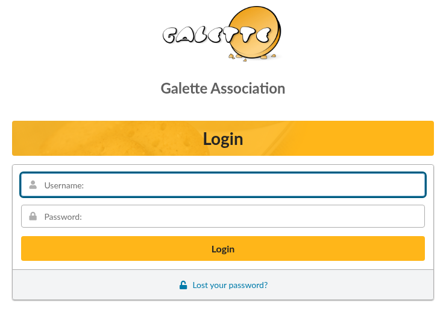
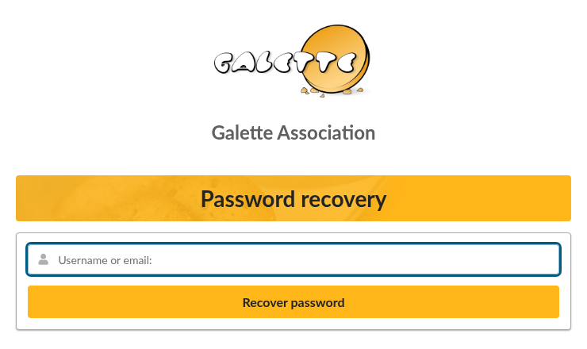
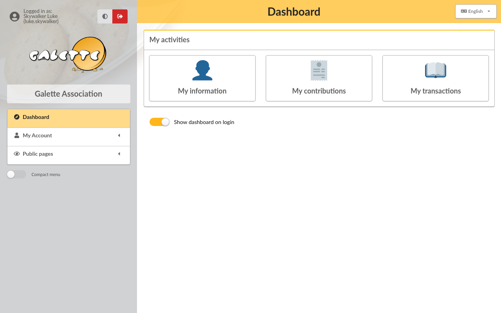
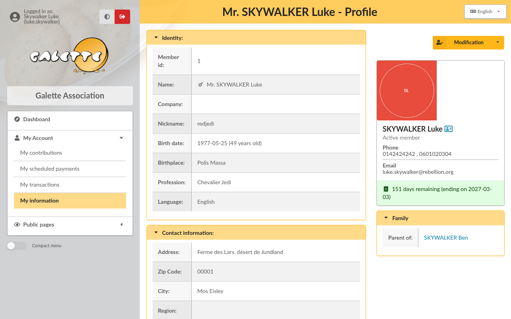
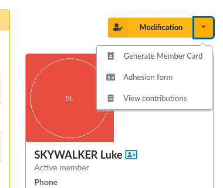
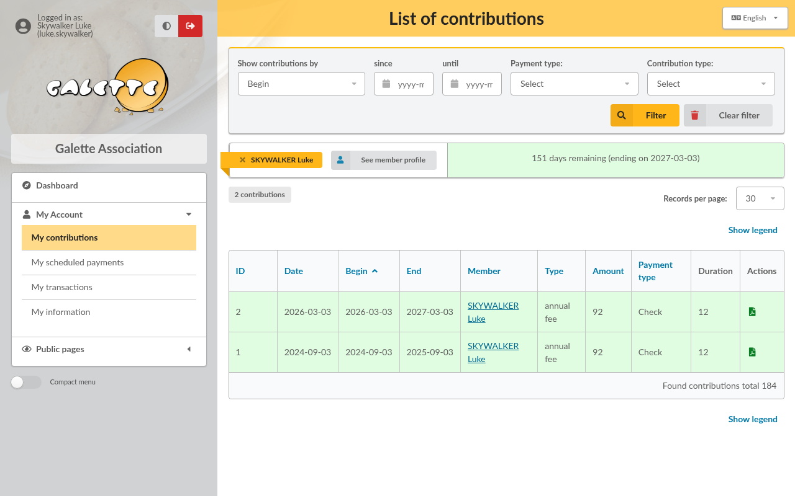

.. _man_my_account:

**********
My account
**********

This page is written for the members of your association. It explains what a member can see and do once logged in to Galette. You can send them a link to it.

.. note::

   Some of what is described here depends on choices made by the association: a feature that is not displayed for you has probably been disabled in the :ref:`preferences <man_preferences>`.

Logging in
==========

Your association gives you a username and a password, often by email when your member card is created. On the login page, type either your **username** or your **email address**, then your password, and click on **Login**.

If your association allows it, a **Register** button at the top of the page lets people who are not members yet fill in a membership request themselves.

The language of the interface can be changed at any time from the list at the top right of the page.

.. _my_account_password:

Forgotten or new password
=========================

If you do not remember your password - or if it's not been set yet, click on **Lost your password?** under the login form. This link is only displayed when your association has configured the sending of emails.

Type your username or your email address, and click on **Recover password**. If an account matches, Galette will send an email to you.

The email you receive contains a link. Follow it, then type your new password twice and click on **Change my password**. The link only works once, and for 24 hours.

.. note::

   No email received? Check your spam folder first. If your member card holds no email address, or an invalid one, no message can be sent: ask a staff member to fix your account information.

Your dashboard
==============

After logging in, you reach your dashboard. It gives a quick access to your information, your contributions and your transactions.

The same pages are listed in the **My Account** menu, on the left:

* **My contributions**,
* **My scheduled payments**,
* **My transactions**,
* **My information**.

**Two-factor authentication** and **Add a child member** may also be listed there, when your association has enabled them.

.. _my_account_information:

My information
==============

**My information** displays your member card: your identity, your contact information, the groups you belong to, the state of your membership, ...

The state of your membership is displayed under your picture:

* **X days remaining (ending on ...)**: your membership is up to date,
* **Last day!**: your membership ends today,
* **Late of X days (since ...)**: your membership has expired, it is time to renew it,
* **Never contributed**: no membership fee has been recorded for you yet,
* **Freed of dues**: you do not have to pay membership fees.

Changing your information
^^^^^^^^^^^^^^^^^^^^^^^^^

Click on **Modification** to change your information, then on **Save** at the bottom of the form. Your association decides which fields you can change: the others are read only, or not displayed at all.

To change your password, type the new one in **Password:** and again in **Password confirmation:**. Leave both fields empty to keep your current password.

Other actions
^^^^^^^^^^^^^

The small arrow next to the **Modification** button opens more actions:

* **Generate Member Card**: download your member card as a PDF file. It is only available when your membership is up to date, and when your association allows members to print their card,
* **Adhesion form**: download your adhesion form as a PDF file, filled in with your information,
* **View contributions**: the list of your contributions.

The small card icon next to your name downloads your contact information as a vCard file, that most address books can import.

My contributions
================

**My contributions** lists the membership fees and donations recorded for you. Each line shows the dates, the type, the amount and the payment type of the contribution.

The PDF icon of the **Actions** column downloads an invoice or a receipt for the contribution, depending on its type.

The filters at the top of the list help to find a contribution: by date, by payment type or by contribution type. Click on **Filter** to apply them, and on **Clear filter** to come back to the whole list.

You cannot add or change a contribution yourself.

My transactions and scheduled payments
======================================

A transaction is a payment that covers several contributions; for example, a single check that pays both a membership fee and a donation. **My transactions** lists the transactions recorded for you.

**My scheduled payments** lists the payments that are planned for your contributions, when your association lets you pay in several times.

Both lists are read only, as for contributions.

Adding a child member
=====================

If your association allows it, **Add a child member** in the **My Account** menu lets you create the member card of a child, or of any person you are responsible for. That card is then attached to yours: you can see and change it, and see its contributions. See also :ref:`links between members <linkmembers>`.

Two-factor authentication
=========================

When your association has enabled it, you can protect your account with a code that changes every thirty seconds, in addition to your password. This is described in :ref:`two-factor authentication <man_2fa>`.
