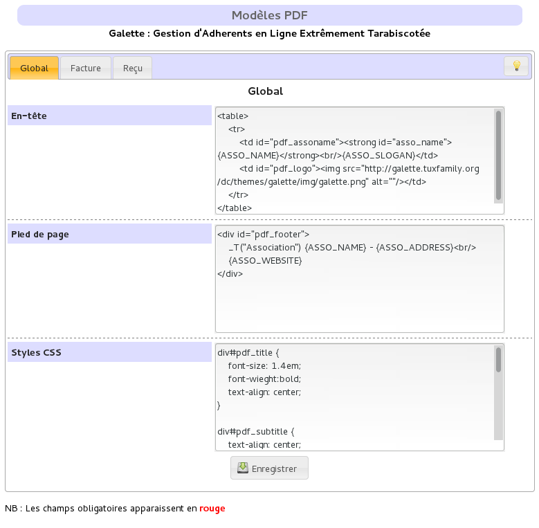
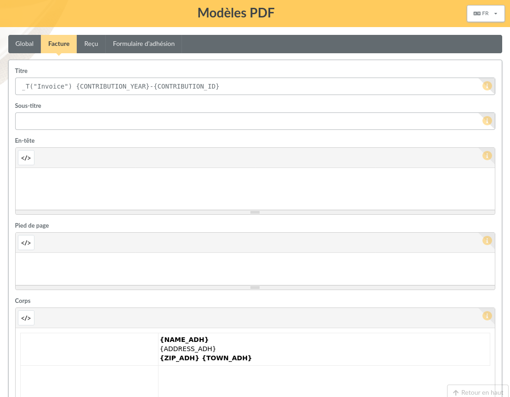

.. _pdf_models:

***********
PDF models
***********

PDF models are provided for several outputs : an invoice model, a receipt model and a membership from model are currently available. All of them inherits from a `Global` model.

Models inheritance
==================

The global model defines three distincts parts:

* header,
* footer,
* CSS styles.

Each model which inherits from `Global` will automatically obtain same header and footer except if the new model redefines them, in which case only specific values will be applied.

For CSS properties it is a bit different: `Global` model properties will always be applied, and specific model properties will be appended (jsut like real CSS stylesheets).

Generalities
============

In addition of header, footer and CSS styles, a model defines a title, a sub title and a body.

Each of those fields can take some replacement values, refer to the inline help from the user interface to get details. They also can contains internationnalized texts like `_T("My text")` that relies on Galette standard translation capacities.

Models rely on HTML and CSS styles, but keep in mind we are building a PDF file, and not displaying a page in a recent brower; there are many limitations.

Invoices and receipts
=====================

Invoice and receipt models are the same, excepting their titles.

As you can see in the above screenshot, invoice model does not define any header, footer or CSS styles, the ones form the `Global` model are used.

Membership form
===============

It is a model that can be used to print a membership form. It can be empty (to print some of them for any event for example) or filled with one member informations.

Since there are many limitation, you may use the :doc:`FullCard plugin </plugins/fullcard>` that will replace this model. It is more complex to change, but you can do many more with it. You can also create your own plugin based on FullCard.
