.. _man_preferences:

*******************
Galette preferences
*******************

You can configure several aspects of Galette from the preferences.

General
=======

This tab defines some parameters related to your association:

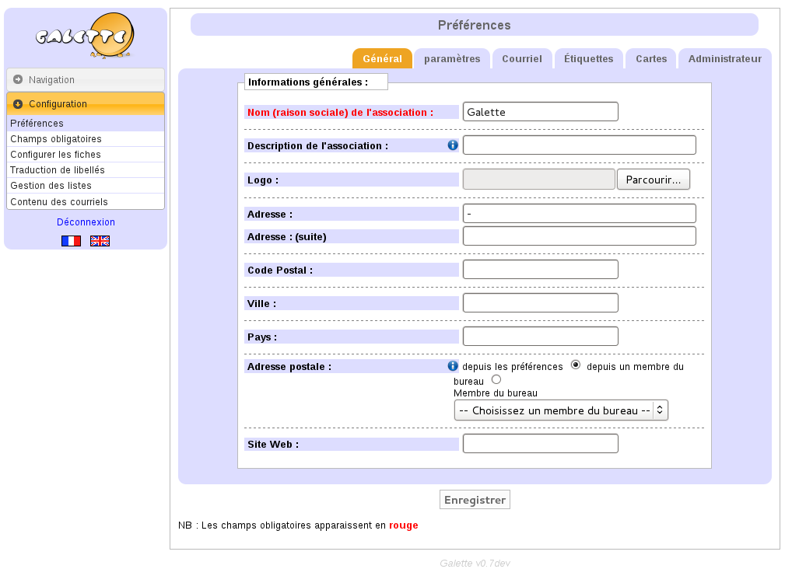

* **Name**: name of the association,
* **Description**: a short description,
* **Footer text**: a text (HTML is allowed) to display in the footer of each page (to add a link to particular legal notices as example),
* **Logo**: set your own logo,
* **Address**,
* **Zipcode**,
* **Town**,
* **Region**,
* **Country**,
* **Postal address**: choose which postal address will be used:

  * either **from the preferences** to use the one entered in the form,
  * either **from a member** to use address from a staff member,

* **Phone**: the phone number of the association; as for the address, it can be the one entered in the form, or the phone or mobile phone of a staff member,
* **E-Mail**: the contact email address of the association,
* **Website**: website URL,
* **Prevent search engines indexation**: asks search engines not to list the pages of your Galette,
* **Telemetry date**: date on which `telemetry information <https://telemetry.galette.eu>`_ was sent,
* **Registration date**: date of `registration of your Galette instance <https://telemetry.galette.eu/reference>`_

The name, the address, the phone number, the email address and the website of the association can be used as variables in :ref:`emails contents <emails_contents>` and in :ref:`PDF models <pdf_models>`.

Social networks
===============

Manage social networks of your association. This may be used in PDF or emails as variables (see inline doc on related parts).

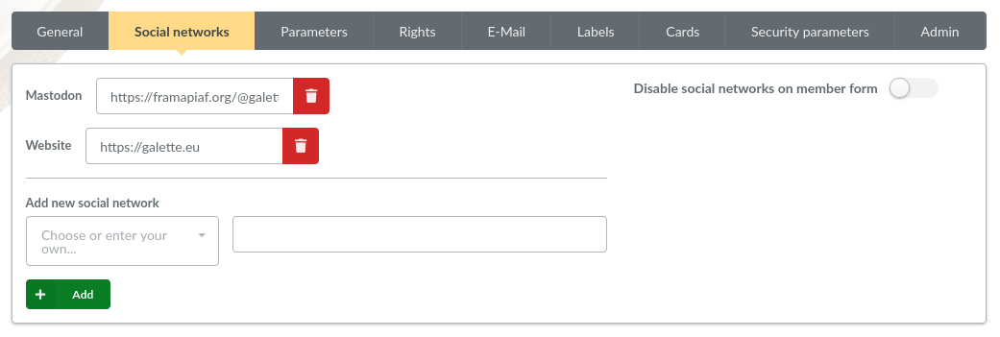

Parameters
==========

Galette related parameters:

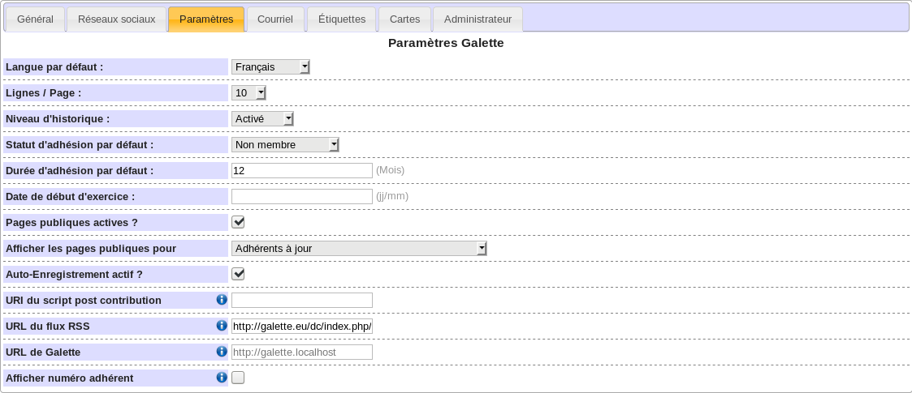

* **Default lang**: default instance lang (can be changed many ways by the user),
* **Lines / page**: number of lines to display on lists for pagination,
* **Default payment type**: the payment type selected by default when a contribution is added,
* **Number of columns on the member form**: display the member form on one, two or three columns,
* **After member creation**: defines action to execute after a member has been added:

  * create a new contribution,
  * create a new transaction,
  * create another member,
  * show member,
  * go to members list,
  * go to main page,

* **Default membership status**: the status to affect to all new created users (can be changed on creation form if current user have rights),
* **Default account filter**: default account filter to apply on members list,
* **Default membership extension**: membership extension in months,
* **Beginning of membership**: beginning date of the financial period,
* **Number of months offered**: when a beginning of membership is set, the contributions recorded during the last months of the period are valid for the whole next period as well. With 2 months offered and a period ending on December 31st, a member who pays in November is up to date until the end of the next year,
* **Force member picture ratio**: resize and crop the pictures of the members to the selected ratio (square, portrait or landscape),
* **Display the link to download the empty adhesion form**: display a link to the empty adhesion form on the public pages and on the registration form, for people who would rather fill it in on paper,
* **Public pages enabled**: enable or disable public pages,
* **Public pages visibility**: who can see each public page, or the **Default** visibility for the pages that are not listed, including the ones of plugins. Each page can be shown to **Everyone**, to **Up to date members**, to **Admin and staff only**, be **Hidden**, or **Inherit** the default; see :ref:`public pages <man_public_pages>`,
* **Include groups managers with staff?**: list the group managers on the public staff pages,

* **Self registration enabled**: enable or disable self registration feature,
* **Post new contribution script URI**: URI of a script that will be called after a new contribution has been added. Several prefixes are handled:

  * **galette://**: call a script provided by Galette that will be called with the HTTP POST method. Path must be relative to your Galette installation. For example, the URI for the ``galette/post_contribution_test.php`` example script would be `galette://post_contribution_test.php`.
  * **get://** or **post://**: use HTTP GET or POST method to call a web address, prefix will be replaced with ``http://``,
  * **file://**: call a file on the web server, full path must be provided. Destination script must be executable, and should define a shellbang if necessary. An email that contains contribution information and script return (if any) will be sent to the administrator if an error occurs. The behavior is the same as cron : if the script outputs something, a mail is sent.

.. warning::

   Using ``file://`` method can be dangerous, Galette just call the provided script, usage and security of the script is **under your own responsibility**.

* **Appearance** : these settings allow you to adapt the default appearance of Galette to your needs.

  * **Hide default background image** : hide the image used as a background on private pages, on modal windows headers, and on public page headers.
  * **Apply custom colors**: enable or disable usage of following color parameters:

    * **Primary color**: applied to primary buttons, checkboxes, labels, headers, borders, and menus.
    * **Text on primary color**: applied to text displayed over the *Primary color*.
    * **Secondary color**: applied to active items in menus, paginations, and accordions views.
    * **Text on secondary color**: applied to text displayed over the *Secondary color*.

* **RSS feed URL**: link to the RSS feed to display on dashboard,
* **Galette base URL**: Galette instance URL, if the one proposed is incorrect,

.. warning::

   This URL should be changed only if there are issues, this may cause instability.

   A contextual help is provided, check it for more information.

.. _pref_rights:

Rights
======

Define few extra rights:

* **Can members create child?** if you enable this settings, any logged in member can create another members that will be attached to him as children.
* **Can group managers edit their groups?** groups manager can edit their owned groups information (name, parent, order).
* **Can group managers create members?** groups managers can create members attached to their groups.
* **Can group managers edit members?** groups managers can edit member of their groups information.
* **Can group managers send mailings?** groups manager can send mailings.
* **Can group managers do exports?** groups managers can export groups as PDF, generate attendance sheets, cards, labels and CSV exports for members of their groups.
* **Can group managers see contributions?** groups managers can see contributions of members of their groups.
* **Can group managers create contributions?** groups managers can create contributions on behalf of members of their groups.
* **Can group managers see transactions?** groups managers can see transactions of members of their groups.
* **Can group managers create transactions?** groups managers can create transactions on behalf of members of their groups.

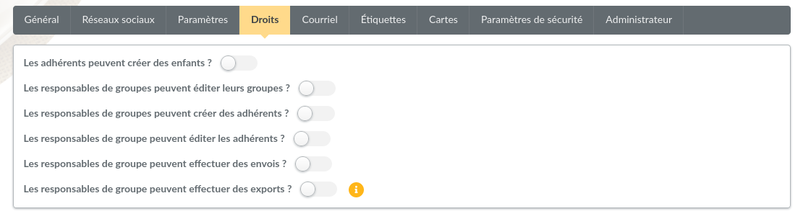

.. _pref_email:

E-Mail
======

Sending email parameters:

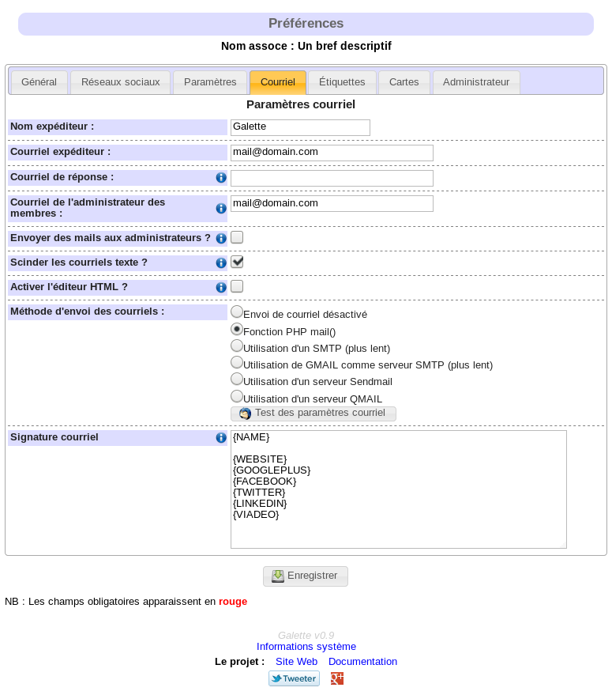

* **Sender name**: name of the sender,
* **Sender email**: email address of the sender,
* **Reply-to email**: reply email address. If empty, sender email will be used,
* **Members administrator email**: email address on which inscription notifications will be send, you can set several addresses separated with comas,
* **Send emails to administrators**: whether to send emails to administrators on subscription,
* **Wrap text emails**: automatically wraps long lines in emails. If you disable this options, make sure to wrap yourself,
* **Send emails to members**: whether to send emails to members when their information are updated or a contribution is created on their behalf,
* **Activate HTML editor**: activate HTML format when sending emails (discouraged),
* **Emailing method**: method used to send emails:

  * **Emailing disabled**: no email will be send from Galette,
  * **PHP mail function**: uses the PHP ``mail()`` fonctions and related parameters (recommended when possible),
  * **Using a SMTP server**: uses an external SMTP server to configure (will be slower than PHP ``mail()`` function),
  * **Using sendmail server**: uses local server sendmail,

* **Mail signature**: signature added to all sent emails. Available variables are displayed in the inline help from the application.

.. versionchanged:: 1.3.0

   * The **qmail** method has been removed. Instances still configured with it are switched to ``sendmail`` when the database is updated.
   * The **GMail** method has been removed. Instances still configured with it are switched to ``SMTP`` when the database is updated.

When using SMTP, you will have to configure user name and password to use.

SMTP configuration is a bit more complex :

* **SMTP server**: server address, required,
* **SMTP port**: server port, required,
* **Use SMTP authentication**: if your server requires an authentication. In this case, you will also have to set username and password,
* **SMTP user** and **SMTP password**: the credentials given by your mail provider. Leave the password empty to keep the current one,
* **Use TLS for SMTP**: enable SSL support,
* **Allow unsecure TLS**: on some cases, SSL certificate may be invalid (self signed for example).

.. _mail_tests:

Testing the settings
^^^^^^^^^^^^^^^^^^^^

.. versionadded:: 1.3.0

Two buttons, under the emailing method, check your settings before you rely on them:

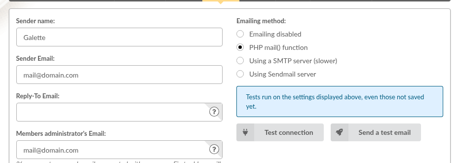

* **Test connection** connects to the mail server and checks that it accepts your settings, without sending anything,
* **Send a test email** sends a message, to make sure it really arrives.

Tests run on the settings displayed in the form, even those that are not saved yet: you can try several values, and save once it works. Nothing can be tested when **Emailing disabled** is selected.

.. _mail_throttling:

Sending limits
^^^^^^^^^^^^^^

.. versionadded:: 1.3.0

.. warning::

   This is an **experimental** feature.

   Try it on a test instance before your production one, watch carefully, and `report what you find <https://bugs.galette.eu>`_. Leaving the settings at their default keeps Galette sending exactly as it always did.

Mail servers are rarely willing to accept anything you throw at them. They restrict the number of recipients a single message may carry, the number of messages a connection may carry, or the number of messages you may send per hour or per day. Galette can respect those restrictions, from five settings of the :ref:`advanced configuration <advanced_config>` page:

* ``pref_mail_batch_size``: maximum number of recipients per message. ``0``, the default, keeps the historical behavior: one single message carrying every recipient in blind copy,
* ``pref_mail_batch_delay``: pause, in seconds, between two messages. ``0`` by default, no pause,
* ``pref_mail_hourly_limit``: maximum number of recipients per hour. ``0``, the default, means no limit,
* ``pref_mail_daily_limit``: maximum number of recipients per day. ``0``, the default, means no limit,
* ``pref_mail_smtp_keepalive``: keep the SMTP connection open across the messages of a mailing instead of reconnecting for each one. Enabled by default.

Apart from the keepalive, they all ship disabled: an instance that is updated behaves exactly as it did before.

Filter the advanced configuration on ``pref_mail_`` to get them all, next to the SMTP settings. The four that drive the queue carry the **alpha** marker:

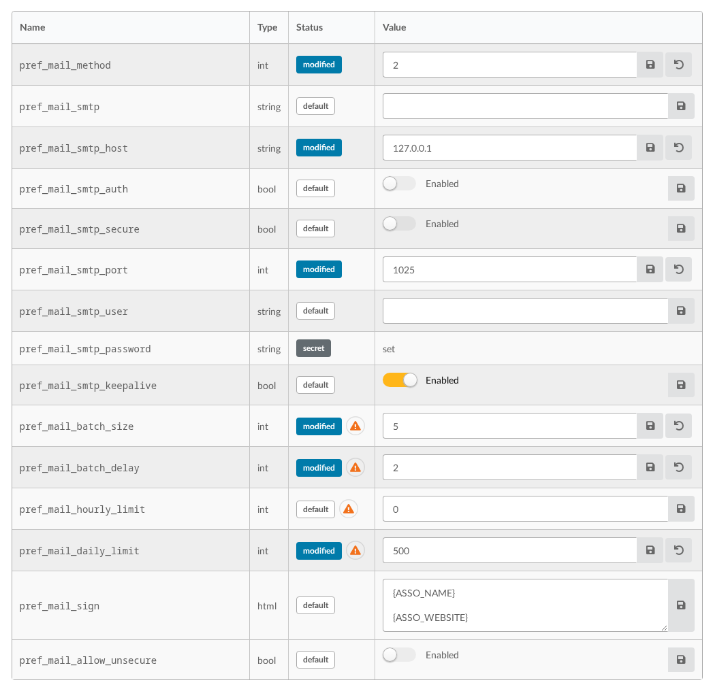

Refer to your mail provider's documentation for the values to use, along with the SMTP settings.

.. note::

   The hourly and daily limits are what turns sending into a :ref:`queue <mailing_queue>`: as soon as one of them is set, a mailing can no longer be sent in a single page load.

.. note::

   Limits count **recipients**, not messages, and for all messages Galette send.

   The real limit of course depends on all usages of configured server.

Labels
======

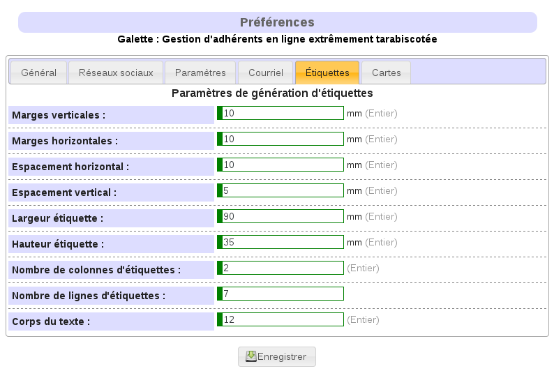

This tab describes the sheets of self-adhesive labels you print the addresses of your members on. All sizes are in millimeters:

* **Vertical margins** and **Horizontal margins**: the blank space around the labels, on the edges of the sheet,
* **Vertical spacing** and **Horizontal spacing**: the blank space between two labels,
* **Label width** and **Label height**: the size of one label,
* **Number of label columns** and **Number of label lines**: how many labels a sheet holds,
* **Font size**: the size of the text printed on the labels,
* **Print border**: print a grey border around each label, handy for a first try on plain paper.

The values usually are written on the box of the labels.

Cards
=====

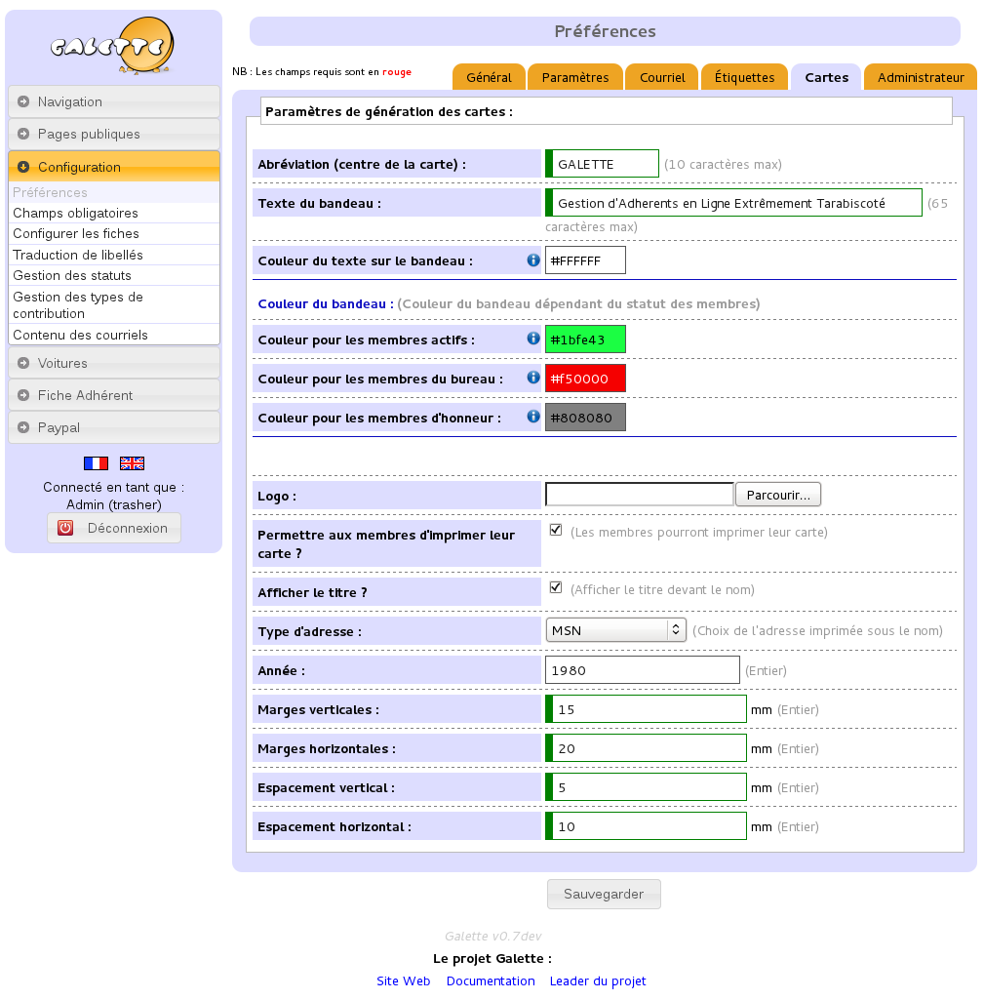

This tab sets the content and the look of the member cards:

* **Short Text (Card Center)**: a short text printed in the middle of the card, 10 characters at most; the acronym of your association for example,
* **Long Text (Bottom Line)**: a text printed at the bottom of the card, 65 characters at most,
* **Strip Text Color**: the color of the text written on the bottom strip,
* **Active Member Color**, **Board Members Color** and **Honor Members Color**: the color of the main texts and of the bottom strip, depending on the status of the member; the honor color is used for benefactor and founder members,
* **Logo**: a logo for printing, if the one of the association does not suit,
* **Allow members to print card ?**: members can download their own card, as long as their membership is up to date,
* **Show title ?**: print the title (Mr., Mrs....) in front of the name,
* **Address type**: what is printed under the name: email, zip code and town, nickname, profession or member number,
* **Year**: the year printed on the card. It can be a year, two years separated with a slash (*2026/2027*), or ``DEADLINE`` to print the end of membership of each member,
* margins, spacing, width and height of the cards on the page, in millimeters.

Colors are written in hexadecimal notation, ``#RRGGBB``.

.. _pref_dynamic_fields:

Dynamic fields
==============

.. versionadded:: 1.3.0

You can add your own fields to the preferences, for information about your association that Galette does not know about: a registration number, a bank account number, the name of the president...

Create them from **Configuration**, then **Dynamic fields**, choosing the **Settings** form; see :ref:`dynamic fields <dynamic_fields>`. They are then displayed in this tab, and can be used as variables in :ref:`emails contents <emails_contents>` and in :ref:`PDF models <pdf_models>`.

.. _password_rules:

Security
========

.. versionadded:: 0.9.4

.. warning::

   Complex password rules are not user friendly; but security is mainly never :)

   Of course, all passwords should be as secure as possible, but this is especially true for all accounts that have privileges (staff, admin, super-admin); you may explain your users why this is important.

You can enforce some rules for members (and super-admin) passwords:

* minimum length (6 characters or more),
* minimum "strength",
* blacklist,
* no personal information.

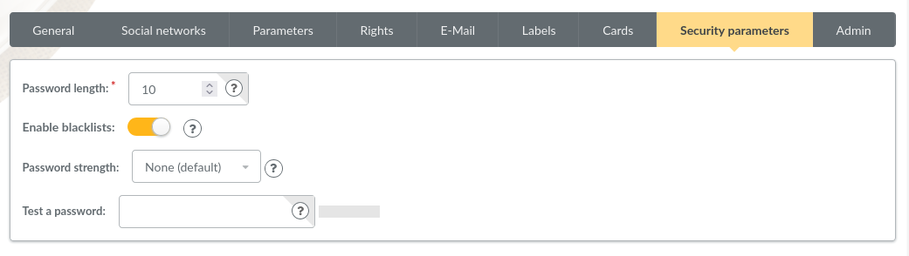

The **Test a password:** field, at the bottom of the tab, checks any password against the values currently selected; do not forget to save your preferences once you are happy with the result.

Length is still the only rule that is active per default, just configure the number of characters required. On passwords fields, failures will be displayed on the fly; as well as a "strength meter" displayed for information.

.. note::

   If you enable password checks, it is not possible to know if some of existing ones does not respect them. Galette will display a warning at login if checks are not respected, but login will still be possible!

But wait... Password security is important, but Galette does not enforce nothing! Isn't that dumb? Well, not really. For tests or entirely private instances, security may be less important; and in some cases, being too restrictive may be an issue for your users; that's why this is up to you to secure as needed; just like using SSL or not :)

Password strength
^^^^^^^^^^^^^^^^^

Password strength calculation is quite simple. It is based on 4 rules:

* contains lower case characters,
* contains upper case characters,
* contains number,
* contains special characters.

You can choose between 5 values for strength configuration:

* **none**: (default): disables strength checks and check for personal information,
* **weaker**: enables check for personal information, only one of the rule is mandatory,
* **medium**: two rules are mandatory,
* **strong**: three rules are mandatory,
* **very strong**: the four rules are mandatory.

Blacklisted passwords
^^^^^^^^^^^^^^^^^^^^^

A default list of 500 common passwords is provided as a blacklist you can enable, "galette" is also blacklisted.

.. note::

   The ``galette/data/blacklist.txt`` file is used to list blacklisted terms (one per line). You can provide your own file, we advice you to complete the existing one.

Personal information as password
^^^^^^^^^^^^^^^^^^^^^^^^^^^^^^^^

This check rely on strength activation (all but **none** level). For the super-admin account, this will just ensure you are not using login as password. For standard accounts, there are several information involved:

* name,
* surname,
* nickname,
* login,
* email,
* birthdate,
* town

Basically, user cannot use verbatim any of those information as password. Some possible combinations are also checked, like surname and name couple (or name and surname), first letter of surname with name, etc. Birthdate will be checked in different formats as well (localized, international, and some variants).

.. _pref_2fa:

Two-factor authentication
^^^^^^^^^^^^^^^^^^^^^^^^^

.. versionadded:: 1.3.0

   Marked **experimental**: it is complete and tested, but it is new, and the interface may still change. It is disabled by default; nothing happens until you choose otherwise.

A password is a single factor: whoever knows it is in. Two-factor authentication asks, right after the password, for a six digits code that changes every thirty seconds and comes from an application on the user own phone or computer. A stolen password is then not enough anymore.

Galette implements the TOTP standard (:rfc:`6238`), the one every authenticator application speaks; no third party service is involved, and nothing leaves your server.

Two policies are available:

* **disabled** (default): nothing changes, nobody is asked for a code,
* **optional**: everybody may enable it from their own account, nobody has to.

Making the second factor **compulsory** — for administrators and staff members, or for everyone — is written and tested, but it is not offered yet: under a compulsory policy, a server clock that drifts or an enrolment that goes wrong puts a whole association outside its own instance, and the only way back is a command in the database. It is planned for a later version, once the optional policy has been used in the field.

Since nobody is forced to enrol, administrators and staff members — the accounts that can read the civil status, the addresses and the financial data of every member — are invited to set a second factor up when they log in, with a **Later** and a **Do not ask again** button. Declining is remembered in a cookie of the browser, so the invitation comes back on a new browser, or after a year.

.. note::

   Switching the policy back to **disabled** does not delete anything. Codes are no longer asked for, and the second factors already enabled start being asked for again as soon as you enable a policy back. While the policy is disabled, the pages to enable a second factor answer nothing: a factor enrolled then would never be asked for.

The super administrator is covered as well, as any other account. As it is not a member, it has no recovery codes; see :ref:`what to do should you lose it <faq_2fa>`.

Members enable and manage their own second factor from their account; this is described in :ref:`the members part of this manual <man_2fa>`. Administrators and staff members can :ref:`reset the second factor of a member <member_2fa_reset>` who lost it.

.. _auth_attempts:

Authentication attempts
=======================

.. versionadded:: 1.3.0

To protect accounts against people trying passwords one after the other, Galette counts the failed logins. After too many failures, further attempts are refused for a while, even with the right password. The same applies to password recovery requests and to self registrations.

By default:

* 5 failed logins on one account, from one address, within 15 minutes,
* 30 failed logins from one address, on any account, within 15 minutes,
* 100 failed logins on one account, from anywhere, within a day,
* 3 password recovery requests within an hour,

get further attempts refused for 15 minutes. Those thresholds and durations can be changed from the :ref:`advanced configuration <advanced_config>`.

**Configuration**, then **Authentication attempts** lists what is refused right now: what is counted, the account, the address, the number of failures and until when attempts are refused.

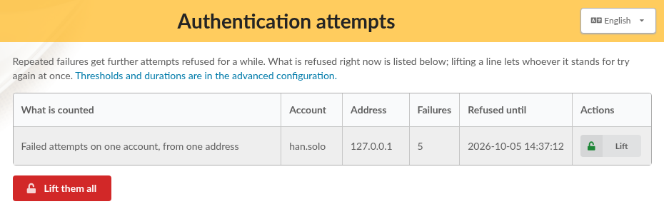

When a member tells you they cannot log in anymore, look here: **Lift** lets them try again at once, and **Lift them all** clears the whole list.

Super administrator credentials
===============================

.. versionchanged:: 1.3.0

The super administrator login and password are no longer in the preferences. Once logged in as super administrator, go to **My account**, then **My information**. Galette asks for the current password before saving a new one.

Should that password be lost, it can be changed :ref:`from the command line <cli_superadmin_password>`.
