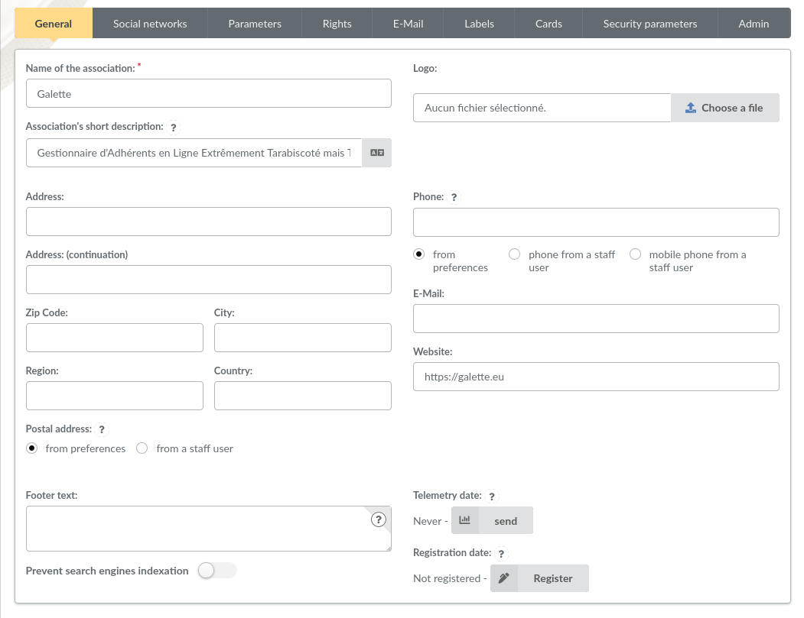
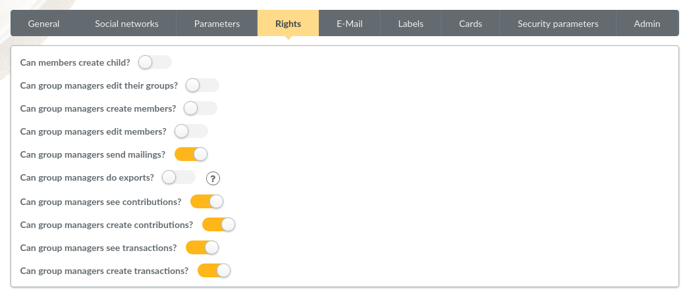

.. _man_preferences:

*******************
Galette preferences
*******************

You can configure several aspects of Galette from the preferences.

General
=======

This tab defines some parameters related to your association:

* **Name**: name of the association,
* **Description**: a short description,
* **Footer text**: a text (HTML is allowed) to display in the footer of each page (to add a link to particular legal notices as example),
* **Logo**: set your own logo,
* **Address**,
* **Zipcode**,
* **Town**,
* **Country**,
* **Postal address**: choose which postal address will be used:

  * either **from the preferences** to use the one entered in the form,
  * either **from a member** to use address from a staff member,

* **Website**: website URL,
* **Telemetry date**: date on which `telemetry infomations <https://telemetry.galette.eu>`_ was sent,
* **Registration date**: date of `registration of your Galette instance <https://telemetry.galette.eu/reference>`_

Social networks
===============

Manage social networks of your association. This may be used in PDF or emails as variables (see inline doc on related parts).

Parameters
==========

Galette related parameters:

.. image:: ../_styles/static/images/usermanual/prefs_parameters.png
   :scale: 50%
   :align: center
   :alt: Galette settings, parameters tab

* **Default lang**: default instance lang (can be changed many ways by the user),
* **Lines / page**: number of lines to display on lists for pagination,
* **After member creation**: defines action to execute after a member has been added:

  * create a new contribution,
  * create a new transaction,
  * create another member,
  * show member,
  * go to members list,
  * go to main page,

* **Logging**: handles internal history:

  * Enabled,
  * Disabled,

* **Default membership status**: the status to affect to all new created users (can be changed on creation form if current user have rights),
* **Default account filter**: default account filter to apply on members list,
* **Default membership extension**: membership extension in months,
* **Beginning of membership**: beginning date of the financial period,
* **Public pages enabled**: enable or disable public pages,
* **Show public pages for**: defines who can see public pages:

  * **Everyone**, including simple visitors,
  * **Up to date members**,
  * **Administrators and staff members**,

* **Self subscription enabled**: enable or disable self subscription feature,
* **Post new contribution script URI**: URI of a script that will be called after a new contribution has been added. Several prefixes are handled:

  * **galette://**: call a script provided by Galette that will be called with the HTTP POST method. Path must be relative to your Galette installation. For example, the URI for the ``galette/post_contribution_test.php`` example script would be `galette://post_contribution_test.php`.
  * **get://** or **post://**: use HTTP GET or POST method to call a web address, prefix will be replaced with ``http://``,
  * **file://**: call a file on the web server, full path must be provided. Destination script must be executable, and should define a shellbang if necessary. An email that contains contribution information and script return (if any) will be sent to the administrator if an error occurs. The behavior is the same as cron : if the script outputs something, a mail is sent.

.. warning::

   Using ``file://`` method can be dangerous, Galette just call the provided script, usage and security of the script is **under your own responsability**.

* **RSS feed URL**: link to the RSS feed to display on dashboard,
* **Galette base URL**: Galette instance URL, if the one proposed is incorrect,

.. warning::

   This URL should be changed only if there are issues, this may cause instability.

   A contextual help is provided, check it for more information.

* **Show identifiers**: display database identifiers instead of simple counts on lists.

.. _pref_rights:

Rights
======

Define few extra rights:

* **Can members create child?** if you enable this settings, any logged in member can create another members that will be attached to him as children.
* **Can group managers edit their groups?** groups manager can edit their owned groups information (name, parent, order).
* **Can group managers create members?** groups managers can create members attached to their groups.
* **Can group managers edit members?** groups managers can edit member of their groups information.
* **Can group managers send mailings?** groups manager can send mailings.
* **Can group managers do exports?** groups managers cen export groups as PDF, generate attendance sheets, cards, labels and CSV exports for members of their groups.

E-Mail
======

Sending email parameters:

.. image:: ../_styles/static/images/usermanual/prefs_mail.png
   :scale: 50%
   :align: center
   :alt: Galette settings, e-mail tab

* **Sender name**: name of the sender,
* **Sender email**: email address of the sender,
* **Reply-to email**: reply email address. If empty, sender email will be used,
* **Members administrator email**: email address on which inscription notifications will be send, you can set several addresses separated with comas,
* **Send emails to administrators**: whether to send emails to administrators on subscription,
* **Wrap text emails**: automatically wraps long lines in emails. If you disable this options, make sure to wrap yourself,
* **Send emails to members**: whether to send emails to members when their information are updated or a contribution is created on their behalf,
* **Activate HTML editor**: activate HTML format when sending emails (discouraged),
* **Emailing method**: method used to send emails:

  * **Emailing disabled**: no email will be send from Galette,
  * **PHP mail function**: uses the PHP ``mail()`` fonctions and related parameters (recommended when possible),
  * **Using a SMTP server**: uses an external SMTP server to configure (will be slower than PHP ``mail()`` function),
  * **Using GMail as SMTP**: same as SMTP server, but GMail specific (will also be slower than PHP ``mail()`` function),
  * **Using sendmail server**: uses local server sendmail,
  * **Using qmail server**: uses local server qmail,

* **Mail signature**: signature added to all sent emails. Available variables are displayed in the inline help from the application.

When using GMail as SMTP, you will have to configure user name and password to use.

SMTP configuration is a bit more complexe :

* **SMTP server**: server address, required,
* **SMTP port**: server port, required,
* **Use SMTP authentication**: if your server requires an authentication. In this case, you will also have to set username and password,
* **Use TLS for SMTP**: enable SSL support (always on for GMail),
* **Allow unsecure TLS**: on some cases, SSL certificate may be invalid (self signed for example).

The `Test mail settings` button will send a test message to the email currently stored as members administrator.

Labels
======

.. image:: ../_styles/static/images/usermanual/prefs_labels.png
   :scale: 50%
   :align: center
   :alt: Galette settings, labels tab

Cards
=====

.. image:: ../_styles/static/images/usermanual/prefs_cards.png
   :scale: 50%
   :align: center
   :alt: Galette settings, cards tab

Security
========

.. versionadded:: 0.9.4

.. warning::

   Complex password rules are not user friendly; but security is mainly never :)

   Of course, all passwords should be as secure as possible, but this is especially true for all accounts that have privileges (staff, admin, super-admin); you may explain your users why this is important.

You can enforce some rules for members (and super-admin) passwords:

* minimum length (6 characters or more),
* minimum "strength",
* blacklist,
* no personal information.

Length is still the only rule that is active per default, just configure the number of characters required. On passwords fields, failures will be displayed on the fly; as well as a "strength meter" displayed for information.

.. note::

   If you enable password checks, it is not possible to know if some of existing ones does not respect them. Galette will display a warning at login if checks are not respected, but login will still be possible!

But wait... Password security is important, but Galette does not enforce nothing! Isn't that dumb? Well, not really. For tests or entirely private instances, security may be less important; and in some cases, being too restrictive may be an issue for your users; that's why this is up to you to secure as needed; just like using SSL or not :)

Password strength
^^^^^^^^^^^^^^^^^

Password strength calculation is quite simple. It is based on 4 rules:

* contains lower case characters,
* contains upper case characters,
* contains number,
* contains special characters.

You can choose between 5 values for strength configuration:

* **none**: (default): disables strength checks and check for personal information,
* **weaker**: enables check for personal information, only one of the rule is mandatory,
* **medium**: two rules are mandatory,
* **strong**: three rules are mandatory,
* **very strong**: the four rules are mandatory.

Blacklisted passwords
^^^^^^^^^^^^^^^^^^^^^

A default list of 500 common passwords is provided as a blacklist you can enable, "galette" is also blacklisted.

.. note::

   The ``galette/data/blacklist.txt`` file is used to list blacklisted terms (one per line). You can provide your own file, we advice you to complete the existing one.

Personal information as password
^^^^^^^^^^^^^^^^^^^^^^^^^^^^^^^^

This check rely on strength activation (all but **none** level). For the super-admin account, this will just ensure you are not using login as password. For standard accounts, there are several information involved:

* name,
* surname,
* nickname,
* login,
* email,
* birthdate,
* town

Basically, user cannot use verbatim any of those information as password. Some possible combinations are also checked, like surname and name couple (or name and surname), first letter of surname with name, etc. Birthdate will be checked in different formats as well (localized, international, and some variants).

Admin
=====

.. note::

   This tab wil be present only if you are logged in as super administrator.

.. image:: ../_styles/static/images/usermanual/prefs_admin.png
   :scale: 50%
   :align: center
   :alt: Galette settings, admin tab
