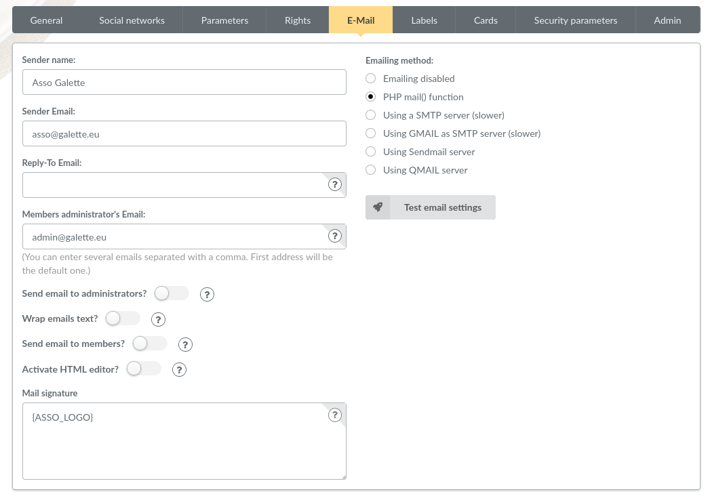
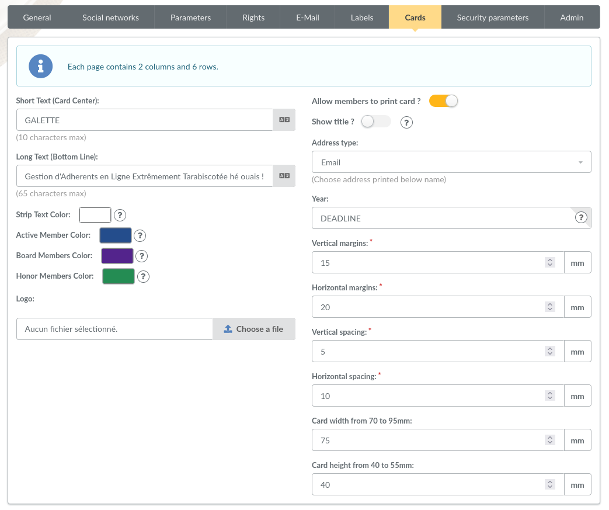

.. _man_preferences:

**************************
Les Préférences de Galette
**************************

Cet écran vous permet de configurer divers aspects relatifs à l'application ou à votre association.

Général
=======

Cet onglet vous donne accès aux paramètres relatifs à votre association :

.. image:: ../_styles/static/images/usermanual/prefs_general.png
   :scale: 50%
   :align: center
   :alt: Préférences de Galette, onglet Général

* **Nom** : nom (raison sociale) de l'association,
* **Description** : brève description,
* **Logo** : envoi de votre logo,
* **Adresse** : adresse de l'association
* **Code postal** : code postal,
* **Ville** : ville,
* **Pays** : pays,
* **Adresse postale** : choix de l'adresse postale qui sera affichée :

  * soit **depuis les préférences** pour utiliser l'adresse entrée plus haut,
  * soit **depuis un membre du bureau** pour utiliser l'adresse de l'un des membres du bureau

* **Site web** : éventuelle adresse du site Web de l'association

Paramètres
==========

Paramètres de Galette :

.. image:: ../_styles/static/images/usermanual/prefs_parameters.png
   :scale: 50%
   :align: center
   :alt: Préférences de Galette, onglet Général

* **Langue par défaut** : choix de la langue par défaut de l'application,
* **Thème par défaut** : choix du thème à utiliser,
* **Lignes/page** : nombre de lignes à afficher par défaut pour la pagination,
* **Niveau d'historique** : modifie le niveau de l'historique :

  * **Désactivé** : l'historique est complètement désactivé,
  * **Normal** : historique activé,
  * **Détaillé** : historique activé, mais plus verbeux.

* **Durée d'adhésion** : durée maximale d'une adhésion,
* **Date de début d'exercice** : date du début de l'exercice pour l'association,
* **Pages publiques actives** : active ou désactive l'affichage des pages publiques,
* **Afficher les pages publiques pour** : définit quels utilisateurs ont accès aux pages publiques. Vous pouvez choisir entre :

  * **Tout le monde**, y compris les utilisateurs qui ne sont pas authentifiés,
  * **Adhérents à jour**,
  * **Administrateurs et membres du bureau**,

* **Auto-enregistrement actif** : active ou désactive la page d'auto enregistrement,
* **URI du script post contribution** : l'URI d'un script qui sera appelé après l'enregistrement d'une nouvelle contribution. Plusieurs préfixes sont possibles, qui vont définir la méthode à utiliser :

  * **galette://** : appel d'un script fourni par Galette, qui sera appelé avec la méthode HTTP POST. Le chemin doit être relatif à l'installation de Galette. Par exemple, L'URI du script d'exemple qui se trouve dans ``galette/post_contribution_test.php`` sera `galette://post_contribution_test.php`.
  * **get://** ou **post://** : utilisation de la méthode HTTP GET ou HTTP POST. Dans ces deux cas de figure, le préfixe sera automatiquement rempalcé par ``http://`` par Galette,
  * **file://** : appel d'un fichier sur le serveur, le chemin complet doit être fourni, le script de destination doit être exécutable et fournir au besoin le shellbang nécessaire. Un courriel qui contiendra les informations sur la contribution, ainsi que le retour du script sera envoyé à l'administrateur en cas de problème. Le fonctionnement est pareil à celui de cron : si le script renvoie quelque chose, un courriel est envoyé.

.. warning::

   L'utilisation de la méthode ``file://`` est potentiellement dangereuse, Galette se contente de lancer l'exécution du script fourni ; le bon fonctionnement et la sécurisation de ce script qui sera appelé tel quel par le logiciel sont votre **entière responsabilité**.

Courriel
========

Paramètres d'envoi de courriels :

* **Nom expéditeur** : le nom textuel de l'expéditeur des courriels,
* **Courriel expéditeur** : l'adresse courriel de l'expéditeur des courriels,
* **Courriel de réponse** : l'addresse de réponse aux courriels envoyés. Si cette valeur est vide, l'addresse de courriel de l'expéditeur sera utilisée,
* **Courriel de l'administrateur des membres** : adresse à laquelle les courriels de notification d'inscription des membres seront envoyés,
* **Envoyer des mails aux administrateurs** : envoi de courriels aux administrateurs lors d'une inscription,
* **Scinder les courriels texte** : coupe automatiquement les longues lignes dans les courriels en mode texte. Si vous désactivez cette option, il faudra vous assurer de scinder vous-mêmes ces courriels,
* **Activer l'éditeur HTML** : active l'envoie de courriels au format HTML (déconseillé - une copie en texte sera envoyée dans tous les cas, mais la génération peut ne pas convenir à ce que vous pourriez souhaiter),
* **Méthode d'envoie des courriels** : la méthode à utiliser pour l'envoi :

  * **Envoi de courriel désactivé** : aucun courriel ne sera envoyé par Galette,
  * **Fonction PHP mail** : utilisation de la fonction PHP mail() et des paramètres qui y sont associas (recommandé),
  * **Utilisation d'un SMTP** : utilisation d'un serveur SMTP externe à configurer (sera certainement plus lent que la fonction php mail()),
  * **Utilisation de GMail pour serveur SMTP** : identique à la possibilité précédente, mais spécifique à GMail (sera certainement plus lent que la fonction php mail()),
  * **Utilisation d'un serveur sendmail** : utilisera le serveur sendmail local configuré sur le serveur,
  * **Utilisation d'un serveur qmail** : utilisera le serveur qmail local configuré sur le serveur,
  * **Signature courriel** : la signature apposée automatiquement à tous les courriels envoyés. Les variables disponibles sont :

    * ``{NAME]`` le nom de l'association,
    * ``{WEBSITE}`` le sie web de l'assiciation,
    * ``{FACEBOOK}`` l'adresse Facebook renseignée dans les paramètres des réseaux sociaux,
    * ``{GOOGLEPLUS}`` l'adresse Google+ renseignée dans les paramètres des réseaux sociaux,
    * ``{TWITTER}`` l'adresse Twitter renseignée dans les paramètres des réseaux sociaux,
    * ``{LINKEDIN}`` l'adresse LinkedIn renseignée dans les paramètres des réseaux sociaux,
    * ``{VIADEO}`` l'adresse Viadeo renseignée dans les paramètres des réseaux sociaux.

Dans le cas de l'utilisation de GMail comme serveur SMTP, vous devrez configurer le nom d'utilisateur et le most de passe à utiliser.

La configuration d'un serveur SMTP est un peu plus complexe :

* **Serveur SMTP** : l'addresse du serveur, requis,
* **Port SMTP** : le port du serveur, requis,
* **Utiliser l'authentification SMTP** : si le serveur requiert une authentification. Dans ce cas, il vous faudra également rensigner l'utilisateur et le mot de passe,
* **Utiliser TLS pour SMTP** : activer SSL (toujouors actif pour Gmail, qui ne permet pas autre chose),
* **Autoriser TLS non sécirisé** : dans certains cas, le certificat SSL peut être invalide (certificats auto signés par exemple).

Le bouton « Test des paramètres courriel » enverra un message de test à l'adresse renseignée pour l'administrateur des membres en utilisant la configuration acutellement enregistrée.

Étiquettes
==========

.. image:: ../_styles/static/images/usermanual/prefs_labels.png
   :scale: 50%
   :align: center
   :alt: Préférences de Galette, onglet Général

Cartes
======

Administrateur
==============

.. note::

   Cette entrée ne sera visible que si le super administrateur est connecté.

.. image:: ../_styles/static/images/usermanual/prefs_admin.png
   :scale: 50%
   :align: center
   :alt: Préférences de Galette, onglet Général

