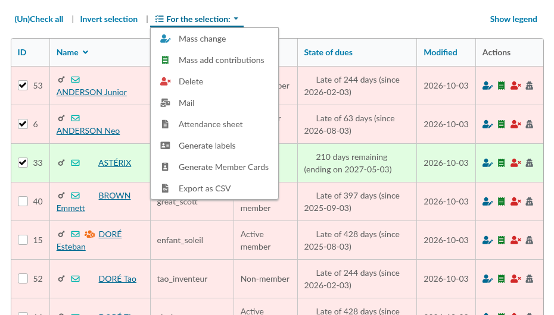
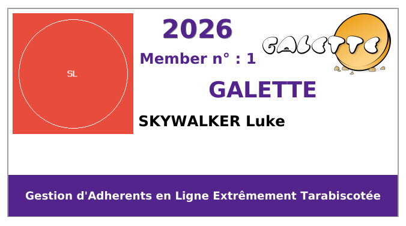
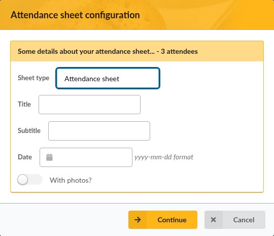
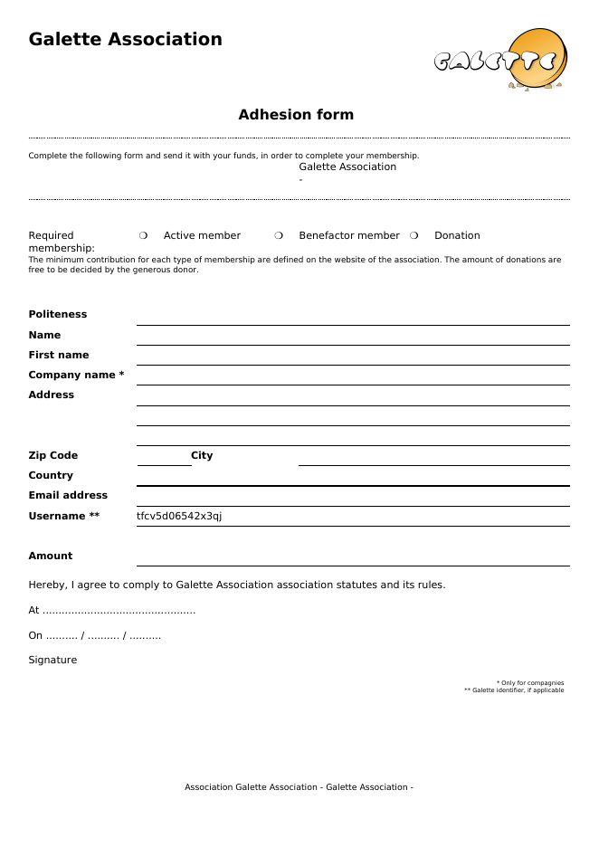
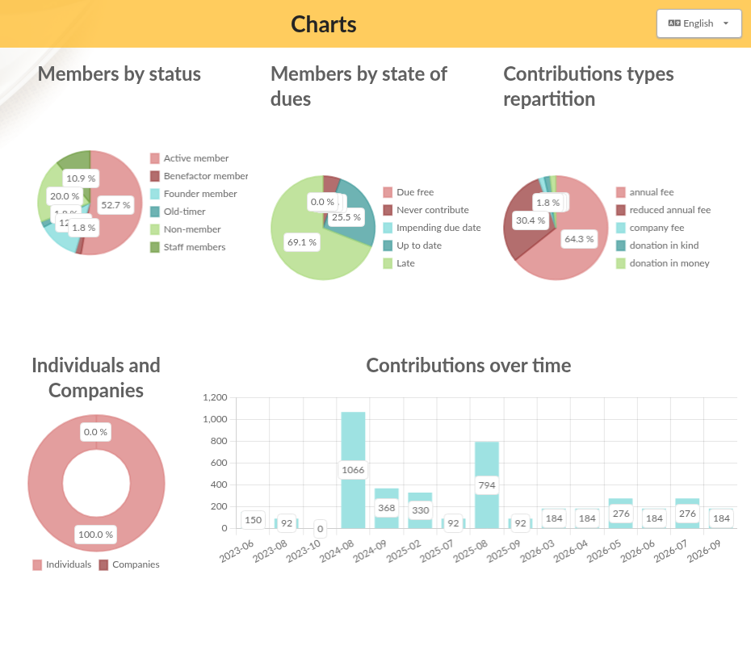

.. _man_printing:

*********************
Printing and exports
*********************

Galette can produce documents from your members list: member cards, address labels, attendance sheets, spreadsheets... All of them start the same way, from a selection of members.

Selecting members
=================

Go to **Members**, then **List of members**. Use the filters if needed, for example to keep only the up to date members, or the members of a group; see :ref:`search <search_galette>`.

Then check the members you want, or use **(Un)Check all** to select the whole list, and open **For the selection:** above the list.

The menu lists what can be done with the selected members: :ref:`Mass change <mass_changes>`, **Mass add contributions**, **Delete**, :ref:`Mail <emailing>`, and the documents described below.

Member cards
============

**Generate Member Cards** produces a PDF file with one card per selected member, ready to be printed and cut.

The content and the look of the cards are set in the **Cards** tab of **Configuration**, then **Settings**: the texts printed on the card, the year or the end of membership, the colors used depending on the status of the member, the logo, the size of the cards...

Members can also print their own card, from **My Account**, then **My information**, when **Allow members to print card ?** is checked in the same tab. They can only do it while their membership is up to date.

Labels
======

**Generate labels** produces a PDF file with the postal address of each selected member, for sheets of self-adhesive labels.

The size of the labels, the number of columns and lines on a page, the margins and the spacing are set in the **Labels** tab of the settings. Measure your sheets of labels, set the values, and make a first try on plain paper before printing on the labels themselves.

Attendance sheet
================

**Attendance sheet** produces a PDF file listing the selected members, with room for their signature; for a general meeting, for example.

Before the file is generated, Galette asks for a few details: the type of sheet, a title, a subtitle and a date, and whether the pictures of the members must be included. Click on **Continue** to get the file.

Adhesion form
=============

The adhesion form is a paper form that new members can fill in by hand and send back with their membership fee.

* **Members**, then **Empty adhesion form** produces a blank form,
* the **Adhesion form** action of a member card produces the same form, filled in with the information of the member.

The content of the form can be changed from **Configuration**, then **PDF models**; see :ref:`PDF models <pdf_models>`.

Export to a spreadsheet
=======================

**Export as CSV** produces a CSV file of the selected members, that any spreadsheet software can open. By default, the file holds the columns displayed in the list; this can be changed, see :ref:`CSV fields <csv_export_fields>`.

Other exports, of the contributions for example, are available from **Management**, then **Exports**; see :ref:`CSV exports <csv_exports>`.

Charts
======

**Management**, then **Charts** displays a few charts about your association: members by status, members by state of dues, the repartition of the contribution types, individuals and companies, and the contributions over time.

