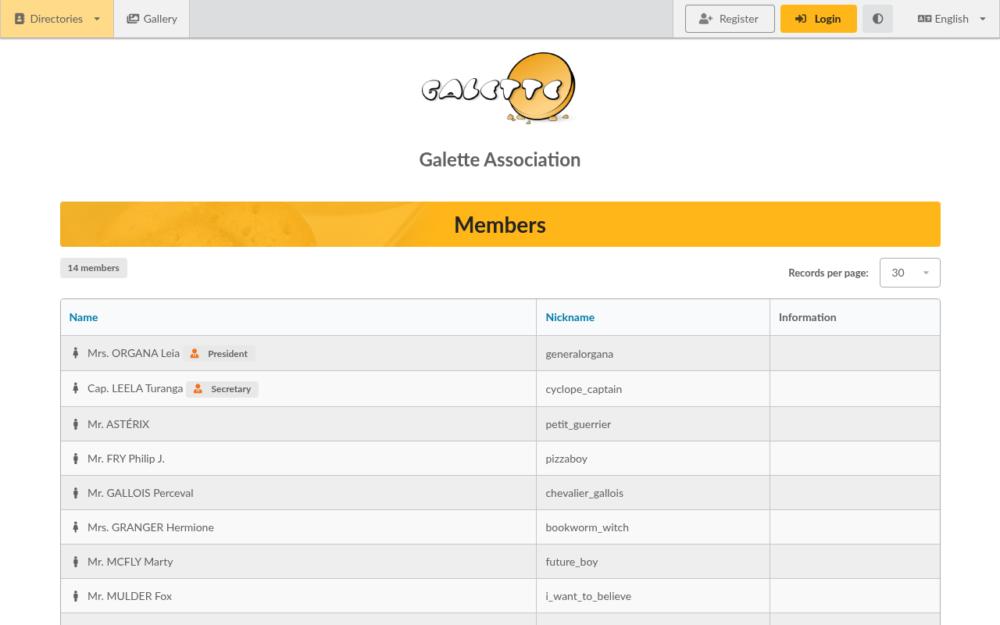
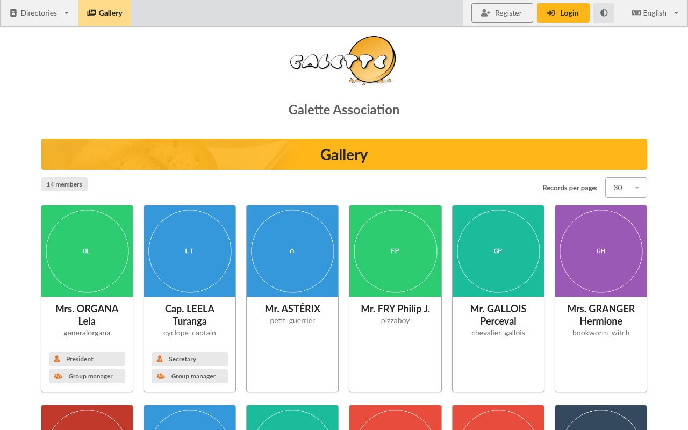
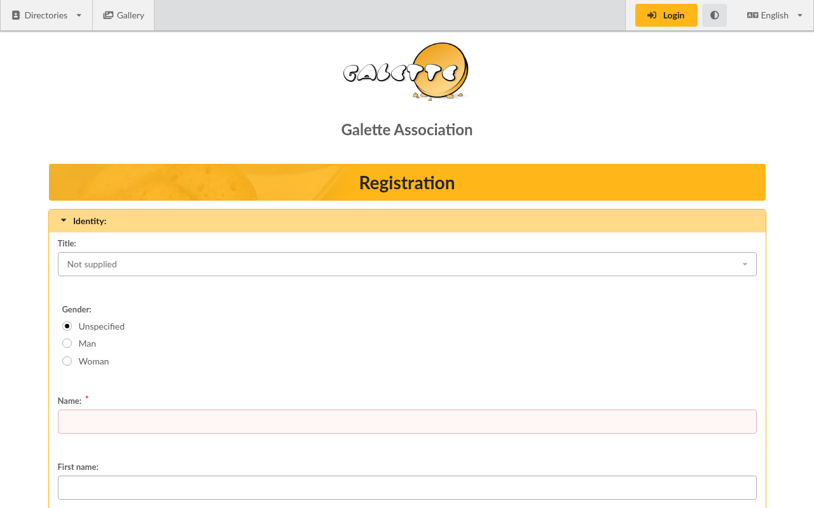

.. _man_public_pages:

*******************************
Public pages and registration
*******************************

Galette can show a few pages to people who are not logged in, or to all your members: a list of members, a gallery of their pictures, the list of the staff, the public documents of the association. It can also let new people fill in a registration form themselves.

All of this is optional, and set from **Configuration**, then **Settings**.

Public pages
============

The public pages are listed in the **Public pages** menu, or at the top of the login page for visitors.

* **Members** and **Gallery**: the members of your association, as a list or with their pictures,
* **Staff** and **Staff gallery**: the members of the board only,
* **Documents**: the :ref:`documents <documents>` your association chose to share.

Who is listed?
^^^^^^^^^^^^^^

A member only appears on the public lists of members when **all** the following conditions are met:

* they checked **Be visible on public pages:** on their member card,
* their account is active,
* their membership is up to date, or they are freed of dues.

The staff lists show the members whose status makes them :ref:`staff members <man_generalites>`, if they agreed to be visible as well. The **Include groups managers with staff?** setting adds the group managers to them.

Only some information is displayed: the name, the nickname, the picture, and the text of the **Other information** field of the member card.

Who can see them?
^^^^^^^^^^^^^^^^^

In the **Parameters** tab of the settings:

* **Public pages enabled?** turns all public pages on or off,
* each page then has its own visibility:

  * **Everyone**, including visitors who are not logged in,
  * **Up to date members**,
  * **Admin and staff only**,
  * **Hidden**,
  * **Inherit**: the page follows the **Default** visibility.

The **Default** visibility also applies to the public pages added by :doc:`plugins </plugins/index>`.

.. warning::

   Showing the list of your members to **Everyone** publishes their names on the Internet. Make sure your members agree, and that it complies with the rules on personal data that apply to your association.

Self registration
=================

When **Self registration enabled?** is checked in the **Parameters** tab of the settings, a **Register** button is displayed on the login page and on the public pages. Anyone can then fill in a form to become a member.

The form asks for the same information as the member form, and for a username and a password. A small question whose answer is a number, the *captcha*, has to be answered to prevent robots from registering.

Once the form is sent:

* the new member receives an email with their login information, if sending emails is configured,
* the administrators are informed by email, if **Send email to administrators?** is checked in the **E-Mail** tab of the settings,
* the new member gets the **Default membership status** set in the settings, and no contribution yet: it is up to the staff to check the request and record the membership fee.

The emails that are sent can be changed from **Configuration**, then **Emails content**; see :ref:`emails contents <emails_contents>`.

.. note::

   To limit abuse, a same address can only send a few registrations in a row: 5 per hour by default. Those limits can be changed from the :ref:`advanced configuration <advanced_config>`.
