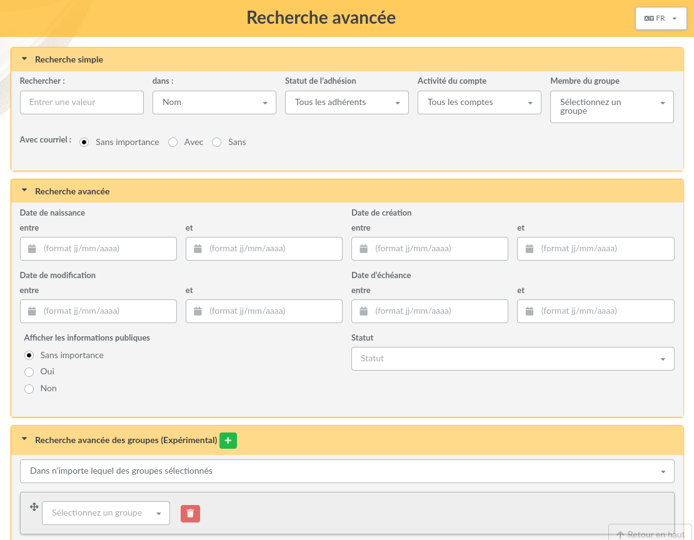
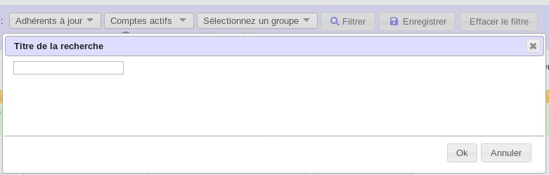
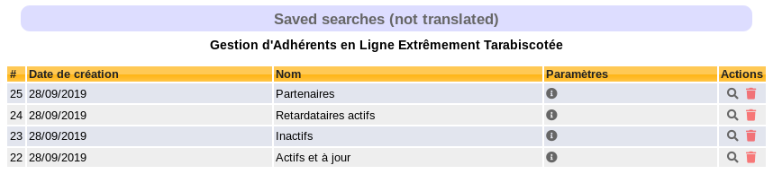

.. _search:

**********
Recherches
**********

Toute recherche exécutée sera conservée le temps de votre session. Vous pourrez ainsi aller modifier un paramétrage ou autre puis revenir sur la liste ; vous récupérerez automatiquement le filtre que vous aviez exécuté.

Filtrage de la liste des adhérents
==================================

Le formulaire situé en haut de la liste des adhérents vous permet d'effectuer des recherches parmi les adhérents. La `Recherche avancée`_ vous propose bien plus de critères et de possibilités.

.. image:: ../_styles/static/images/usermanual/list_members-filter.png
   :scale: 50%
   :align: center
   :alt: Filtrage de la liste des membres

Vous pourrez ainsi filtrer sur :

* une recherche textuelle sur l'une des informations suivante :

  * le nom (nom, prénom et pseudo),
  * la raison sociale,
  * l'adresse (adresse, complément d'adresse, code postal, ville et pays),
  * le courriel et les messageries instantanées (adresse de courriel, URL du site web, adresses MSN, ICQ et Jabber),
  * l'emploi,
  * les informations (les informations publiques, et [pour les administrateurs uniquement] les informations destinées aux administrateurs).

* l'un des statuts de l'adhérent :

  * tous les adhérents,
  * les adhérents à jour,
  * les échéances proches (les adhérents dont la cotisation va arriver à échéance sous 30 jours),
  * les retardataires,
  * les adhérents n'ayant jamais cotisé,
  * les membres du bureau,
  * les administrateurs.

* un état du compte :

  * tous les comptes,
  * comptes actifs,
  * comptes inactifs

* l'appartenance à un groupe,
* la présence ou l'absence d'une adresse de courriel.

Les différents filtres sont bien entendu complémentaires, vous donnant la possibilité par exemple de chercher parmi vos adhérents ceux dont le compte est actif, qui possèdent une adresse courriel et dont le nom contient un « a » ;-)

Recherche avancée
=================

La recherche avancée, accessible depuis le menu principal, propose un certain nombre de champs de types différents, qui sont liées aux adhérents ou à leurs contributions. L'interface est séparée en quatre parties (qu'il est possible de réduire individuellement) :

* la **recherche simple** qui reprend à l'identique les possibilités de filtrage de la liste des adhérents,
* la **recherche avancée** qui propose quelques champs complémentaires d'une potentielle utilité,
* la **recherche dans les contributions** qui permet de rechercher des adhérents à partir d'informations liées à leurs contributions,
* la **recherche libre** permet de chercher dans tous les chamsp possibles d'un adhérent (y compris les champs dynamiques) et qui s'adaptera automatiquement au champ sélectionné. Vous pouvez ajouter et supprimer des lignes pour affiner la recherche.

Recherches enregistrées
=======================

.. versionadded:: 0.9.3

Toute recherche effectuée sur les adhérents peut être enregistrée avec un titre pour être exécutée à nouveau par la suite. Les recherches sont liées à un utilisateur.

Après avoir effectué une recherche (« simple » ou « avancée »), cliquez simplement sur le bouton « Enregistrer », et renseignez un titre.

Vous pourrez ensuite la retrouver dans la liste des recherches :

Depuis cette liste, vous pourrez supprimer ou ré-exécuter les recherches, ainsi que voir le détail des paramètres utilisés.
