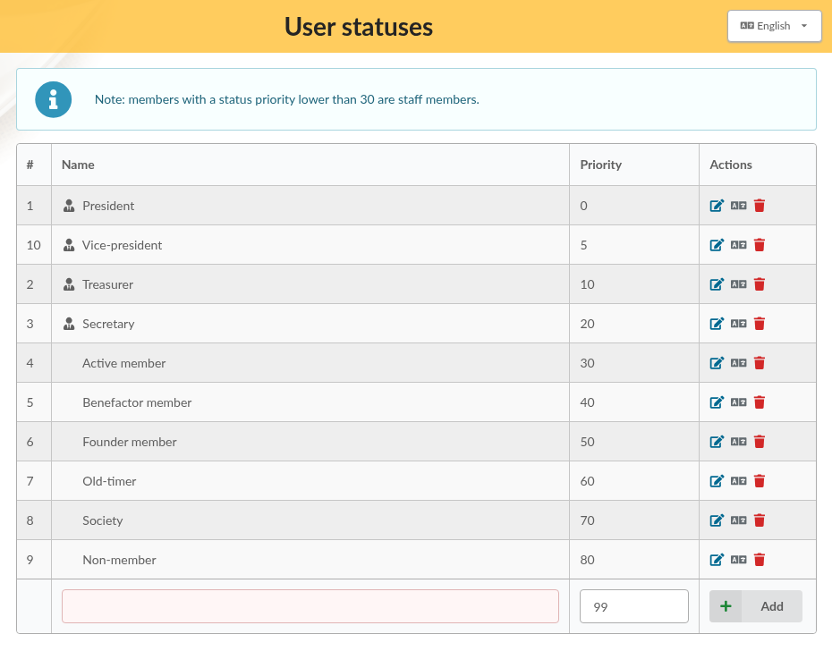
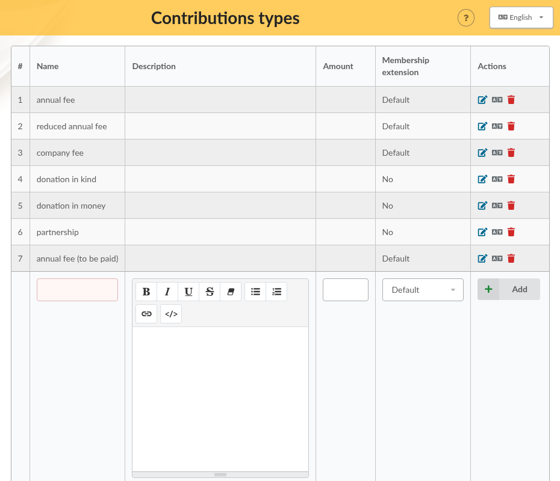
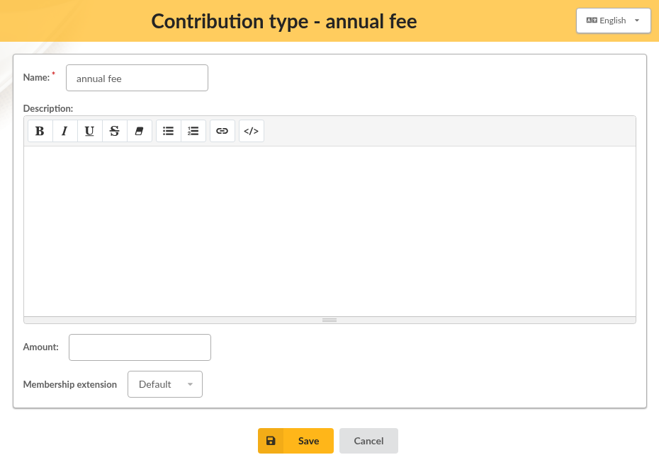
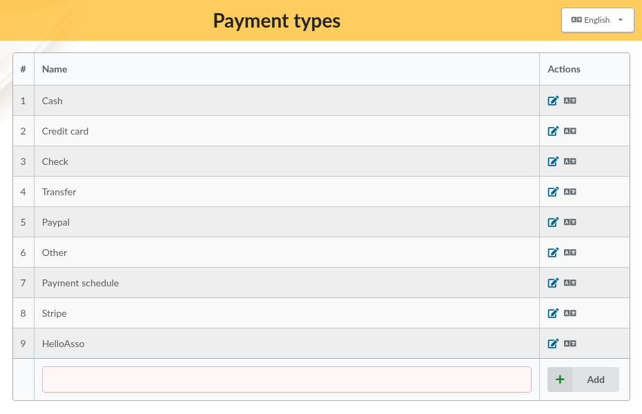
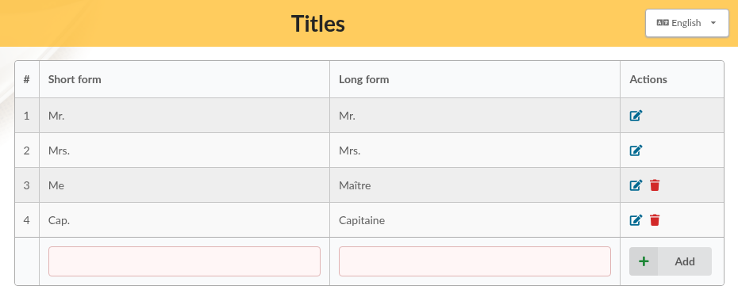

.. _man_reference_lists:

***************
Reference lists
***************

Several lists are used all over Galette: the statuses of the members, the kinds of contributions, the payment types, the titles. Galette comes with ready to use values, that you can adapt to your association from the **Configuration** menu.

All those lists work the same way:

* the last line of the list, or the **Add** button, adds a new entry,
* the edit icon of the **Actions** column changes an entry,
* for statuses, contribution types and payment types, the translation icon opens **Translate labels**, to give the entry a name in every language your members use,
* the delete icon removes an entry. An entry that is still in use, for example a status still given to some members, cannot be deleted.

.. _user_statuses:

User statuses
=============

**Configuration**, then **User statuses**.

The status tells the role of a member in your association: president, treasurer, active member, benefactor member... Each member has one status.

Each status has a **name** and a **priority**. The priority orders the statuses in the lists, and it decides who belongs to the staff:

.. note::

   Members with a status priority lower than 30 are **staff members**: they can manage members, contributions and mailings. With the default statuses, this is the case for the president, the vice-president, the treasurer and the secretary.

   See :ref:`rights <man_generalites>` for what staff members can do.

The **Non-member** status is given to new members unless another **Default membership status** is set in the :ref:`preferences <man_preferences>`; it cannot be deleted.

.. _contributions_types_list:

Contributions types
===================

**Configuration**, then **Contributions types**.

Contribution types describe what your members pay: annual fee, reduced fee, donation...

Each type has:

* a **name**,
* a **description**, to explain for example who the type is meant for,
* an **amount**: when a contribution of that type is added, this amount is proposed, and can still be changed. Leave it empty if the amount varies,
* a **membership extension**: whether a contribution of that type extends the membership of the member.

The choices of **Membership extension** depend on the **Default membership extension** set in the :ref:`preferences <man_preferences>`:

* **Default**: the membership is extended by the default duration, 12 months for example,
* a number of months: the membership is extended by that duration instead; use it for a monthly or quarterly membership,
* **No**: the contribution does not extend the membership. This is what donations use.

When no default membership extension is set (because all memberships start on the same day of the year), the choices are only **Yes** and **No**.

See :doc:`contributions management <contributions>` to record contributions.

.. _payment_types_list:

Payment types
=============

**Configuration**, then **Payment types**.

Payment types are the ways your members pay: cash, check, credit card, transfer...

You can add your own, for example a local currency or holiday vouchers. The payment types provided with Galette can be renamed or translated, but not deleted: some of them are used by Galette itself, like **Payment schedule** for :ref:`scheduled payments <scheduled_payments>`, or by plugins.

.. _titles_list:

Titles
======

**Configuration**, then **Titles**.

Titles are displayed before the name of the members: Mr., Mrs....

Each title has a **short form** (*Mr.*), displayed before the name of the members, and an optional **long form** (*Mister*). **Mr.** and **Mrs.** cannot be deleted.
